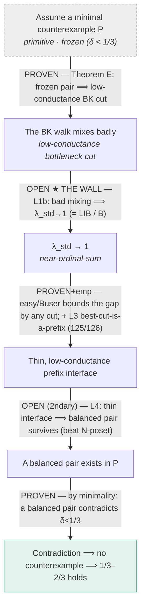

# 1/3–2/3 Program — State of the Wall

*Canonical state of the spectral / near-ordinal-sum attack on the 1/3–2/3 conjecture. Maintained by pm-onethird; updated on every verdict. Everything here is **any-width** — width-3 is old-repo baggage, not part of this program. Attempts and probes are subordinate to this document.*

Rich rendered version: `docs/state-of-the-wall.html`. Generated 2026-07-19.

---

## The one-paragraph state

Both **endpoints** of a single spectral axis are proven, along with all the machinery that reduces the whole conjecture to **one implication**. Almost every quantity we track — `λ_std`, inversion count, squared displacement, interface thinness, entropy — is the *same axis* ("near-ordinal-sumness") in different units. The balance constant `δ` is a **separate axis** (the counterexample condition). The entire remaining gap is the one **bridge** between them:

> **L1b (the wall):** `δ(P) < 1/3` ⟹ `λ_std → 1`  — equivalently `E[inv_e] = O(n/γ)` (LIB) or `E[Σ disp²] = O(E[inv_e])` (B).

It is hard because it must use that `σ` ranges over a **real poset's** linear extensions — it is *false* for abstract frozen distributions.

---

## Two axes, one bridge

- **Axis 1 — near-ordinal-sumness** (how close to an ordinal sum): `λ_std → 1`, `inv_e = O(n)` (LIB), `Σ disp² = O(inv)` (B), interface `Δ₁ → 0`, cross-cut entropy → 0. Mutually equivalent up to the exact identities below.
- **Axis 2 — balance / frozenness** (the counterexample condition): `δ(P) < 1/3` = frozen = no balanced pair = every incomparable pair is `>2/3`-decided toward `e`.

**Equivalence dictionary** (why "many things tried" is one gap wearing many faces):

- `Σ disp² = 2ΣK_m + 2ΣM_{k,l}` — exact (GID)
- `ΣK_m ≤ inv ≤ 2ΣK_m` — exact (DG)
- `Σ prefix-violations = footrule ≍ inv`
- `λ_std = 1 ⟺ ordinal sum ⟺ incomparability graph disconnected`
- `S_P = ρ_std(η_P)` — the gap lives in the standard sector

---

## Glossary (do not conflate δ and Δ)

| symbol | meaning | axis |
|---|---|---|
| `δ(P)` | balance constant: `max` over incomparable pairs of `min(p, 1−p)` — balance of the *most-balanced* pair. `< 1/3` = frozen. | **Axis 2** |
| `Δ₁(A)` | interface fatness of a cut: `E|A∖σ(A)| / min(|A|,|Aᶜ|)`. A *cut-geometry* property. **Not** `δ`. | Axis 1 |
| `λ_std` | top eigenvalue of the symmetrized transport operator on `1⊥`. `→1` = near-ordinal-sum. | Axis 1 |
| `inv_e(σ)` | Kendall distance: incomparable pairs flipped vs the distinguished order `e`. | Axis 1 |
| `disp(x)` | `pos_σ(x) − rank_e(x)`. `Σ disp²` is the (B) quantity. | Axis 1 |
| `e` | distinguished linear extension: the `>2/3`-majority order all biases align with. Reference, not a choice. | frame |
| `frozen` | `δ < 1/3`: every incomparable pair `>2/3`-decided. Minimal-counterexample condition. | Axis 2 |
| `primitive` | incomparability graph connected ⟺ not an ordinal sum ⟺ `λ_std < 1` (strictly). Minimal counterexamples are primitive. | structure |
| `R` | the (B)-ratio `E[Σ disp²]/E[inv]`. Large `R` = heavy displacement tail. | Axis 1 |
| `log e(P)` | poset entropy = `log` #linear-extensions = `log` vol(order polytope). *Joint*-law quantity. | geometry |

---

## The proof, and what's proven

Two links are open (**L1b** primary, **L4** secondary); the rest are proven or empirical.

**Machinery L1b's reduction stands on** (all proven, any-width): **standard dominance** (gap lives in the standard sector, so a combinatorial bound controls `λ_std`), **(A) SPREAD** `‖r‖² = Ω(n³)`, and the exact identities **GID** + **DG**.

### Full ledger

| # | Result | Status | Width |
|---|---|---|---|
| 1 | `λ_std = 1 ⟺ ordinal sum` | **proven** | any |
| 2 | ordinal sum ⟺ incomparability graph disconnected (primitive = negation) | **proven** | any |
| 3a | `S_P = ρ_std(η_P)` (gap in the standard sector) | **proven** | any |
| 3b | standard **dominance** (that block carries the 2nd eigenvalue) | empirical (0/132) | n ≤ 7 data |
| 4 | (A) SPREAD `‖r‖² = Ω(n³)` | **proven** | any |
| 5 | easy/Buser `1−λ_std ≤ n·leak(A)/(|A||Aᶜ|)`, every cut | **proven** | any |
| 6 | Theorem E: minimal counterexample ⟹ low-conductance BK cut | **proven** | any |
| 7 | identities GID & DG | **proven** | any |
| 8 | **L1b — the wall**: frozen ⟹ `λ_std→1` ⟺ LIB ⟺ (B) | **OPEN** | any |
| 9 | L2 standard-eigenvector monotonicity | false as stated (2/126) | n=6 data |
| 10 | L3 best-cut-is-a-prefix | empirical (125/126) | n ≤ 6 data |
| 11 | L4 near-ordinal-sum stability ⟹ balanced pair survives | **OPEN** (AMBER) | any |

**Width-3 baggage to keep out:** (i) the deleted pre-`a7c5` certificate crutch (≤2-chain Dilworth + constant-2 Cauchy–Schwarz, carried a fatal factor-`n`); (ii) the side "cuts-by-pairs C2" route (BK-transport option, genuinely width-3); (iii) the separate *finished* width-3 Lean paper. The skeleton above has zero width dependence.

---

## The single lemma to prove

**Poset-LE displacement anti-concentration** (any width). For every finite poset `P` with distinguished order `e` and `δ(P) < 1/3`, `σ` uniform on `L(P)`:

- **displacement face (B):** `E[ Σₓ (pos_σ(x) − rank_e(x))² ] = O( E[ Σₓ |pos_σ(x) − rank_e(x)| ] )`
- **inversion face (LIB):** `E_σ[ inv_e(σ) ] = O( n / γ )`

"A random linear extension of a real, 2/3-frozen poset stays close to its reference order — no heavy displacement tail / only linearly many inversions." The two faces are logically independent; either alone suffices.

**Forced hypotheses:** real-poset LE measure · `δ < 1/3` · distinguished order `e`.

**Why it is hard (obstruction 4):** both faces are false for abstract frozen distributions (a two-atom law has every pair frozen yet `Θ(n²)` inversions). So the proof *must* use that `σ` ranges over a genuine poset's linear extensions. This kills marginal-only tools (slot-law log-concavity numerically false; FKG/XYZ wrong-signed). The untried handle: **weak-Bruhat convexity / Stanley absolute-position AF log-concavity** forcing the slot probabilities to decay.

---

## Attempt index (so nothing is re-walked)

| verdict | attempt | note |
|---|---|---|
| dead end | Bruhat-convexity "prefix ⟹ O(n) inversions" | collapses to Diaconis–Graham; prefix/footrule/inversions are one equivalence class — no easier target |
| avoid this aim | balance → `log e(P)` aimed at `δ` directly | the Kahn–Saks/Kahn–Linial line, stuck at `δ ≥ 0.276` for 30 years; program built to escape it |
| **untried · open** | entropy / order-polytope aimed at the *conditional* inversion sum | deliverable: joint→marginal bridge `log e(P) → E[inv_e]`; Young-lattice/"harmonic-area" decode here |
| **untried · convergent target** | convexity / order-polytope forbids the **flat slot law** | convexity kills the two-atom witness + positivity kills the *exact* block-cross, but both are silent on the *approximate flat tail* (the real LIB-violator); weak-Bruhat convexity + Stanley absolute-position AF untried |
| dead ≠ AF | slot-law log-concavity of `e(P_m)` | numerically false (Neggers–Stanley, relative-to-chain) — does **not** touch Stanley's *absolute*-position AF log-concavity |
| **untried · new object** | incomparability-graph conductance → `δ` / inv-sum | "primitive ⟹ good mixer" in `λ_std` is *refuted* (primitives reach `λ≈0.96`); the incomparability graph's own expansion is unexamined |
| **AMBER · diagnostic (mg-a1ec)** | entropy-discontinuity mechanism (doc: `OneThird-EntropyDiscontinuity-Mechanism.md`) | Genuine new lemmas (audited correct): conditional-uniformity insertion law; exact per-element entropy decomposition; **(B) collapses to a first-moment `Σaₓ² = O(Σaₓ)` via the *live* Stanley absolute-position AF** (closes the "AF untried" gap); Blocking-Dichotomy trichotomy on the flat tail. Sharpest finding: **AF is *saturated*** — the fatal flat law and the KL `1/φ` optimum are *both* Stanley equality cases, so no AF *inequality* can separate them; the sole remaining lever is AF **equality-case** theory (Ma–Shenfeld 2211.14252). **Closes no open step** (diagnostic, not progress); correctly confronts the two-atom law without over-claiming. **Citations checked:** Sah width-2 gap + constants (λ=(−3+5√17)/52≈0.33876, β≈0.348843, 𝟏⊕ℰ exception) — **accurate ✓**. Ma–Shenfeld 2211.14252 — **verified ✓**, it characterizes the extremals of *Stanley's inequality* for linear-extension counts (a poset specialization of AF), exactly the equality-case lever. **Aires–Kahn 2509.11549 `O(log n)`-minimals — MISATTRIBUTED ✗** (that paper proves ω(log n)-minimals ⟹ δ→1/2, a sufficient condition for *balance*; no frozen-poset structure theorem) — any doc step leaning on it is void. |
| **GREEN-partial · diagnostic (mg-48ab)** | AF equality-case (Ma–Shenfeld) vs the frozen hypothesis (doc: `OneThird-AF-EqualityCase-MaShenfeld.md`) | Ma–Shenfeld 2211.14252 read + used correctly. New **Window Rigidity Lemma** + **Theorem 5.2: a full-support flat *absolute-position* law ⟹ δ ≥ 1/3** — proof independently verified, **non-circular**, sharp at tight3. **BUT the hypothesis is the exact Stanley-equality endpoint** (Cor 3.2: `x` is a free element in an ordinal sandwich `D(x)⊕Q⊕U(x)`; the conclusion is ≈folklore) — it excludes only the `r=1` exact point and does **NOT** close L1b: the conjecture-relevant *approximate* flat law (`θ = 1−1/n`) is untouched. **Residual = a k=1 quantitative *stability* theorem for Stanley's inequality (a rate on the deficit), which the doc reports does not exist in the literature — a precise *relabeling* of the whole hard part, not a reduction.** 2nd honest gap: object mismatch (MS governs *absolute*-position `N_i`; the arc's actual residual is the `ρ_s` *gap* law, a different sequence whose log-concavity is false). Corrects mg-a1ec Finding 5.4 (Correction 2.1: geometric ray is NOT a realizable equality case) and quarantines the misattributed Aires–Kahn step. The MS Thm 1.3(iii)/Rem 1.8 citation is now **verified ✓** (checked verbatim against the paper: equality ⟹ companions incomparable; k=1 ⟹ every poset supercritical; equality forces flat `r=1`, geometric ray excluded; and the paper has **no rate/stability version** — confirming the residual is genuinely open here). Sound because the argument is at k=1 (Ma–Shenfeld Ex. 1.4 shows k≥3 would break it). |
| **RED-for-residual · AMBER-redirect (mg-dcae, verified sound)** | k=1 Stanley-stability scoping (doc: `OneThird-k1-Stanley-Stability-Scoping.md`) | The mg-48ab residual — an *unconditional* k=1 stability bound `N_i² ≥ (1+cΦ)N_{i−1}N_{i+1}` — is **REFUTED by hand** (verified in full): for `P = C_n⊔C_n`, `x=min` of one chain, at i=2, `Φ₂=1/2` exactly while deficit = `1+1/(2n−1)`, so `deficit/Φ ∼ 1/n → 0` (exact `N_{1+j}=C(n−j+m−1,m−1)`; n=2 enumeration confirms). It fails **only unconditionally** (`C_n⊔C_n` has δ=1/2, maximally *unfrozen*), so the **frozen-conditional wall is untouched** — and **mg-48ab's reduction is proven circular** (a hypothesis-free Stanley-stability tool cannot exist; the residual *is* the frozen-conditional single lemma). Route survey (sound): AF-stability DEAD (Shenfeld–van Handel: needs a spectral gap, operator has no compact resolvent), combinatorial atlas priced-out, injective route **not** blocked by "defect∉#P" (that forbids an exact interpretation, not an inequality). **New verified lead — variance/bias decomposition:** `E[Σdisp²] = Σ Var(pos_x) + Σ(h(x)−rank_e x)²`, and under (H) the variance diagonal is `Θ(E[inv])` *free*, so **(B) ⟺ (B-cov)+(B-bias) = O(E[inv])`**. `(B-bias)` is a new obligation with a clean first lemma (**Prop 5.4:** `max_x Σ_{y∥x} Pr[{x,y} inverts] = O(1)` — no Stanley/AF input); `(B-cov)` = the known wrong-signed same-side-covariance wall (FKG/XYZ). Exemplary citation hygiene. |
| **INERT · proven (probe A, mg-61bb)** | can the frozen/coherence fact improve the Kahn–Saks 0.2764 bound? — ISOLATED elementary probe | **No, provably.** Coherence buys the *old* argument nothing: it is a logical *consequence* of δ<1/3 (same poset class — shrinks it by zero); zero content on the ≤3 elements KS/BFT sees; its only residual — subadditivity of balances `β(u,w)≤β(u,v)+β(v,w)` — is a system of *upper* bounds a chain satisfies, so it can never force a positive lower bound. The rigorous form of "the distinguished order is **redundant as data**." Clean isolation. |
| **PROVEN bounds (probe B, mg-92e6)** | doubly-stochastic position-matrix / majorization — ISOLATED elementary probe | New **diagonal-capacity** bound `δ ≥ ½(T[x,k]+T[x,k+1]+T[y,k]+T[y,k+1]−1)⁺` — proven, tight, nontrivial, independent of the empirical sweep; certifies δ≥1/3 on ~19% of n=7 posets. Also pins the exact *marginal-only* ceiling (max-flow), which dies as the pair spreads — the extra juice is one joint fact (adjacency symmetry `J(k,k+1)=J(k+1,k)`). Uses the position matrix as an *elementary* object only (no spectral). |
| **PROVEN · modest, correctly scoped (probe C, mg-f82f)** | a new direct entropy count on the coherent order — ISOLATED elementary probe | **Coherence-load-bearing** count: run the union bound over the `s ≤ n−1` *free slots* of the coherent order `e` (not ~n² pairs) ⟹ `δ ≥ (1−1/e(P))/s`. **Proves the full 1/3–2/3 conjecture for s ≤ 2**; gives `δ ≥ 5/18 ≈ 0.278 > 0.2764` on part of the s=3 family (verified exactly). **NOT a global record beat:** the extremal posets have `s ≥ 4`, where the count dies (`≤ 1/s`). **Open lead:** Window conjecture **W3** (`p ≤ 1/3` on a 3-window of adjacent free slots) + probe B's bound ⟹ full conjecture for posets with two adjacent free slots; W3 is tight to n≤6 but unproven (isolated-slot case is the genuine residual). |
| **SOUND negative (probe D, mg-e2de)** | incomparability-graph local geometry — ISOLATED elementary probe | One genuine graph-only theorem: **co-degree ≤ 1 ⟹ δ ≥ 1/3** (so frozen ⟹ every edge of G has co-degree ≥ 2, i.e. G is locally dense) — but it **provably stops**: the best local bound decays like `2^{−m}` (via `C_p ⊔ C_q`), collapsing to `1/6` at co-degree m=2, exactly where frozen posets sit; the first-moment degree/Cheeger budget `Σ_x(E[pos]−rank) = Σ_edges(Pr+Pr−1)` is **identically 0** (inert); small cuts give only `δ(A⊕B)=max` (ordinal-sum-inert). And **G doesn't even determine δ** — verified n=6 witness: two posets, isomorphic incomparability graph `K_1∨(P_3⊔2K_1)`, `e(P)=18`, but **`δ = 4/9` vs `1/2`**. Mechanism: G measures an element's positional *spread*, while δ is about its *location* (offset `d⁻(x)`) — structurally the wrong object. |
| **SOUND negative · actionable (mg-210d)** | best *constant* lower bound on `λ_std`, primitive/frozen — ISOLATED elementary probe (doc: `probe-lambda-constant-bound.md`) | **Best constant this route proves = `0`.** Master bound (re-derived from scratch, sharp): `1−λ_std ≤ 3·E[footrule]/(n²−1) ≤ 6·E[inv]/(n²−1)`, equality at the antichain. Frozen ⟹ `λ_std > 1 − d·n/(n+1)` (`d = m/C(n,2)` = incomparability density), but `d ≤ 1` degenerates it to `1/(n+1)` — positive, **not constant**. **Connectivity is wrong-signed:** primitivity gives `m ≥ n−1` — a *lower* bound on the pair count — which *degrades* the bound `O(1/n)`; a non-degeneracy hypothesis, not a quantitative lever. **Sole missing ingredient = Residual (R): is there a constant `D < 1` with density `d(P) ≤ D` on every *frozen* poset?** ⟹ `λ_std > 1 − D` immediately. (R) open: entropy + inversion-counting attacks both fail; pinning-cost heuristic supports; antichain (`d=1`) is *not* frozen, so freezing does spend density. **Free by-product (= our 3-cycle anchor, independently re-derived): frozen ⟹ the majority relation is automatically a linear extension**, and `1/3` is exactly the threshold — the distinguished order is *canonical*, not chosen. Honest caveat: (R) ⟹ a *constant λ_std*, which does **not** by itself give `δ` (rate ≠ the problem; the `λ_std → δ` conversion stays open). All four load-bearing claims hand-verified; scripts benign (n≤7, no dataset). |

**Four-probe summary (2026-07-19, all audited).** *Does the coherence fact buy anything over 0.2764?* Verified answer: **a genuine but small, non-record, discrete-and-local something.** Coherence is usable exactly when the coherent order has **few free slots (pinned regime)** — probe C proves the conjecture there and beats 0.2764 on part of s=3; probe B adds a proven position-matrix diagonal bound — and it **dies in the many-free-slots (spread) regime**, which is precisely where the extremal near-counterexamples live. Probe A proves *why* the old tool is blind: coherence is a logical *consequence* of δ<1/3, not new data. Probe D closes the incomparability-graph bridge: G is the wrong object — it sees an element's *spread* but δ is about its *location*, and G doesn't even determine δ. So the leverage is real, structurally located (pinned/few-slots), and provably cannot move the global worst case. Next concrete swing if desired: prove **W3** (probe C's residual).

**Framing correction (2026-07-19).** The "entropy *discontinuity* at δ=1/3" is a category error: posets are discrete, so there is no continuum to have a phase transition in. `1/3` is the **extremal value** (min balance over discrete posets; `= 1/3 = 1 slot of 3` in tight3); the real "gap" is a **rigidity in the discrete set of achievable δ** (jumps 1/3 → ≈0.348; Sah proved it for width-2, Brightwell open). Coherence exists at *and above* the boundary (tight3 coheres; whole Olson–Sagan boundary family coheres), so its *existence* is not the discriminator — matching probe A. The program is an **extremal-rigidity** question, and leverage = combinatorial rigidity, not thermodynamic discontinuity — consistent with the probes' rigid-but-local gain.

### Where the threads converge

Convexity dispensing the two-atom case, an **entropy-gradient discontinuity at `δ = 1/3`**, and **Brightwell's open question** (can a poset sequence reach `δ → 1/3`?) are three windows on one unproven statement: *a real poset's uniform / connected / order-polytope structure forces the slot probabilities to decay (`ρ_s < 1`).* Prove that, and the wall falls.

**Refinement (mg-a1ec, 2026-07-19 — audited).** The untried lever narrows sharply: the AF *inequality* is **saturated** on the flat law (both the fatal flat tail and the KL `1/φ` optimum are Stanley *equality* cases), so no AF-inequality strengthening can distinguish them — the operative tool is AF **equality-case** theory (Ma–Shenfeld, pending citation check), not the AF inequality. And (B) provably reduces to a **first-moment** `Σaₓ² = O(Σaₓ)` via the live absolute-position AF. So the target is now: use the AF *equality-case* rigidity to force the first drop `θ < 1` in the slot sequence of a real frozen poset.

**Further refined (mg-48ab, audited).** Pointing Ma–Shenfeld at the wall proved the *exact*-equality endpoint (full-support flat law ⟹ δ≥1/3, folklore-adjacent) but showed the equality-case classification is **`=`-vs-`>` with no rate** — so the conjecture-relevant *approximate* flat law slips through. The residual is now named precisely: **a k=1 quantitative *stability* theorem for Stanley's inequality (a lower bound on the strict deficit `N_i² − N_{i−1}N_{i+1}`), which does not exist in the literature.** That residual holds the entire hard part of L1b. Also note: Ma–Shenfeld governs the *absolute*-position sequence `N_i`, whereas the corpus residual is the `ρ_s` *gap* sequence — reconciling the two is a second open obligation.

**Retired (mg-dcae, audited).** That "external k=1 stability tool" is **refuted** — a *hypothesis-free* quantitative bound of that shape provably does not exist (`C_n⊔C_n` gives `deficit/Φ ∼ 1/n`), so mg-48ab's reduction was **circular**: there is nothing to import; any usable statement must **consume the frozen hypothesis directly** (the residual *is* the frozen-conditional single lemma). The new best coordinates: mg-dcae's verified **variance/bias split** `E[Σdisp²] = Σ Var(pos_x) + Σ(h(x)−rank_e x)²`, with the variance diagonal `Θ(E[inv])` for free under (H). So **the concrete target is no longer "build a stability tool" but: prove (B-bias)** — `max_x Σ_{y∥x} Pr[{x,y} inverts] = O(1)` (Prop 5.4, no Stanley input) — **and break the wrong-signed (B-cov) covariance** (FKG/XYZ force it ≥0). That covariance wall is the honest current edge of the whole program.

**Second clean residual (mg-210d, audited).** The elementary Buser route gives *no* constant lower bound on `λ_std` (it collapses onto incomparability density `d`, and the tool is tight at the antichain), pinpointing a **more elementary, self-contained** open target alongside the (B-cov) covariance wall: **Residual (R) — do frozen posets have a density ceiling `d(P) ≤ D < 1`?** (R) ⟹ constant `λ_std` immediately. It is pure finite-poset combinatorics — no Stanley/AF, no covariance — and independently re-derives the frozen ⟹ canonical-linear-extension fact. The caveat keeps it honest: even (R) yields a *constant* `λ_std`, not `δ` — per the 2026-07-19 rate-vs-problem exchange, the `λ_std → δ` step is a separate open door, so (R) is progress on the spectral sub-question, not a route to the conjecture on its own. Two residuals now stand: **(B-cov)** (break the wrong-signed same-side covariance — the sharp edge) and **(R)** (bound frozen density — the elementary edge).

**Direct attack on the core residual (mg-0ed7, filed 2026-07-19, in flight).** Daniel-directed: carefully read Ma–Shenfeld (arXiv:2211.14252) to extract a natural **near-ordinal-sandwich** definition and attempt a **frozen-conditional, combinatorial** stability theorem for Stanley's inequality (a rate on the deficit `N_i² − N_{i−1}N_{i+1}`). This is the most direct swing yet at the L1b core residual. Briefed with three binding guardrails so it can't re-walk closed ground: (a) unconditional stability is **refuted** (mg-dcae, `C_n⊔C_n`) ⟹ must consume the frozen hypothesis; (b) generic **AF-stability is dead** (Shenfeld–van Handel) ⟹ must be combinatorial, not AF-machinery; (c) **object mismatch** — Ma–Shenfeld governs absolute `N_i`, we need the gap/slot `ρ_s` sequence, so transfer must be addressed explicitly. A clean "blocks here and why" is an accepted outcome.

**Mixing ⊥ balance, now with a theorem (reference, 2026-07-19).** Leake–Lindberg–Oveis Gharan 2025 (arXiv:2503.01005, 𝒞-Lorentzian trickle-down) proves the flag complex of `J(P)` (whose maximal chains = linear extensions, by Birkhoff) is a **local spectral expander for every poset** ⟹ poly-time mixing of the down-up walk, arbitrary fields. Caveats: it is the *down-up* walk (not adjacent-transposition), exponent ~`n^{4–5}` (worse than Bubley–Dyer `n³ log n`, which stays best), and *poly* not entropy-rate — so the "ideal operator" is still open. Significance for us: if its expansion is uniform over all posets (apparent, unverified against the theorem statement), fast mixing holds even for near-counterexamples, so the `δ` obstruction is **provably not a mixing obstruction** — it lives in the *marginal*, exactly where mg-210d/dcae put it. Corrects an earlier pm-onethird claim that "spectral independence for `L(P)` is open." The one new object it hands us: the 𝒞-Lorentzian spectral-independence constant of `J(P)`, whose correlation (if any) with `δ` is an open, checkable question (expected: none, by the orthogonality above).

Empirically no poset reaches `δ ∈ (1/3, ≈0.354)`; best-known constructions plateau at `≈0.349` (Evan Chen; Sah; Olson–Sagan) — the forbidden-band signature, still open at `n → ∞`. The **pair biases are the discrete derivatives of the entropy** (`p_xy = e(P+x<y)/e(P)`), so coherence of biases at `δ<1/3` = all entropy-gradients aligned + extreme; whether that forces a discontinuity the continuous method is blind to is the live conceptual program.

### Why 1/3 — the elementary anchor (proven)

An elementary counting fact pins why **1/3** (not 0.276 or any other constant) is the threshold. For any three elements, `Pr[x<y] + Pr[y<z] + Pr[z<x] ≤ 2` (each of the 6 orders makes at most 2 of the three cyclic events true). So **no three pairwise orientations can all exceed 2/3** — no *strong* 3-cycle. At `δ < 1/3` every pair is `>2/3`-oriented (comparable pairs at probability 1), so the strong-majority relation is a **complete tournament with no 3-cycle ⟹ transitive ⟹ a total order** (the distinguished order `e`). This is the elementary proof that the distinguished order exists, and it locates the conjecture's magic number: **2/3 is exactly the strong-3-cycle threshold, i.e. `δ = 1/3`.** Coherence is *necessary* (this) but not *sufficient* (the two-atom law coheres) — the open step is coherence **+ realizability ⟹ the gap**.

**Literature status (2026-07-19 research).** The gap above 1/3 is **proven for width-2** (Sah, [arXiv:1811.01500](https://arxiv.org/abs/1811.01500): any width-2 poset not built from specific pieces has `δ ≥ ≈0.33876`; a family → `≈0.34884`) — but by opaque casework, with **no articulated reason**. The continuous entropy method (Kahn–Linial Brunn–Minkowski on the order polytope) stalls at `≈0.276` and structurally cannot reach 1/3 (the "blind" half, confirmed). An **entropy discontinuity at 1/3 appears nowhere** in the literature — the mechanism is novel. The field's tool for rational-rigidity extremal facts is Aleksandrov–Fenchel / the combinatorial atlas ([Chan–Pak–Panova arXiv:2005.08390](https://arxiv.org/abs/2005.08390)), never aimed at the 1/3 gap. Master open-problem reference: Chan–Pak survey [arXiv:2311.02743](https://arxiv.org/abs/2311.02743) §16.
