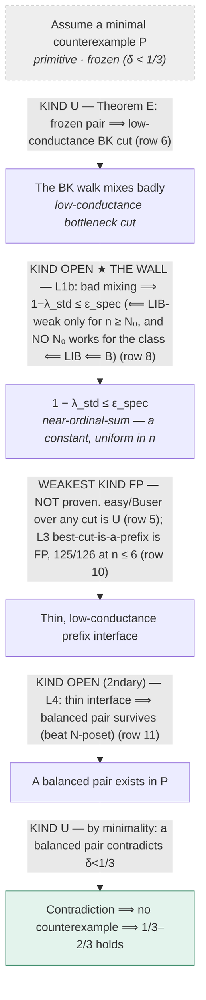

# 1/3–2/3 Program — State of the Wall

*Canonical state of the spectral / near-ordinal-sum attack on the 1/3–2/3 conjecture. Maintained by pm-onethird; updated on every verdict. Everything here is **any-width** — width-3 is old-repo baggage, not part of this program (row 6 is the one row where that had to be *checked* rather than assumed; see its cell). Attempts and probes are subordinate to this document.*

> ⚠️ **READ THE `Kind` COLUMN BEFORE QUOTING ANY ROW, AND READ THE STANDING RULE BEFORE WRITING A SENTENCE THAT SPANS ROWS** (§ *Kinds*, below the ledger). Rows differ **in kind**, not only in status: `U`/`U-id` instantiate at the unknown `n` of a minimal counterexample; **`FP` does not, at all**. One load-bearing row is `FP` — **10** (L3 best-cut-is-a-prefix, `125/126`, `n ≤ 6`). ⚠️ **ROW 3b IS NO LONGER ONE OF THEM AND IS WEAKER, NOT STRONGER, FOR IT (mg-55f2, on mg-65f5):** its **unconditional** form is **REFUTED** (`FP✗`, 166 refuters at moderate-λ `n = 7`) and the **conditional** (all-pairs-frozen) form that remains open **is L1b, i.e. row 8, `OPEN`** — so row 3b is not independent support for anything. **The `0/132` is a SAMPLING ARTIFACT: `n ≤ 6` exhaustive + `n = 7` top-λ spot only, a frame that excludes the known refuters. NEVER QUOTE IT WITHOUT THAT FRAME, AND NEVER AS A "CLEAN SWEEP".** **Any prose aggregating rows must state the WEAKEST kind in the set it names**; *"all proven"* over a set containing an `n ≤ 7` empirical row is false however true each row is individually.

Rich rendered version: [`docs/state-of-the-wall.html`](docs/state-of-the-wall.html) — **HAND-MAINTAINED, NOT GENERATED, AND SUBORDINATE TO THIS FILE.** It carried the words *"Generated 2026-07-19"* for three weeks and both halves were false: **no generator has ever existed** (mg-9bc2), and a date says *when* a rendering was made, never *whether* it still matches. It now carries a **`STATE-PIN`** naming the revision of this file it was last reconciled against, checked **per ledger row** by `python3 code/rendered_twin_pin_9bc2/twin_pin.py`. **Do not quote a ledger row from it without running that** — it reports which rows have moved here since, and as of 2026-08-10 **rows 8 and 9 have** (row 9 is mg-2f44's open repair).

---

## The one-paragraph state

Both **endpoints** of a single spectral axis are proven, along with the machinery that reduces the whole conjecture to **one implication** — and **that machinery is now uniformly `U`/`U-id`, which this sentence has got wrong in three successive ways and which must NOT be read as good news.** It said *"all proven"* (false — mg-957a), then *"weakest kind `FP`"*, then *"weakest kind `OPEN`"* (mg-55f2, landing mg-65f5's §1.5 on row **3b**, standard dominance). **The floor is `U` because row 3b WAS NEVER A MEMBER OF THIS SET, not because anything was proven:** mg-65f5's R1 finds standard dominance is L1b's *conclusion* and not its input, so listing it as machinery recorded the open problem as its own premise — struck at `:76`, landed `mg-a1db`. What the removal buys is that the headline is now literally true rather than flattering: the machinery is proven, and **the one implication the conjecture reduces to IS standard dominance itself** — row 8, the wall, `OPEN`. Row **3b**'s own warrant is untouched by the strike and is **weaker than the `FP` this sentence claimed until mg-55f2**: the `0/132` is `0` failures inside a frame — `n ≤ 6` exhaustive + `n = 7` **top-λ spot only** — that excludes the known moderate-λ `n = 7` refuters, so the **unconditional** statement is **refuted** (166 refuters, mg-8b64, read-not-measured) and the form that stays open is the **all-pairs-frozen conditional, which is L1b itself — row 8, `OPEN`**. The defect mg-957a caught was real, and mg-65f5's is a **worse** one and not a lesser: a false belief is wrong about a dependency, but a circularity makes the open problem look discharged (the rule and the per-row marks are at *Kinds* below). Almost every quantity we track — `λ_std`, inversion count, squared displacement, interface thinness, entropy — is the *same axis* ("near-ordinal-sumness") in different units. The balance constant `δ` is a **separate axis** (the counterexample condition). The entire remaining gap is the one **bridge** between them:

> **L1b (the wall):** `δ(P) < 1/3` ⟹ **`1 − λ_std ≤ ε_spec`** for an *explicit absolute constant, uniform in `n`* — in inversion terms **(LIB-const)** `E[inv_e] ≤ (ε_spec/6)(n²−1)`. **That constant, not a limit, is what the architecture consumes** (mg-88bd, audited mg-e35c — row below), and it is **CONFIRMED CONDITIONALLY, not settled**: L4-as-stated is the thing whose provability at an `n`-free modulus is in doubt, and **if L4 needs an `n`-dependent modulus the answer flips**. **WHICH SIDE FLIPS — mg-345e: the flip is on the DEMAND side only.** `ε_spec` names two numbers and this row states both at once: the constant we can **prove** (`ε_sup`) and the constant that **suffices** (`ε_dem`). **The pair-bias derivation of `ε_sup` is INDEPENDENT of L4** — its dependency list is `inv_e` · frozen · coherence (a *consequence* of frozen, mg-61bb) · linearity of expectation · mg-210d's master bound, and L4 is not on it; it is already **PROVEN** at `Op-Form` Claim 6.1 and it lands at **`ε_sup < 1`**. ⚠️ **THE `1` AND THE `1/6` ARE THE SAME THEOREM IN TWO NORMALISATIONS — NOT TWO RESULTS, AND NOT A FACTOR OF 6 APART (mg-6bc2 §2.1, [`OneThird-PairBias-EpsSup-Sharpening-mg-6bc2.md`](docs/OneThird-PairBias-EpsSup-Sharpening-mg-6bc2.md)).** **THE UNIT MAP, stated inline so it cannot be re-welded wrongly:** the ONE theorem is `E[inv_e] < m/3 ≤ n(n−1)/6`, and the two constants are two divisions of it — **`÷ n²` ⟶ `ε_c3ca < (n−1)/(6n)` ⟶ `1/6`**, and **`÷ (n²−1)/6` ⟶ `ε_spec < n/(n+1)` ⟶ `1`**, which is this row. **`ε_spec/ε_c3ca = 6n²/(n²−1) → 6`, and the explicit `/6` in this row's own definition of `ε_spec` is the ENTIRE difference.** The `1/6` form is **already in this corpus and is cited, not restated**: [`OneThird-LIBweak-mg-c4f5-IndependentAudit.md:415`](docs/OneThird-LIBweak-mg-c4f5-IndependentAudit.md) — *"Freezing unconditionally gives only `ε < 1/6 ≈ 0.167`"* — with that `ε` defined by `E[inv_e] ≤ ε·n²` at [`OneThird-LIBweak-mg-c3ca.md:172`](docs/OneThird-LIBweak-mg-c3ca.md). **So `1/6` and `1` DO NOT COMPARE, and quoting one against the other reads a change of units as a gap:** anyone who set out to prove `ε_spec = 1/6` from pair bias would be attempting a statement **6× stronger** than the `1/6` that is already proven, while believing they were confirming it — the same welding shape the `N₀` guard below prevents. **AND THE ROUTE IS CLOSED, NOT MERELY UNSHARPENED: `max{ 6E_μ[inv_e]/(n²−1) : μ ∈ M_n(η) } = (1−3η)·n/(n+1)`, ATTAINED IN `M_n(η)` AT EVERY `η > 0` — `≤` and `≥` BOTH PROVEN FOR ALL `n`** (the `≥` by this file's own two-atom law, `:135`), machine-confirmed exactly at `n = 3,4,5,6` (mg-6bc2 Claim 3.1), where `M_n(η)` is the pair-bias information set (all measures on `S_n` with every pair flipped against `e` with probability `≤ 1/3 − η`). ⚠️ **CARRY THE `η`, AND SAY WHICH WORD IT LICENSES — `n/(n+1)` IS A SUPREMUM OVER THE FROZEN CLASS, NOT A MAXIMUM IN IT (mg-832f Correction 2; the parent mg-6bc2 states Claim 3.1 with the `η` and is RIGHT — this row is where it was lost).** The hypothesis is `δ(P) < 1/3` **STRICT**, so a frozen object lives in `M_n(η)` for some `η > 0` and the constant this row leads with is `sup_{η>0} (1−3η)·n/(n+1) = n/(n+1)`, **approached and not attained inside the class**: the `η = 0` witness has **every pair at exactly `1/3`**, i.e. `δ = 1/3`, i.e. **NOT FROZEN and OUTSIDE THE HYPOTHESIS**. `ATTAINED` is exact **at each `η > 0` at the value `(1−3η)·n/(n+1)`**, and at `n/(n+1)` itself only in the **closed relaxation `M_n(0)`**, which is the boundary. **THE CLOSURE IS UNAFFECTED** — the supremum is still `n/(n+1)`, no pair-bias argument reaches below it, and `Op-Form` Claim 6.1 is still not improvable by pair bias — but this row previously said `ATTAINED` at `η = 0` without saying which, and a reader who checks that witness finds it outside the class and concludes the ledger is wrong. **`Op-Form` Claim 6.1 is therefore an EQUALITY for the information it consumes, not a bound awaiting a better argument** — no rearrangement can move it, because an explicit feasible measure sits on `(1−3η)·n/(n+1)` at **every** `η > 0` and on `n/(n+1)` itself at the boundary; every route below `1` must add a **realizability** fact (mg-92e6's adjacency symmetry, `:156`, is the first that bites). *(The footrule rendering buys nothing either: `max{ 3E_μ[footrule]/(n²−1) : μ ∈ M_n } = n/(n+1)` as well — **stated here at `η = 0` because that is how its parent states it (mg-6bc2 Claim 4.1); the `η`-strictness note above applies to it verbatim and is NOT separately proven for the footrule form here** — but mark that one's kind separately, **`≤` proven for all `n`, ATTAINMENT FINITE-POPULATION: `n = 3,4,5,6` by exact-rational LP and `n = 8` by explicit construction, NOT proven for all `n`** (mg-6bc2 Claim 4.1); a hierarchical block-rotation family caps the ever-available gain at `8/7`.)* **WHICH `1/6` WAS MEANT IS NOT DECIDED HERE** — that question is Daniel's and is with him; the map above is true under either reading, and nothing in it says the conjecture is confirmed or refuted. It is independent *by force*, not by choice: L4's hypothesis (a thin prefix) is reachable only through this row's own conclusion, so a derivation of L1b invoking L4 would be circular — with one named escape, the direct-prefix route (`mg-00b9`, repaired `mg-2de0`), which reaches only `Δ₁ ≤ 2/3` against `ε_leak ≈ 0.20` and which, if it ever closed, would make the class **empty** rather than the constant L4-dependent. `ε_dem` **is** gated — but **narrower than this row implies and not on L4 alone**: Step 6 consumes no branch in which the modulus `F` appears ((i) is `F`-free, (ii) unconsumable for every strictly positive `F` per mg-3af9, (iii)-repaired `F`-free), so what it needs is L4's **threshold `ε₀`**, not its modulus; and `ε_dem = ε_leak²/(2C₃)` with **`C₃` unquantified and NOT an L4 question**. **The published gap factor of ~50 is `ε_sup/ε_dem` — an L4-independent numerator over an L4-dependent denominator, so shrinking it from the left needs no L4 answer at all.** *(This states only what Step 6 CONSUMES; it does not touch whether L4-as-stated is provable at an `n`-free modulus, which stays open — [`OneThird-PairBias-Independence-mg-345e.md`](docs/OneThird-PairBias-Independence-mg-345e.md).)* The limit `λ_std → 1` and mg-7ae7's rate `1 − λ_std ≤ C/(γn)` are **stronger renderings that happen to be available**, not the requirement. *Sufficient* conditions, one-way: **(B) ⟹ LIB ⟹ (LIB-weak)** — `E[Σ disp²] = O(E[inv_e])`, `E[inv_e] = O(n/γ)`, `E[inv_e] = o(n²)` respectively. **As asymptotic classes `(B) ⊊ LIB ⊊ (LIB-weak) ⊊ (LIB-const)`: (LIB-weak) is *stronger* than (LIB-const), NOT the weakest on the board — and `(LIB-weak) ⟹ (LIB-const)` fails at finite `n`. They differ IN KIND, and the threshold is not merely unknown — `N₀` IS NOT UNSPECIFIED, NO `N₀` WORKS FOR THE CLASS AT ALL (mg-c4f5 §5.3, landed mg-5ce3): for any candidate `N₀`, `g(n) = n²` below it and `n²/log₂ n` at and above is `o(n²)` and violates (LIB-const) throughout `[1, N₀)`. So *go and find `N₀`* IS NOT AN AVAILABLE RESEARCH DIRECTION — no threshold follows from the `o(n²)` hypothesis at all; the counterexample needs one at its own `n`. The gap is a QUANTIFIER and it is UNBOUNDED, not a constant** — so (LIB-weak) closes the **limit** rendering `λ_std → 1`, not the constant form above. *Not* blocked by the arc's named obstruction (one-element-scale; (LIB-weak) needs `Θ(n)` at once) — but **neither proved nor blocked**: no route, its forward vector's status is **undecided** and its threshold **moves with `n`** — **CORRECTED by mg-c4f5: the marginal form mg-c3ca reports as *false* is NOT the one its probe tested.** `p3_window.py` evaluates `1−TV ≥ ½ ∧ min(p,1−p) < ⅓`; the document names the *linear* form `min(p,1−p) ≥ ⅓(1−TV)`, which has **0 counterexamples over 1,168,036 pairs at n ≤ 7** and best constant `c*(n) = ½, ½, 5/12, 2/5, 7/20` — above ⅓ and falling. mg-c4f5 reproduces the published 16/351/8088 EXACTLY under mg-c3ca's own predicate, so this is a label, not arithmetic. **WITHDRAWN AT SOURCE TOO — mg-2df8:** mg-c3ca's own §0.5 and §5 now carry the refutation struck through with the measurement beside it, so the false sentence is no longer readable anywhere without its correction; the instrument's `README` note that recorded the mislabel's cause is corrected with it. **mg-c3ca ([`OneThird-LIBweak-mg-c3ca.md`](docs/OneThird-LIBweak-mg-c3ca.md)) is now AUDITED — mg-c4f5, [`OneThird-LIBweak-mg-c4f5-IndependentAudit.md`](docs/OneThird-LIBweak-mg-c4f5-IndependentAudit.md): PREMISE CONFIRMED (master bound re-derived by hand, 0 violations n ≤ 7; `never attacked` holds, 0 of 4 pre-c3ca items filed against it), all 11 printed figures of its §6 reproduce EXACTLY, §3's verdict CONFIRMED — with SIX corrections, the largest being §5's refutation-of-the-wrong-statement (see the axis bullet).** (see § *The single lemma to prove*; these were previously written as equivalent). **Finite `n` is why the distinction matters:** `ε_spec ≲ 2×10⁻²` under the repaired calibration (unpinned by ~2 orders of magnitude; **mg-c3ca §2.3 *carried* the SUPERSEDED `2×10⁻⁴`/`5×10³`/`10⁵` as flat text against this row's own instruction — mg-c4f5; the repaired gap factor is ~50, not ~5×10³. STRUCK AT SOURCE by mg-5827 (`d101026`): all three now stand struck with the repaired value beside them, 0 flat-text occurrences left (re-checked mg-2df8)**), putting the crossover at which (LIB-const) stops being numerically harder than (LIB) at **`n ≈ 900`** — inside the range an unknown minimal counterexample could live.

It is hard because it must use that `σ` ranges over a **real poset's** linear extensions — it is *false* for abstract frozen distributions.

---

## Two axes, one bridge

- **Axis 1 — near-ordinal-sumness** (how close to an ordinal sum): `1 − λ_std ≤ ε_spec`, a constant uniform in `n` — **the form the architecture consumes**, with `λ_std → 1` a stronger rendering that happens to be available; `inv_e = o(n²)` (LIB-weak), `inv_e = O(n)` (LIB), `Σ disp² = O(inv)` (B), interface `Δ₁ → 0`, cross-cut entropy → 0. Tied together by the exact identities below — but **not all mutually equivalent, and the last step is not even an implication**: `(B) ⟹ LIB ⟹ (LIB-weak)` is one-way, and `(LIB-weak) ⟹ (LIB-const)` holds only for `n ≥ N₀` — and **no `N₀` works for the class at all**: for any candidate `N₀` there is an `o(n²)` function violating (LIB-const) throughout `[1, N₀)` (mg-c4f5 §5.3, landed mg-5ce3), so the threshold is not *unspecified* but **underivable from the hypothesis** — `find N₀` is closed, not open. As asymptotic classes `(LIB) ⊊ (LIB-weak) ⊊ (LIB-const)`, so **(LIB-weak) is the stronger of those two and they differ IN KIND — the gap is a quantifier, not a constant** (row 8, § *The single lemma to prove*).
- **Axis 2 — balance / frozenness** (the counterexample condition): `δ(P) < 1/3` = frozen = no balanced pair = every incomparable pair is `>2/3`-decided toward `e`.

**Equivalence dictionary** (why "many things tried" is one gap wearing many faces):

- `Σ disp² = 2ΣK_m + 2ΣM_{k,l}` — exact (GID)
- `ΣK_m ≤ inv ≤ 2ΣK_m` — exact (DG)
- `Σ prefix-violations = footrule ≍ inv`
- `λ_std = 1 ⟺ ordinal sum ⟺ incomparability graph disconnected`
- `S_P = ρ_std(η_P)` — the gap lives in the standard sector

---

## Glossary (do not conflate δ and Δ)

| symbol | meaning | axis |
|---|---|---|
| `δ(P)` | balance constant: `max` over incomparable pairs of `min(p, 1−p)` — balance of the *most-balanced* pair. `< 1/3` = frozen. | **Axis 2** |
| `Δ₁(A)` | interface fatness of a cut: `E|A∖σ(A)| / min(|A|,|Aᶜ|)`. A *cut-geometry* property. **Not** `δ`. | Axis 1 |
| `λ_std` | top eigenvalue of the symmetrized transport operator on `1⊥`, **relative to a chosen reference linear extension** — `T[x,i] = Pr[pos_σ(x)=i]` after relabelling by it. **The choice is load-bearing: `λ_std` moves by up to `1/3` across reference orders (4,069 of 4,824 posets at n=6, mg-c4f5), against a target of `ε_spec ≈ 0.02`.** Frozen removes the choice (`e` is canonical and a linear extension) — that is a hypothesis, not a convention. `→1` = near-ordinal-sum. | Axis 1 |
| `inv_e(σ)` | Kendall distance: incomparable pairs flipped vs the distinguished order `e`. | Axis 1 |
| `disp(x)` | `pos_σ(x) − rank_e(x)`. `Σ disp²` is the (B) quantity. | Axis 1 |
| `e` | distinguished linear extension: the `>2/3`-majority order all biases align with. Reference, not a choice. | frame |
| `frozen` | `δ < 1/3`: every incomparable pair `>2/3`-decided. Minimal-counterexample condition. | Axis 2 |
| `primitive` | incomparability graph connected ⟺ not an ordinal sum ⟺ `λ_std < 1` (strictly). Minimal counterexamples are primitive. | structure |
| `R` | the (B)-ratio `E[Σ disp²]/E[inv]`. Large `R` = heavy displacement tail. | Axis 1 |
| `log e(P)` | poset entropy = `log` #linear-extensions = `log` vol(order polytope). *Joint*-law quantity. | geometry |

---

## The proof, and what's proven

```mermaid
flowchart TD
    A["Assume a minimal counterexample P<br/><i>primitive · frozen (δ &lt; 1/3)</i>"]:::assume
    B["The BK walk mixes badly<br/><i>low-conductance bottleneck cut</i>"]
    C["1 − λ_std ≤ ε_spec<br/><i>near-ordinal-sum — a constant, uniform in n</i>"]
    D["Thin, low-conductance prefix interface"]
    E["A balanced pair exists in P"]
    F["Contradiction ⟹ no counterexample ⟹ 1/3–2/3 holds"]:::concl
    A -->|"KIND U — Theorem E: frozen pair ⟹ low-conductance BK cut (row 6)"| B
    B -->|"KIND OPEN ★ THE WALL — L1b: bad mixing ⟹ 1−λ_std ≤ ε_spec (⟸ LIB-weak only for n ≥ N₀, and NO N₀ works for the class ⟸ LIB ⟸ B) (row 8)"| C
    C -->|"WEAKEST KIND FP — NOT proven. easy/Buser over any cut is U (row 5); L3 best-cut-is-a-prefix is FP, 125/126 at n ≤ 6 (row 10)"| D
    D -->|"KIND OPEN (2ndary) — L4: thin interface ⟹ balanced pair survives (beat N-poset) (row 11)"| E
    E -->|"KIND U — by minimality: a balanced pair contradicts δ&lt;1/3"| F
    classDef assume fill:#eee,stroke:#999,stroke-dasharray:4 3;
    classDef concl fill:#e3f3ec,stroke:#1f7a54;
```

Two links are **OPEN** (**L1b** primary, **L4** secondary). **Of the remaining ledger rows, one is `FP` — finite-population — (row 10), one is refuted as stated (row 9), and row 3b is `FP✗`/`OPEN` — its unconditional form REFUTED and its open form identical to L1b itself (mg-55f2, on mg-65f5) — so "the rest are proven" is FALSE of that set**; the weakest kind below L1b/L4 is **`OPEN`, not `FP`** (row 3b's open half *is* row 8), and the chain is exactly as strong as that. (This sentence previously read *"the rest are proven or empirical"*, a disjunction that names both kinds and commits to neither — mg-957a.)

**Machinery L1b's reduction stands on** — ⚠️ **WEAKEST KIND IN THIS SET: `U` — ~~`FP`~~ ~~`OPEN`~~, RE-DERIVED (not deleted) at mg-a1db on mg-65f5's R1 strike, and THE NEXT CLAUSE IS PART OF THE MARK: the floor rose because the `OPEN` member WAS NEVER A MEMBER — standard dominance is L1b's conclusion, not its input (struck below) — and NOT because anything was proven. `U` HERE DOES NOT MEAN "L1b's MACHINERY IS PROVEN" IN ANY SENSE THAT HELPS: L1b is OPEN, and it is open *as* standard dominance (row 8, the wall). All this set now says is that what the reduction *stands on* is `U`/`U-id` throughout; what it does not have is the implication itself, and that is the whole remaining gap:**

- ~~**standard dominance** (gap lives in the standard sector, so a combinatorial bound controls `λ_std`) — **`FP`, row 3b: empirical `0/132`, `n ≤ 7` data.**~~ ⚠️ **STRUCK — IT IS L1b'S *CONCLUSION*, NOT ITS INPUT (mg-65f5 §1.6; landed here mg-a1db).** Listing it here recorded **the open problem as its own premise** — a **CIRCULARITY**, and a third failure mode worse than either branch of the fork that used to sit at `:81`: a false belief is wrong about a dependency and a gloss slip is wrong about a label, but this one made the open problem **look discharged by listing it under its own feet**. `λ_std` is *defined* as `max spec(S_P|_{1⊥})` (glossary; [`one_third_width_three/docs/probe-lambda-constant-bound.md:65`](../one_third_width_three/docs/probe-lambda-constant-bound.md)) — an `n × n` transport object over the **elements of `P`**, **not** a block of the BK spectrum over `L(P)` — so nothing about which block carries `λ₂` is needed to *define* it, and nothing about it is needed to *bound* it either. The operative clause *"a combinatorial bound controls `λ_std`"* **IS mg-210d's master bound** `1 − λ_std ≤ 6E[inv]/(n²−1)` (Thm 2.4), whose whole proof spends **row 5** (Buser test vector on `S|_{1⊥}`) and **row 7** (Diaconis–Graham) and nothing else — as the (A) SPREAD bullet below already says in as many words, a sentence that had answered this bullet for days while being read as settling a different one. On the Cheeger route standard dominance is the **missing** transfer: `λ_std` and `λ₂^BK` are **INCOMPARABLE** — no universal inequality holds in **either** direction (`A₂ ⊕ A₂`: `λ_std = 1 > 2/3 = λ₂^BK`; `A₃ ⊕ A₃`: `1 > 9/10`; the reverse fails on antichains — exact rationals, mg-d1be) — so Theorem E's bound on `λ₂^BK` gives **nothing** for `λ_std` ([`OneThird-L1b-Reverse-Cheeger-Proof-Attempt.md`](../one_third_width_three/docs/OneThird-L1b-Reverse-Cheeger-Proof-Attempt.md) §5 and §5.0′), i.e. **`L1b ⟺ "all-pairs-frozen ⇒ standard dominance"`** (ibid. §5). **It stays on the board as row 8, where it already is** — struck from *this set*, not from the program, and the strike **raises this set's floor to `U` without proving anything** (see the header above). **mg-55f2's two corrections are NOT withdrawn by the strike; they live at row 3b:** the `FP` mark and the `0/132` are both withdrawn — unconditionally row 3b is **`FP✗`-REFUTED** (166 explicit refuters at moderate-λ `n = 7`, mg-8b64 — read, not re-measured) and the `0/132` is a **sampling artifact, never quotable bare**, its frame being `n ≤ 6` exhaustive + `n = 7` **top-λ spot only**, which excludes the known refuters.
- **easy/Buser** `1−λ_std ≤ n·leak(A)/(|A||Aᶜ|)`, every cut — **`U`, row 5.**
- the exact identities **GID** + **DG** — **`U-id`, row 7.**
- ~~**(A) SPREAD** `‖r‖² = Ω(n³)` — `U`, row 4.~~ **STRUCK — OFF THE CRITICAL PATH (mg-a58f 2026-07-29, audited mg-d112 — CONFIRMED; struck here mg-5827 2026-08-07).** It remains **proven and true** and row 4 is untouched; it is simply **not consumed**. It was the denominator bound of the *certificate* route, and mg-210d's master bound — which every sufficient condition in row 8 lands on — **postdates that certificate** and is Buser-over-prefix-cuts plus a mediant relaxation, **unconditional**, consuming rows 5 and 7 and not row 4. Determined by lineage and mechanism, not by assuming the summary is the stale side: this bullet was original text of 2026-07-19 and `git log -S` over `STATE.md` returns that commit and nothing else, mg-a58f's finding is ten days newer and audited, [`attempt-mg-a58f.md:44`](docs/state-history/attempt-mg-a58f.md) writes the consuming chain out end to end without SPREAD in it, and **no arc since re-instates it** — the token occurs in exactly four tracked places, this list, row 4, mg-a58f's own row, and the 2026-07-19 HTML snapshot. **Striking it does not change this set's weakest kind** — ~~`FP`~~ ~~`OPEN`~~ **`U`** (this bullet is itself `U`, so removing it can never lower the floor; the floor was set by the standard-dominance bullet, until *that* bullet was struck at mg-a1db as never having been a member at all — see the first bullet and the header).

**RESOLVED (mg-65f5 §1.6; landed here mg-a1db) — AND THE FORK WAS MALFORMED, WHICH IS WHY TWO WORKERS COULD NOT SETTLE IT.** The question *"does L1b's reduction consume row **3a** alone, or does it genuinely need row **3b**?"* — with its fork *3a alone ⟹ **NAME/GLOSS SLIP**, 3b needed ⟹ **FALSE BELIEF*** — **presupposed that row 3b is an INPUT to that reduction. It is not: it is that reduction's CONCLUSION** (struck bullet above; row 3b (b) below). **The fork therefore has no true branch**, and no amount of care in choosing between them could have produced one. **The reduction consumes rows 5 and 7 and nothing else** — Buser test vector on `S|_{1⊥}` and Diaconis–Graham, assembled in mg-210d's master bound `1 − λ_std ≤ 6E[inv]/(n²−1)` (Thm 2.4); no sector decomposition, no representation theory, and no claim about which irrep carries `λ₂` appears anywhere in that chain, which runs entirely inside the `n × n` transport matrix. Row **3a** (`S_P = ρ_std(η_P)`, `U-id`, **proven**) is the **dictionary** that licenses the word *"standard"* for `S_P`; Thm 2.4 bounds `S_P|_{1⊥}` **directly** and does not invoke it as a lemma. So the old *"all proven"* was neither a **FALSE BELIEF** about a dependency nor a **NAME/GLOSS SLIP** about a label — it was a **CIRCULARITY**. *(Two things the superseded paragraph asserted, corrected rather than dropped: its row-3b mark read `FP` and that is withdrawn — row 3b is **`FP✗`** unconditionally and **`OPEN`** conditionally, mg-55f2, see the row; and its *"nothing anywhere records what L1b's reduction actually consumes"* is **no longer true** — this paragraph records it.)* **The superseded paragraph is kept STRUCK rather than deleted, because the fork has to be readable as it was posed for "it had no true branch" to be checkable:** ~~The *gloss* attached to "standard dominance" above — *"the gap lives in the standard sector"* — is **row 3a** (`S_P = ρ_std(η_P)`, `U-id`, **proven**). The *name* "standard dominance" is **row 3b** (`FP`). Whether L1b's reduction consumes **3a alone** or genuinely needs **3b** is settled nowhere in the corpus: mg-e768 could not settle it, and re-searched at mg-957a the phrase *standard dominance* occurred, across the whole corpus **before this landing**, in exactly three places — this sentence, row 3b, and [`docs/OneThird-LIBweak-mg-c3ca.md:258`](docs/OneThird-LIBweak-mg-c3ca.md) (which repeats the *status*, not the *dependency*). **Nothing anywhere records what L1b's reduction actually consumes.** If **3a alone** suffices, the old *"all proven"* was a **NAME/GLOSS SLIP** — the right rows, the wrong label. If **3b** is needed, it was a **FALSE BELIEF** about the reduction's own footing, and the reduction rests on an `n ≤ 7` check. The sentence above is correct **under either reading**, which is why it states the weakest kind present rather than picking one. ⚠️ **TWO CORRECTIONS TO THIS PARAGRAPH, neither of them landed here.** (i) **Row 3b's mark in it is stale**: it is not `FP` — unconditionally it is `FP✗`-REFUTED and its open form is the all-pairs-frozen conditional, which is L1b (mg-55f2, see row 3b), so *"the reduction rests on an `n ≤ 7` check"* understates it. (ii) **The fork itself is SETTLED and neither branch is right** — mg-65f5 finds row 3b is L1b's *conclusion*, not an input, making the old sentence a **CIRCULARITY** rather than a false belief or a gloss slip; *"nothing anywhere records what L1b's reduction actually consumes"* is therefore no longer true (it consumes rows 5 and 7). **Replacing this paragraph is `mg-a1db`'s patch and is deliberately NOT done here** — this note exists so the paragraph is not read as live in the meantime.~~ **← THAT REPLACEMENT IS THE PARAGRAPH ABOVE, LANDED mg-a1db 2026-08-10.** mg-55f2's correction (ii) is what came true; correction (i) is carried into the replacement.

### Kinds — the standing rule, and it is the point of the column

mg-e768's cut, replacing the earlier individual-vs-category one (which pm-onethird has withdrawn: nothing in these rows is categorical):

| mark | name | meaning | usable against a minimal counterexample? |
|---|---|---|---|
| `U` | **pointwise-universal** | proven for **every** finite poset; instantiates at the counterexample's own `n` for free | **yes** |
| `U-id` | **identity** | an exact identity or a definitional equivalence — holds by algebra, consumes no hypothesis | **yes**, and it transfers freely |
| `FP` | **finite population** | an exhaustive check over a finite set of small posets. Says **nothing** above the largest `n` checked | **NO** — the counterexample's `n` is unknown and unbounded |
| `FP✗` | **finite population, refuting** | a finite population exhibiting a **counterexample** | **yes, and at universal strength** — one witness kills a universal at every `n` |
| `OPEN` | — | no warrant of any kind on the board | no |

**The asymmetry is the whole reason `FP` and `FP✗` are different marks:** a finite population can **refute** a universal outright and can **never establish** one. Row 9 is `FP✗` and is as strong as anything in the table; **row 10** is `FP` and is not evidence at unbounded `n` at all. **Row 3b was `FP` here and is not any more (mg-55f2): its `0/132` was `FP` only inside a frame — `n ≤ 6` exhaustive + `n = 7` top-λ spot — that excludes the known refuters, so the unconditional form is `FP✗`-REFUTED and the conditional form is `OPEN` (it is row 8). See the row.**

> **STANDING RULE (mg-957a).** *Every row carries its kind, at the row. Any prose that **aggregates** rows must state the **WEAKEST** kind in the set it names.* A sentence saying *"all proven"* over a set containing an `n ≤ 7` empirical row is **FALSE however true each row is individually** — and it is a **different defect** from any individual row being wrong. It is the one that survives fixing rows one at a time, so fixing rows is not a substitute for obeying this rule.

Ordering for aggregation: `U`/`U-id` ≻ `FP` ≻ `OPEN`. `FP✗` is a *refutation*, not support: a set asserted to *support* something is not repaired by containing one — it is false in a second way, and should be reworded rather than relabelled.

**Scope of the marks, stated so they are not over-read (mg-957a).** The `Kind` column classifies **the kind of warrant each row's own recorded `Status` claims** — it does not re-verify the mathematics. A row whose `Status` says *proven* is marked `U`/`U-id` on the ledger's own authority; a row whose `Status` says *empirical `k/N` at `n ≤ m`* is marked `FP` **by construction of that status**, and that half of the column is not a judgement at all. Re-auditing the proofs behind the `U` rows was not attempted here.

### Full ledger

| # | Result | Kind | Status | Width |
|---|---|---|---|---|
| 1 | `λ_std = 1 ⟺ ordinal sum` | `U` | **proven** | any |
| 2 | ordinal sum ⟺ incomparability graph disconnected (primitive = negation) | `U-id` | **proven** | any |
| 3a | `S_P = ρ_std(η_P)` (gap in the standard sector) | `U-id` | **proven** | any |
| 3b | standard **dominance** (that block carries the 2nd eigenvalue). ⚠️ **RESTATED CONDITIONALLY — mg-55f2, landing mg-65f5's §1.5 finding on pm-onethird's ruling. This row is NOT independent empirical support for L1b; the half of it that is open IS L1b.** **(a) The UNCONDITIONAL statement is REFUTED, not unproven.** `mg-8b64`'s BK-transport probe exhibits **166 explicit refuters at moderate-λ `n = 7`** ([`one_third_width_three/docs/OneThird-L1b-BK-Transport-Transfer-Probe.md`](../one_third_width_three/docs/OneThird-L1b-BK-Transport-Transfer-Probe.md) §2.1), and **L1b's own document says so in as many words** at `:310–313`: the kill-shot *"reported standard dominance 'universal,' but only checked `n≤6` exhaustively and `n=7` at the highest-λ posets; the moderate-λ `n=7` refuters, outside that spot-check, violate it."* **(b) The all-pairs-frozen CONDITIONAL is OPEN — and it IS L1b, i.e. row 8**, not a second witness for it: [`OneThird-L1b-Reverse-Cheeger-Proof-Attempt.md:310`](../one_third_width_three/docs/OneThird-L1b-Reverse-Cheeger-Proof-Attempt.md) states **`L1b ⟺ "all-pairs-frozen ⇒ standard dominance"`**. Reading this row as *support* for L1b records the open problem as its own evidence — the same defect class as the `:76` bullet (mg-65f5's R1), which is a row making an open problem look discharged. **(c) `0/132` IS A SAMPLING ARTIFACT AND IS NEVER QUOTABLE BARE.** Its frame is its own source's: *"standard-dominance failures (`n≤6` exhaustive + `n=7` top-λ spot) — 0 / 132"* ([`OneThird-Spectral-NearOrdinalSum-KillShot-Probe.md:286`](../one_third_width_three/docs/OneThird-Spectral-NearOrdinalSum-KillShot-Probe.md), mg-b0a6). **It is zero failures in a frame chosen so that the known failures are not inside it.** A figure whose population excludes the known counterexamples is not evidence and must not be quoted as evidence — **always carry the frame with the number.** **Why the conditional survives the refuters, stated because it is a real limit on them and not a rescue:** every one of the 166 has `δ(P) ∈ {0.473, 0.474, 0.500}`, i.e. possesses a near-balanced or balanced pair, so **none of them is a counterexample** and none is in the all-pairs-frozen regime; they kill the unconditional form and leave the conditional untouched. **EVIDENCE BOUND, kept rather than laundered (mg-65f5's own, carried forward): `166` and `0/132` are READ FROM THE TWO PROBE DOCUMENTS AND NOT RE-MEASURED** — not by mg-65f5, not here. What *is* solid is **documentary**: it is what each probe declares about its own scope, and the frame-mismatch does not depend on either figure being re-derived. Independently recorded and pointing the same way: mg-4a86's audit found the `0/132` is **Cayley-walk** evidence, not BK-chain evidence, and was mis-attributed ([`docs/state-history/threads-chronology.md`](docs/state-history/threads-chronology.md)) | ⚠️ **`FP✗`** (unconditional — refuted) / **`OPEN`** (conditional = row 8). ~~`FP`~~ **— the `FP` mark is WITHDRAWN (mg-55f2): it rested on `0/132`, whose frame excludes the refuters.** | **unconditional: REFUTED** — 166 refuters at moderate-λ `n = 7` (mg-8b64; **read, not re-measured**). **conditional (all-pairs-frozen): OPEN — it is row 8.** ~~empirical (0/132)~~ **struck as a bare status (mg-55f2)** | n ≤ 7 data — **frame: `n ≤ 6` exhaustive + `n = 7` TOP-λ SPOT ONLY**; the known `n = 7` refuters are moderate-λ, i.e. outside it |
| 4 | (A) SPREAD `‖r‖² = Ω(n³)` | `U` | **proven** | any |
| 5 | easy/Buser `1−λ_std ≤ n·leak(A)/(\|A\|\|Aᶜ\|)`, every cut | `U` | **proven** | any |
| 6 | Theorem E: minimal counterexample ⟹ low-conductance BK cut. **PROVENANCE REPAIRED, mg-957a — the "any" was CORRECT MATHEMATICS CARRIED ON AN UNRECORDED GENERALISATION, and the ledger's *warrant* was the defect, not its *claim*.** The corpus's only proof of this row is [`one_third_width_three/step8.tex`](../one_third_width_three/step8.tex) §G1, whose statement reads *"If `P` is a **width-3** indecomposable `γ`-counterexample on `n ≥ 2` elements…"* (`:57–62`). mg-e35c's auditor raised the discrepancy as **F12**, it was ruled out of scope, and it never landed — so this cell carried **"any"** against a width-3 source for months. **Settled by reading the source rather than by assumption: the width-3 hypothesis is PRESENT AND INERT.** It enters only as the file's blanket Setup hypothesis (`:21` — a file whose *own* main theorem is the **width-3** conjecture, so every statement in it inherits the phrase) and is restated at `:60`, `:158`, `:196`, `:332`. **No step of any of the four proofs consumes it:** Lemma `dirichlet-conductance` (`:122–152`) is a general reversible-chain inequality; Lemma `indec-incompairs` (`:167–195`) uses only indecomposability, via an ordinal-sum split; Lemma `frozen-pair-existence` (`:196–270`) uses only (1) at most `n−1` adjacent positions per `σ`, (2) the `γ`-counterexample hypothesis, (3) `I(P) ≥ n/2` from the previous lemma, (4) min ≤ ratio-of-sums; the theorem's own proof (`:330–370`) adds only `p_xy ≥ γ`. **The general statement, and what proves it: delete "width-3" from `:60` and the same four proofs stand verbatim.** ⚠️ **What this does NOT cover, stated because it is the part that could still bite:** the Step-8 **cascade** downstream of Theorem E (Prop `G2` onward, `:424` ff — layered width-3 decompositions, Step-7 interaction width) **is genuinely width-3** and nothing here touches it; nor did I inspect the Lean artifact (`lean/OneThird/MainTheorem.lean`), which may carry `width-3` as a formal hypothesis; and this is a reading of the LaTeX, not a machine check. Full record: [`docs/OneThird-TheoremE-Width-and-Row-Kinds-mg-957a.md`](docs/OneThird-TheoremE-Width-and-Row-Kinds-mg-957a.md) | `U` | **proven** | **any** — see cell |
| 7 | identities GID & DG | `U-id` | **proven** | any |
| 8 | **L1b — the wall**: frozen ⟹ **`1 − λ_std ≤ ε_spec`**, a constant uniform in `n` — in inversion terms **(LIB-const)** `E[inv_e] ≤ (ε_spec/6)(n²−1)`. That is what the architecture consumes, and **CONDITIONALLY** (mg-88bd, audited mg-e35c — the condition is L4-as-stated, row 11); **the condition binds the constant that SUFFICES, not the constant we can PROVE — the pair-bias route to the latter is L4-INDEPENDENT and already proven at `ε_sup < 1` (mg-345e, see the L1b blockquote above)**. ⚠️ **`ε_sup < 1` AND "pair bias gives `1/6`" ARE THE SAME THEOREM IN TWO NORMALISATIONS, NOT A FACTOR OF 6 APART:** one theorem `E[inv_e] < m/3 ≤ n(n−1)/6`, divided by `(n²−1)/6` here (`ε_spec < n/(n+1) → 1`) and by `n²` there (`ε_c3ca < (n−1)/(6n) → 1/6`, the units `E[inv_e] ≤ ε·n²` of [`OneThird-LIBweak-mg-c3ca.md:172`](docs/OneThird-LIBweak-mg-c3ca.md), already written down as *"Freezing unconditionally gives only `ε < 1/6 ≈ 0.167`"* at [`OneThird-LIBweak-mg-c4f5-IndependentAudit.md:415`](docs/OneThird-LIBweak-mg-c4f5-IndependentAudit.md)) — so `ε_spec/ε_c3ca = 6n²/(n²−1) → 6` and **the explicit `/6` this row's own `(ε_spec/6)(n²−1)` carries is the entire difference; DO NOT READ `1/6` AS A SHARPENING OF THIS `1`, because proving `ε_spec = 1/6` from pair bias would be proving a statement 6× STRONGER than the `1/6` that is already proven** (mg-6bc2 §2.1, [`OneThird-PairBias-EpsSup-Sharpening-mg-6bc2.md`](docs/OneThird-PairBias-EpsSup-Sharpening-mg-6bc2.md)) — **and pair marginals alone are CLOSED, not merely unsharpened: `max{ 6E_μ[inv_e]/(n²−1) : μ ∈ M_n(η) } = (1−3η)·n/(n+1)`, ATTAINED at every `η > 0`, both directions PROVEN FOR ALL `n`** (the `≥` by this file's own two-atom law, machine-confirmed exactly at `n = 3,4,5,6`; mg-6bc2 Claim 3.1), so **`Op-Form` Claim 6.1 is an EQUALITY for the information it consumes, not a bound awaiting a better argument** — every route below `1` must add a *realizability* fact. ⚠️ **THE `η` IS RESTORED FROM THE PARENT AND IT DECIDES ONE WORD (mg-832f Correction 2).** `M_n(η)` is *every pair flipped with probability `≤ 1/3 − η`*; frozen is `δ(P) < 1/3` **STRICT**, so the `1` this row leads with is `sup_{η>0} (1−3η)·n/(n+1) = n/(n+1)` — **a SUPREMUM over the frozen class, NOT a maximum in it.** The `η = 0` witness puts **every pair at exactly `1/3`**, i.e. `δ = 1/3`, i.e. **outside the hypothesis**, so an unqualified `ATTAINED` at `η = 0` is the weaker rendering stated as the stronger one. **Nothing downstream moves** — the supremum is `n/(n+1)`, pair bias cannot go below it, and Claim 6.1 remains not improvable by pair bias — but the word must say which it is, because `ATTAINED` is exactly what makes Claim 6.1 an **equality** rather than a bound awaiting sharpening. *(Kind marked at the claim: Claim 3.1's `≤` and its attainment **in `M_n(η)` for each `η > 0`** are theorems for all `n`, and the value at the boundary `η = 0` is a supremum for the frozen class; the parallel **footrule** statement `max{ 3E_μ[footrule]/(n²−1) } = n/(n+1)` has `≤` proven for all `n` but its **ATTAINMENT is FINITE-POPULATION — `n = 3,4,5,6` by exact-rational LP, `n = 8` by explicit construction, NOT proven for all `n`** (mg-6bc2 Claim 4.1).)* **Which `1/6` was meant is Daniel's question and is NOT decided here; the map is true either way.** `λ_std→1` is a stronger rendering that happens to be available, not the requirement. Sufficient conditions, **one-way**: **(B) ⟹ LIB ⟹ (LIB-weak) `E[inv_e] = o(n²)`**, which closes the **limit** rendering `λ_std → 1` (via mg-210d's master bound, re-derived by hand and tested at 0 violations over 101,658 posets n ≤ 7, mg-c4f5) — but **(LIB-weak) ⟹ (LIB-const) only for `n ≥ N₀`, and `N₀` IS NOT UNSPECIFIED: NO `N₀` WORKS FOR THE CLASS AT ALL** (mg-c4f5 §5.3, landed mg-5ce3 — re-derived independently there). For any candidate `N₀`, `g(n) = n²` below `N₀` and `n²/log₂ n` at and above is `o(n²)` and violates `E[inv_e] ≤ (ε_spec/6)(n²−1)` throughout `[1, N₀)`; and the tame member `n²/log₂ n` on its own first satisfies (LIB-const) at `log₂ n ≥ 6/ε_spec = 300`, i.e. **`n ≥ 2³⁰⁰ ≈ 10⁹⁰`** at the repaired `ε_spec = 2×10⁻²` (`10⁹⁰³¹` at the superseded `2×10⁻⁴`). **What that closes:** *go and find `N₀`* is **not a research direction** — no threshold follows from the `o(n²)` hypothesis at all, so there is nothing to compute. Only a *rate* would give one ((LIB)'s `O(n)`, or `o(n²)` carrying an explicit modulus); the qualitative hypothesis never can, at any `n`. **What it does not claim:** a single family satisfying (LIB-weak) does have *some* threshold of its own — it is simply not a function of the hypothesis, so it cannot be extracted from it, and any argument that needs `N₀` must first prove something strictly stronger than (LIB-weak). So it does *not* supply the constant form this row leads with. As asymptotic classes `(LIB) ⊊ (LIB-weak) ⊊ (LIB-const)`: **(LIB-weak) is the stronger of those two, and they differ IN KIND — the gap is a quantifier, not a constant** (mg-c3ca, **audited mg-c4f5 — premise CONFIRMED, 11/11 figures reproduce, 6 corrections**; verdict there is **neither proved nor blocked**). The reverse arrows are **UNPROVEN — not merely absent** (see § *The single lemma to prove*). **DO NOT CITE THE LITERATURE BOUND AGAINST THIS `N₀`:** a minimal counterexample is known to have `n ≥ 12` (refereed, Peczarski 2006) and `n ≥ 15` (preprint, Gupta 2026) — **and that discharges nothing here.** The reason is stronger than the one this guard first carried (mg-d1a2: *an unspecified threshold is not a size any number can exceed*, still true): **there is no threshold to exceed.** No `N₀` works for the class (mg-c4f5 §5.3, earlier in this cell), so the bound is not falling short of an unknown number — it is being offered against a quantifier that **no** number, however large, addresses; a future computation of `N₀` will not change this, because there is none to compute. Separately, it also falls short of the two thresholds that *are* explicit, `n ≥ 100` (primitive) and `n ≈ 900C` (mg-33f5, landed mg-d1a2 — see § *Literature status*) | `OPEN` | **OPEN** | any |
| 9 | **L2's FIRST DISJUNCT** — standard-eigenvector monotonicity. ⚠️ **SCOPE REPAIRED (mg-3329, on mg-fa70's finding): this row is L2's FIRST disjunct ONLY.** `L2` is a **DISJUNCTION** — *"a dominant standard eigenvector is monotone in the distinguished order, **or at least yields a low-conductance prefix**"* (`spectral_near_ordinal_sum_program.tex:560–566`, quoted verbatim at [`OneThird-C3-PrefixCapture-mg-76b2.md`](docs/OneThird-C3-PrefixCapture-mg-76b2.md) §2 — **that `.tex` is not in this repository, so mg-3329 read the quote from mg-76b2's document and did not re-verify it at the source**) — so the `FP✗` refutes the **first clause** and says **NOTHING** about the second. **L2 ITSELF IS `OPEN`, NOT REFUTED.** What the second disjunct does and does not buy is row `:169`'s, cited rather than restated. | `FP✗` | **first disjunct** false as stated (2/126); **L2 as a disjunction: OPEN** | n=6 data |
| 10 | L3 best-cut-is-a-prefix. **Note the population is not unanimous — `125/126`, i.e. one instance at `n ≤ 6` already fails**, so this is `FP` support carrying a known exception, ~~not a clean sweep like row 3b's `0/132`~~ **— THE COMPARISON IS STRUCK (mg-55f2, on mg-65f5's §1.5): ROW 3b's `0/132` IS NOT A CLEAN SWEEP EITHER.** It is `0` failures in a frame — `n ≤ 6` exhaustive + `n = 7` **top-λ spot only** — chosen so that the known moderate-λ `n = 7` refuters are outside it; the unconditional statement it was read as supporting is **refuted** (166 refuters, mg-8b64), see row 3b. What survives of the contrast is row 10's own honesty about its exception, **not** the comparand. **`0/132` must never be cited as a clean sweep, here or anywhere.** **What that one instance is, and whether the statement survives excluding it, was NOT determined here (mg-957a).** | ⚠️ **`FP`** | empirical (125/126) | n ≤ 6 data |
| 11 | L4 near-ordinal-sum stability ⟹ balanced pair survives. **As literally stated it closes Step 6 only through its trivial branch (i)**: branch (iii) needs restating as *exact* preservation in `[1/3,2/3]` (the source's own `:476–479` and `:567–569` already read that way — an internal drafting inconsistency, not an architectural defect), and **branch (ii) is unconsumed by Step 6's stated transfer for *every strictly positive* modulus — UNCONDITIONAL, and the `Ω(ε)` condition is DISCHARGED** (mg-3af9, audited mg-c8c6 — see that row): `F(ε) = ε/4` and every `F(ε) = o(ε)` are included, via the witness **`W*`**, which lives arbitrarily far **outside** the `Δ₁·n < 2` regime the earlier witness `W` provably could not leave. The only escape is `F ≡ 0`, which reads (ii) as *exact* ordinal sum — that makes L4 a **strictly stronger** conjecture, it does not repair Step 6.  **The conditional form this clause used to carry is SUPERSEDED and the earlier *"with no repair available"* is STRUCK at this site; the candidate repair **(IB)** is recorded in repaired form at the mg-63e3 row of the attempt index** — [row history H1](docs/state-history/ledger-row-11-L4.md). Separately and **modulus-free**: branch **(iii) as a *standalone universal* is refuted at every `ε > 0`, for every modulus** — (iii) is a disjunct and was never asserted standalone, so this kills the standalone reading and every `ε`-calibration of it, not L4 *(Full per-row record — every passage relocated from this cell, verbatim: [`docs/state-history/ledger-row-11-L4.md`](docs/state-history/ledger-row-11-L4.md).)* | `OPEN` | **OPEN** (AMBER) | any |

**Width-3 baggage to keep out:** (i) the deleted pre-`a7c5` certificate crutch (≤2-chain Dilworth + constant-2 Cauchy–Schwarz, carried a fatal factor-`n`); (ii) the side "cuts-by-pairs C2" route (BK-transport option, genuinely width-3); (iii) the separate *finished* width-3 Lean paper. The skeleton above has zero width dependence — **with one rider that had to be earned rather than asserted (mg-957a):** row 6's Theorem E is proved **inside** that width-3 paper (`step8.tex` §G1), so *"zero width dependence"* was, for that row, a claim about a source that says the opposite. It now holds because the hypothesis was checked and found **present but never consumed** — see row 6. The rest of `step8.tex` downstream of Theorem E **is** genuinely width-3 and stays out.

---

## The single lemma to prove

**Poset-LE displacement anti-concentration** (any width). For every finite poset `P` with distinguished order `e` and `δ(P) < 1/3`, `σ` uniform on `L(P)`:

- **displacement face (B):** `E[ Σₓ (pos_σ(x) − rank_e(x))² ] = O( E[ Σₓ |pos_σ(x) − rank_e(x)| ] )`
- **inversion face (LIB):** `E_σ[ inv_e(σ) ] = O( n / γ )`

"A random linear extension of a real, 2/3-frozen poset stays close to its reference order — no heavy displacement tail / only linearly many inversions." **Either alone suffices** — but the two faces are **not** logically independent (corrected 2026-07-29; mg-a58f Thm 3.3, audited mg-d112 CONFIRMED). **(B) ⟹ LIB**, elementary and unconditional, and in the footrule form stated above it is one line: write `D := E[Σₓ|disp|]`; Cauchy–Schwarz gives `D ≤ √(n·E[Σₓ disp²]) ≤ √(nCD)`, so `D ≤ Cn`, and Diaconis–Graham's `inv ≤ footrule` gives `E[inv_e] ≤ D ≤ Cn` = LIB, `γ`-free. So **(B) is the strictly stronger face and LIB is the one to attack.** The converse `LIB ⟹ (B)` is **UNPROVEN — not merely absent**, and it *fails as an inequality between the quantities*: on `W_m = C_m ⊔ C_1` (a chain plus one free point) `max_x b_x ≤ 1` and `E[inv_e] = Θ(n)` while `max_x m_x = Θ(n)` and (B) fails by `Θ(n)` through the variance term. *(Caveat, carried from the audit: `W_m` has `δ = 1/2`, so it separates the two **quantities**, not the two frozen-conditional **statements** — which is why the converse is recorded as unproven rather than false.)* Both this line and ledger row 8 previously asserted an equivalence; they are reconciled together here.

**Forced hypotheses:** real-poset LE measure · `δ < 1/3` · distinguished order `e`.

**Why it is hard (obstruction 4):** both faces are false for abstract frozen distributions (a two-atom law has every pair frozen yet `Θ(n²)` inversions). So the proof *must* use that `σ` ranges over a genuine poset's linear extensions. This kills marginal-only tools (slot-law log-concavity numerically false; FKG/XYZ wrong-signed). The untried handle: **weak-Bruhat convexity / Stanley absolute-position AF log-concavity** forcing the slot probabilities to decay.

---

## Attempt index (so nothing is re-walked)

| verdict | attempt | note |
|---|---|---|
| **DROP (tractability only)** | width ≥ 4, n ≥ 10 residual gap (mg-c47a, audited mg-7d24) | The residual gap left open by mg-0eac. Dropped as an operational call on **tractability grounds alone**. **Do not repeat the reason the deliverable led with: that inference is REJECTED, and two further scope claims of the deliverable are corrected** — [row history H1](docs/state-history/attempt-mg-c47a-drop.md). The "shrinking trend" support is circular (see below) and is withdrawn. *(Full per-row record — every passage relocated from this cell, verbatim: [`docs/state-history/attempt-mg-c47a-drop.md`](docs/state-history/attempt-mg-c47a-drop.md).)* |
| **PROVEN (keep)** | low-δ ⟺ bounded-width equivalence (mg-c47a Obs 3.1(a)/(b)) | Genuine result, audit-CONFIRMED, worth keeping independently of the DROP call it was used to justify. |
| **CORRECTION to merged work** | C.md sec.9.5 "all-width min δ" row | **Not all-width at n = 10, 11** — C.md:334 says all widths are "not covered here" and 37/106 is the *width ≤ 3* minimum. Caught by mg-7d24, **missed by the earlier mg-0eac audit**. Consequence worth carrying: the n=10 cell is what makes "shrinking" look like a trend, and its true all-width value requires exactly the width ≥ 4 search that was dropped — so that support is circular and must not be cited. Repair tracked in mg-8ff1. |
| dead end | Bruhat-convexity "prefix ⟹ O(n) inversions" | collapses to Diaconis–Graham; prefix/footrule/inversions are one equivalence class — no easier target |
| avoid this aim | balance → `log e(P)` aimed at `δ` directly | the Kahn–Saks/Kahn–Linial line, stuck at `δ ≥ 0.276` for 30 years; program built to escape it |
| **untried · open** | entropy / order-polytope aimed at the *conditional* inversion sum | deliverable: joint→marginal bridge `log e(P) → E[inv_e]`; Young-lattice/"harmonic-area" decode here |
| **untried · convergent target** | convexity / order-polytope forbids the **flat slot law** | convexity kills the two-atom witness + positivity kills the *exact* block-cross, but both are silent on the *approximate flat tail* (the real LIB-violator); weak-Bruhat convexity + Stanley absolute-position AF untried |
| dead ≠ AF | slot-law log-concavity of `e(P_m)` | numerically false (Neggers–Stanley, relative-to-chain) — does **not** touch Stanley's *absolute*-position AF log-concavity |
| **untried · new object** | incomparability-graph conductance → `δ` / inv-sum | "primitive ⟹ good mixer" in `λ_std` is *refuted* (primitives reach `λ≈0.96`); the incomparability graph's own expansion is unexamined |
| **AMBER · diagnostic (mg-a1ec)** | entropy-discontinuity mechanism (doc: `OneThird-EntropyDiscontinuity-Mechanism.md`) | Genuine new lemmas (audited correct): conditional-uniformity insertion law; exact per-element entropy decomposition; **(B) collapses to a first-moment `Σaₓ² = O(Σaₓ)` via the *live* Stanley absolute-position AF** (closes the "AF untried" gap); Blocking-Dichotomy trichotomy on the flat tail. Sharpest finding: **AF is *saturated*** — the fatal flat law and the KL `1/φ` optimum are *both* Stanley equality cases, so no AF *inequality* can separate them; the sole remaining lever is AF **equality-case** theory (Ma–Shenfeld 2211.14252). **Closes no open step** (diagnostic, not progress); correctly confronts the two-atom law without over-claiming. **Citations checked:** Sah width-2 gap + constants (λ=(−3+5√17)/52≈0.33876, β≈0.348843, 𝟏⊕ℰ exception) — **accurate ✓**. Ma–Shenfeld 2211.14252 — **verified ✓**, it characterizes the extremals of *Stanley's inequality* for linear-extension counts (a poset specialization of AF), exactly the equality-case lever. **Aires–Kahn 2509.11549 `O(log n)`-minimals — MISATTRIBUTED ✗** (that paper proves ω(log n)-minimals ⟹ δ→1/2, a sufficient condition for *balance*; no frozen-poset structure theorem) — any doc step leaning on it is void. |
| **GREEN-partial · diagnostic (mg-48ab)** | AF equality-case (Ma–Shenfeld) vs the frozen hypothesis (doc: `OneThird-AF-EqualityCase-MaShenfeld.md`) | Ma–Shenfeld 2211.14252 read + used correctly. New **Window Rigidity Lemma** + **Theorem 5.2: a full-support flat *absolute-position* law ⟹ δ ≥ 1/3** — proof independently verified, **non-circular**, sharp at tight3. **BUT the hypothesis is the exact Stanley-equality endpoint** (Cor 3.2: `x` is a free element in an ordinal sandwich `D(x)⊕Q⊕U(x)`; the conclusion is ≈folklore) — it excludes only the `r=1` exact point and does **NOT** close L1b: the conjecture-relevant *approximate* flat law (`θ = 1−1/n`) is untouched. **Residual = a k=1 quantitative *stability* theorem for Stanley's inequality (a rate on the deficit), which the doc reports does not exist in the literature — a precise *relabeling* of the whole hard part, not a reduction.** 2nd honest gap: object mismatch (MS governs *absolute*-position `N_i`; the arc's actual residual is the `ρ_s` *gap* law, a different sequence whose log-concavity is false). **Corrects mg-a1ec Finding 5.4 and quarantines the misattributed Aires–Kahn step** — [row history H1](docs/state-history/attempt-mg-48ab.md). The MS Thm 1.3(iii)/Rem 1.8 citation is now **verified ✓** (checked verbatim against the paper: equality ⟹ companions incomparable; k=1 ⟹ every poset supercritical; equality forces flat `r=1`, geometric ray excluded; and the paper has **no rate/stability version** — confirming the residual is genuinely open here). Sound because the argument is at k=1 (Ma–Shenfeld Ex. 1.4 shows k≥3 would break it). *(Full per-row record — every passage relocated from this cell, verbatim: [`docs/state-history/attempt-mg-48ab.md`](docs/state-history/attempt-mg-48ab.md).)* |
| **RED-for-residual · AMBER-redirect (mg-dcae, verified sound)** | k=1 Stanley-stability scoping (doc: `OneThird-k1-Stanley-Stability-Scoping.md`) | The mg-48ab residual — an *unconditional* k=1 stability bound `N_i² ≥ (1+cΦ)N_{i−1}N_{i+1}` — is **REFUTED by hand** (verified in full): for `P = C_n⊔C_n`, `x=min` of one chain, at i=2, `Φ₂=1/2` exactly while deficit = `1+1/(2n−1)`, so `deficit/Φ ∼ 1/n → 0` (exact `N_{1+j}=C(n−j+m−1,m−1)`; n=2 enumeration confirms). It fails **only unconditionally** (`C_n⊔C_n` has δ=1/2, maximally *unfrozen*), so the **frozen-conditional wall is untouched** — and **mg-48ab's reduction is proven circular** (a hypothesis-free Stanley-stability tool cannot exist; the residual *is* the frozen-conditional single lemma). Route survey (sound): AF-stability DEAD (Shenfeld–van Handel: needs a spectral gap, operator has no compact resolvent), combinatorial atlas priced-out, injective route **not** blocked by "defect∉#P" (that forbids an exact interpretation, not an inequality). **New verified lead — variance/bias decomposition:** `E[Σdisp²] = Σ Var(pos_x) + Σ(h(x)−rank_e x)²`, and under (H) the variance diagonal is `Θ(E[inv])` *free*, so **(B) ⟺ (B-cov)+(B-bias) = O(E[inv])`**. `(B-bias)` is a new obligation with a clean first lemma (**Prop 5.4:** `max_x Σ_{y∥x} Pr[{x,y} inverts] = O(1)` — no Stanley/AF input); `(B-cov)` = the known wrong-signed same-side-covariance wall (FKG/XYZ). Exemplary citation hygiene. |
| **INERT · proven (probe A, mg-61bb)** | can the frozen/coherence fact improve the Kahn–Saks 0.2764 bound? — ISOLATED elementary probe | **No, provably.** Coherence buys the *old* argument nothing: it is a logical *consequence* of δ<1/3 (same poset class — shrinks it by zero); zero content on the ≤3 elements KS/BFT sees; its only residual — subadditivity of balances `β(u,w)≤β(u,v)+β(v,w)` — is a system of *upper* bounds a chain satisfies, so it can never force a positive lower bound. The rigorous form of "the distinguished order is **redundant as data**." Clean isolation. |
| **PROVEN bounds (probe B, mg-92e6)** | doubly-stochastic position-matrix / majorization — ISOLATED elementary probe | New **diagonal-capacity** bound `δ ≥ ½(T[x,k]+T[x,k+1]+T[y,k]+T[y,k+1]−1)⁺` — proven, tight, nontrivial, independent of the empirical sweep; certifies δ≥1/3 on ~19% of n=7 posets. Also pins the exact *marginal-only* ceiling (max-flow), which dies as the pair spreads — the extra juice is one joint fact (adjacency symmetry `J(k,k+1)=J(k+1,k)`). Uses the position matrix as an *elementary* object only (no spectral). |
| **PROVEN · modest, correctly scoped (probe C, mg-f82f)** | a new direct entropy count on the coherent order — ISOLATED elementary probe | **Coherence-load-bearing** count: run the union bound over the `s ≤ n−1` *free slots* of the coherent order `e` (not ~n² pairs) ⟹ `δ ≥ (1−1/e(P))/s`. **Proves the full 1/3–2/3 conjecture for s ≤ 2**; gives `δ ≥ 5/18 ≈ 0.278 > 0.2764` on part of the s=3 family (verified exactly). **NOT a global record beat:** the extremal posets have `s ≥ 4`, where the count dies (`≤ 1/s`). **Open lead:** Window conjecture **W3** (`p ≤ 1/3` on a 3-window of adjacent free slots) + probe B's bound ⟹ full conjecture for posets with two adjacent free slots; W3 is tight to n≤6 but unproven (isolated-slot case is the genuine residual). |
| **SOUND negative (probe D, mg-e2de)** | incomparability-graph local geometry — ISOLATED elementary probe | One genuine graph-only theorem: **co-degree ≤ 1 ⟹ δ ≥ 1/3** (so frozen ⟹ every edge of G has co-degree ≥ 2, i.e. G is locally dense) — but it **provably stops**: the best local bound decays like `2^{−m}` (via `C_p ⊔ C_q`), collapsing to `1/6` at co-degree m=2, exactly where frozen posets sit; the first-moment degree/Cheeger budget `Σ_x(E[pos]−rank) = Σ_edges(Pr+Pr−1)` is **identically 0** (inert); small cuts give only `δ(A⊕B)=max` (ordinal-sum-inert). And **G doesn't even determine δ** — verified n=6 witness: two posets, isomorphic incomparability graph `K_1∨(P_3⊔2K_1)`, `e(P)=18`, but **`δ = 4/9` vs `1/2`**. Mechanism: G measures an element's positional *spread*, while δ is about its *location* (offset `d⁻(x)`) — structurally the wrong object. |
| **SOUND negative · actionable (mg-210d)** | best *constant* lower bound on `λ_std`, primitive/frozen — ISOLATED elementary probe (doc: `probe-lambda-constant-bound.md`) | **Best constant this route proves = `0`.** **Full record — this cell's entire text as it stood, verbatim:** [`docs/state-history/attempt-mg-210d.md`](docs/state-history/attempt-mg-210d.md). |
| **RED-for-lever · AMBER-redirect · CORRECTS MERGED WORK (mg-a58f; audited mg-d112 — CONFIRMED, 40 ledger rows re-derived, 0 BROKEN)** | (B-bias) `O(1)` locality lemma (doc: `OneThird-Bbias-Locality-Lemma.md`; audit: `OneThird-Bbias-Locality-Lemma-IndependentAudit.md`) | **⚠️ Largest item first — (B) IMPLIES LIB (Thm 3.3, elementary, unconditional):** `E[inv_e] ≤ E[Σ\|disp\|] ≤ √(n·E[Σdisp²])` by the lower half of Diaconis–Graham + Cauchy–Schwarz, so (B) with constant `C` forces `E[inv_e] ≤ Cn`. **Full record — this cell's entire text as it stood, verbatim:** [`docs/state-history/attempt-mg-a58f.md`](docs/state-history/attempt-mg-a58f.md). |
| **OVERSTATED · core CONFIRMED-conditionally · RE-SHAPES (R) (mg-88bd, no computation; audited mg-e35c — 0 BROKEN mathematics, 2 BROKEN label/attribution derivations)** | the **operative `λ_std` form**, by backward derivation from L4 (doc: `OneThird-lambda-std-Operative-Form.md`; audit: `OneThird-lambda-std-Operative-Form-IndependentAudit.md`) | **The form, and it is CONDITIONAL — record the condition, not just the form.** **Full record — this cell's entire text as it stood, verbatim:** [`docs/state-history/attempt-mg-88bd.md`](docs/state-history/attempt-mg-88bd.md). |
| **RED-conditional · witness fully CONFIRMED · CORRECTS MERGED WORK (mg-63e3, no computation; audited mg-f825 — OVERSTATED: 0 arithmetic defects anywhere, 1 BROKEN universal, 1 BROKEN premise, 1 candidate lemma REFUTED as stated, 1 unledgered result stronger than the headline)** | can Step 6 consume L4's **branch (ii)**? — the ordinal-sum route, run down (doc: `OneThird-L4-Branch-ii-Consumability.md`; audit: `OneThird-L4-Branch-ii-Consumability-IndependentAudit.md`) | **The result, at the strength that survives audit:** **Step 6's stated transfer cannot consume branch (ii) for any modulus `F(ε) = Ω(ε)`.** That is a real and useful theorem. **⚠️ Its condition is now DISCHARGED — see the mg-3af9 row below**, whose witness `W*` escapes the `Δ₁·n < 2` regime and defeats **every strictly positive** modulus, sub-linear included; the `Ω(ε)` form below is what *this* deliverable established and is kept for provenance, not because the restriction still binds. **Full record — this cell's entire text as it stood, verbatim:** [`docs/state-history/attempt-mg-63e3.md`](docs/state-history/attempt-mg-63e3.md). |
| **RED · UNCONDITIONAL · witness `W*` fully CONFIRMED · DISCHARGES row 11's condition (mg-3af9, no computation; audited mg-c8c6 — OVERSTATED, but the headline is CONFIRMED and it is the strongest correct result this arc has produced: 30 CONFIRMED · 4 CONFIRMED-conditionally · 1 BROKEN as scoped, 4 dependents demoted · 1 BROKEN as labelled · 0 arithmetic errors anywhere)** | does a **sub-linear modulus** rescue Step 6's consumption of branch (ii)? (doc: `OneThird-L4-Branch-ii-Sublinear-Modulus.md`; audit: `OneThird-L4-Branch-ii-Sublinear-Modulus-IndependentAudit.md`) | **⭐ THE RED, AT FULL STRENGTH AND UNCONDITIONAL — this is the item that changes program state. No strictly positive modulus rescues Step 6's stated transfer on branch (ii)** — `F(ε) = ε/4` and **every** `F(ε) = o(ε)` included. **Full record — this cell's entire text as it stood, verbatim:** [`docs/state-history/attempt-mg-3af9.md`](docs/state-history/attempt-mg-3af9.md). |
| **GREEN · UNBLOCKS mg-6bc2 ON ITS OWN SECOND DISJUNCT · CORRECTS THE GATE (mg-345e; no poset enumeration — deliberately, see below)** | is the pair-bias derivation of `ε_spec` **INDEPENDENT** of L4's modulus question? (doc: [`OneThird-PairBias-Independence-mg-345e.md`](docs/OneThird-PairBias-Independence-mg-345e.md); instrument: `code/pairbias_independence_345e/`) | **YES — (A) INDEPENDENT, and forced rather than incidental.** `ε_spec` names two numbers and mg-6bc2 asks for both: the constant we can **prove** (`ε_sup`) and the constant that **suffices** (`ε_dem`). **`ε_sup` is L4-free** — dependency list `inv_e` · frozen · coherence · linearity of expectation · master bound, L4 absent; 0 of 5 supply claims reach mg-88bd's ledger claim 4 under its own recorded closure, mutation controls fire both ways. **It already exists, is already PROVEN, and lands at `ε_sup < 1`.** Independent *by force*: L4's hypothesis is reachable only through L1b's conclusion, so invoking L4 would be circular — **with one named escape found by looking for it**, the direct-prefix route (`mg-00b9`, repaired `mg-2de0`), not live at `2/3` vs `ε_leak ≈ 0.20`, and which if it closed would empty the class rather than make the constant L4-dependent. **`ε_dem` is gated, and the gate mg-6bc2 names is wrong TWICE: (1) NARROWER — Step 6 consumes no branch in which `F` appears, so it needs L4's *threshold* `ε₀`, not its *modulus*; (2) INSUFFICIENT — `ε_dem = ε_leak²/(2C₃)` and `C₃` is unquantified and is NOT an L4 question, so mg-6bc2's FIRST disjunct would not have unblocked its title either.** **Where the route stops is not L4:** `m/3` is *saturated* by per-pair information and `d` is structural, so both levers below `1` are realizability facts — the boundary `STATE.md:17` and mg-92e6's own ticket already name; a grep for a frozen-conditional **upper** bound on `d` returns **0** (every density fact on record is a lower bound). **Riders — the first is now TWO sentences about TWO DIFFERENT `C₃`s, both true, and NEITHER is struck; read the currency before quoting either (mg-76b2, audited mg-94c3 — the `C₃` row at the foot of this ledger):** the live `ε_spec ≲ 2×10⁻²` is the `C₃ = 1` value, and **(i)** `C₃ ≥ 1` holds **UNCONDITIONALLY** in the **gap-form** currency `1−ρ_pref ≤ C₃(1−λ_std)`, so read *there* the omission runs **optimistic** — and that is a **proof**, not a census: `1−λ_std` is the minimum of `1−ρ` over `H` and a centred prefix indicator lives in `H` (mg-94c3 §3.2; `0` violations over `4376` positive-gap posets, and `1` **is** attained, so the bound is tight and not slack); while **(ii)** in **chain (III)**'s currency — the loss *inside* the Cheeger square, `Φ_pref ≤ √(2C₃ε_spec)`, `Op-Form §4.3`'s displayed relation and the `C₃` the threshold `n ≥ 4C₃/ε_leak² − 1` carries — the omission is not optimistic but **CORRECT ON L2's FIRST DISJUNCT**, because `C₃^(III) = 1` **there**, so under Step 3's **first clause** there is nothing to omit; on L2's **SECOND** disjunct there is no **CONVERSION** to charge for, but the delivered prefix's constant is **L2's own and is UNNAMED IN THE SOURCE**, so `C₃` is **UNQUANTIFIED there rather than `1`** (mg-76b2, qualified mg-39bf §2.2 / mg-fa70; landed here mg-3329). **(ii) IS CONDITIONAL ON L2's FIRST DISJUNCT — A STRICTLY STRONGER CONDITION THAN `L2`, WHICH IS A DISJUNCTION — AND THAT DISJUNCT IS OPEN (row `9`, whose `FP✗` is the first disjunct's and not L2's); (i) IS NOT CONDITIONAL ON ANYTHING.** **CHAIN (II) DOES NOT INHERIT (ii)** — chains (II) and (III) differ by `2/ε_leak = 10` at every `C₃`, so substituting `C₃ = 1` into (II) reads `ε_dem = ε_leak = 0.20` where (III) gives `ε_leak²/2 = 2×10⁻²`, a `10×` overclaim of the demand, and mg-94c3's measurement makes that substitution **FALSE** rather than merely unlicensed. And the published gap factor `~50` is exactly `ε_sup/ε_dem`, an L4-independent numerator over an L4-dependent denominator. **SCOPE: every statement here is about what Step 6 CONSUMES. L4-as-stated's provability at an `n`-free modulus is UNTOUCHED and stays open — row 11 unchanged.** Not done: no L4 attempt, no `ε_spec` derivation (that is mg-6bc2's, once unblocked), no claim about `1/6`, no `C₃`, and no enumeration — the frozen class is **empty at every `n` this corpus can enumerate** (1/3–2/3 verified to `n = 14`, mg-33f5), so the cheap sweep is **declared and refused**. P9 REFUTED (11 recorded edges, I predicted 12–20) and kept as written; this instrument's own parser under-read and dropped an edge until its **selftest** caught it — failing in the direction that flatters this verdict. |
| **GREEN · PROVEN, all finite posets · first proof-carried generalisation in the arc (mg-276d; computation permitted and used — 405 posets, controls both directions; audited mg-e0ce — **CONFIRMED**, GREEN upheld and upheld *for the reason the deliverable gives*: both Laplacians and the whole 405-poset population rebuilt by a disjoint route and the proof re-derived line by line, **0 BROKEN mathematics**, 1 over-labelled universal, 1 control-coverage gap, 4 summary-scope items — all landed by mg-78c0; **the mg-78c0 landing was then itself audited — mg-5630, OVERSTATED: 0 BROKEN mathematics, every committed number reproduced independently and two outputs byte-identically, the D2 upgrade fully earned, and three over-wide claims about METHOD, of which the control-coverage one is the material change to this row — landed by mg-1319**)** | the **foundation claims (1)–(3) supply** for the intrinsic face-geometry program (doc: `OneThird-Intrinsic-Face-Geometry-Probe.md`; audit: `OneThird-Intrinsic-Face-Geometry-Probe-IndependentAudit.md`; code: `code/face_geometry/`, `run_all.sh`, ~17 s; audit instrument: `code/face_geometry_audit_e0ce/`) | **⭐ THE METHOD FINDING FIRST, because it is what five previous rows were missing: the generalisation from Daniel's one four-element example to *all finite posets* is carried by a PROOF, and the proof is sound.** ⚠️ **THE CONTROL-COVERAGE GAP AT `le_to_facet` IS RELOCATED, NOT CLOSED — AND IT IS NOW SIZED (figures handed over by mg-e35b, landed here by mg-77fe; RE-COMPUTED from `code/face_geometry/controls.py` rather than taken from the verdict that carried them). READ THE POPULATION IN THIS SENTENCE, IT IS THE SCOPE OF EVERY COUNT IN IT: NEGATIVE CONTROL 4's own sweep, the 86 posets up to isomorphism with `2 ≤ n ≤ 5`, and nothing wider — not the probe's 405-poset `n ≤ 6` population and not all finite posets, where the claims (1)–(3) above live.** The named load-bearing site is corrupted on **86/86** of those posets and the corruption reaches `L^rel` on **61**, so **coverage at `le_to_facet` is 61/86 — 58 NON-SIMILAR** (a spectral proof that a construction error there is distinguishable from a re-labelling) **+ 3 GAUGE**; on the remaining **25 the pipeline does not see the corruption at all**, and of those, **24 — a SET count, and it is 24 and not 25** — build a genuinely different facet **SET** (14 of them with `\|L(P)\| ≥ 3`), the 25th building the *same* set in a different order. **Across the section: 9 of the 297 biting (poset, row) pairs of the four kept rows are GAUGES, and 1 of the four rows still SCORES its absorbability answer as a measurement while the other 3 carry it as a theorem in the [CANNOT FAIL] row.** **That is a gap narrower than before and NOT a closed one.** *(The `86` was the population size supplied twice — a count that could not move — when mg-e35b handed these over at `53d86a0`, and has been a measurement since mg-8af0: same value, different status. The two `n ≤ 5` battery runs agree figure for figure.)* **Full record — this cell's entire text as it stood, verbatim:** [`docs/state-history/attempt-mg-276d.md`](docs/state-history/attempt-mg-276d.md). |
| **AMBER-POSITIVE · THE BET IS PRICED, AND THE PRICING IS CARRIED BY A THEOREM THAT SURVIVED AN INDEPENDENT REBUILD (mg-a3d4; computation permitted and used — 405 posets, controls both directions incl. one that did not fire and is reported; audited mg-86a3 — **OVERSTATED**: **0 BROKEN mathematics**, every headline number reproduced by a disjoint route sharing no code, **THEOREM G CONFIRMED, `n`-FREE, AND EXTENDED FOUR ORDERS PAST ITS OWN RANGE**, 1 **MAJOR falsification** (ledger row B6), 1 inherited conditional not carried into the summaries, 2 control-calibration defects, 1 framing finding on the word *"Hodge"* — all landed by mg-a806; **and the mg-a806 LANDING was itself audited (mg-d39d) — OVERSTATED with 1 BROKEN, the arc's first, in ledger row `G″`, a row the ticket never asked for: STRUCK by mg-a2bd with the mechanism recorded beside it. THEOREM G STANDS and nothing here depended on `G″`; mg-d39d's remaining findings A2–A8 are NOT yet landed**)** | **pricing the bet: does the face/Hodge side carry technique the graph side lacks?** (doc: `OneThird-Hodge-Side-Leverage.md`; audit: `OneThird-Hodge-Side-Leverage-IndependentAudit.md`; code: `code/hodge_leverage/`, `run_all.sh`, ~13 min; audit instrument: `code/hodge_leverage_audit_86a3/`, `run_all.sh`, ~10 min, **no shared code**) | **⭐ THE CONFIRMATION FIRST, because it is the load-bearing result and because a corrected row must not bury what it upheld. THE `2^{Θ(n)}` LOSS IS A THEOREM.** **Full record — this cell's entire text as it stood, verbatim:** [`docs/state-history/attempt-mg-a3d4.md`](docs/state-history/attempt-mg-a3d4.md). |
| **RED ON THE CONSTANT · RED ON THE RATE TOO · GREEN ON ONE BRANCH · THE HEADLINE IS REFUTED BY A CONSTRUCTION, NOT BY A FAILED SEARCH (mg-200d, computation permitted and used — exact-rational LP over all `2^C(n,2)` branches at `n = 3,4,5` on an independently written simplex sharing no code with mg-6bc2's, control fires; then REFUTED IN PART by mg-131e, which is a follow-on and NOT an audit: it was sent to CERTIFY the `≤` direction and killed the conjecture it was to certify instead; then the **RATE** itself **REFUTED by mg-00a1**, which answered mg-131e's own successor question with an explicit measure — the value is **`Θ(n²)`, SUPERLINEAR**, so **Daniel's route here is DEAD, not re-based**; see (c))** | what does **PER-SLOT adjacency symmetry** — `J_k(x,y) = J_k(y,x)` at every slot, for incomparable `x,y`; mg-92e6's *"the extra juice is one joint fact"*, row `:156` — buy inside the pair-bias information set `M_n`? (docs: [`OneThird-PerSlot-AdjacencySymmetry-mg-200d.md`](docs/OneThird-PerSlot-AdjacencySymmetry-mg-200d.md), [`OneThird-DualCertificate-mg-131e.md`](docs/OneThird-DualCertificate-mg-131e.md), [`OneThird-GrowthRate-mg-00a1.md`](docs/OneThird-GrowthRate-mg-00a1.md); instruments: `code/perslot_symmetry_200d/`, `code/dual_certificate_131e/`, `code/growth_rate_00a1/`) | **THREE STATEMENTS, AND THE DISTINCTIONS BETWEEN THEM ARE THE WHOLE CONTENT — read the kind at each (standing rule, mg-957a, above the ledger); anyone quoting one of them without its kind is quoting a different result.** **(a) REFUTED — `ε_spec = 2/(n+1)` IS A SMALL-`n` COINCIDENCE, AND IT IS FALSE, NOT CONJECTURAL (mg-131e §0, §4).** mg-200d's Conjecture 4.3 — the disjunctive per-slot value is exactly `(n−1)/3` for every `n` — is **CERTIFIED at `n = 3,4,5`** (dual certificates on all `8 + 64 + 1024` branches, infeasible branches covered too, `0` failures, direct `Fraction` arithmetic with no simplex in the verification path, max certified bound exactly `(n−1)/3`; strong duality against a separate LP run on every feasible branch) and **FALSE AT `n = 6`**, by an explicit hard-coded witness that touches no LP: on the branch `I = {(0,1),(1,2),(2,3),(3,4),(4,5)} ∪ {(1,4)}` — a genuine comparability pattern whose comparable set is **transitive**, and that is *checked*, not asserted — a 6-atom measure at mass `1/6` each has mass `1`, every flip probability `≤ 1/3` (the five consecutive pairs at `1/3`, the pair `(1,4)` at `1/6`), **no comparable pair ever flipped**, **zero** per-slot symmetry violations, and `E[inv] = 11/6 > 5/3 = (n−1)/3` — i.e. `ε_spec = 11/35 > 2/7`. **Also refuted at `n = 7,8,9,10`, and the excess GROWS**: `(5n−8)/12` against `(n−1)/3 = (4n−4)/12` on the periodic chord sub-family, a gap `(n−4)/12` **linear in `n`** — not a boundary wobble that a nearby constant would absorb. **THE MECHANISM IS THE USEFUL PART:** at every one of the `52` value-positive branches at `n = 5` the optimum flips **only CONSECUTIVE pairs**; at `n = 6` a non-consecutive pair carries flip mass for the first time (`q_(1,4) = 1/6`) and **that is the entire excess**. **`n ≤ 5` is too small to hold the phenomenon** — so the three exact points were never evidence about the object they were read as evidence about. **(b) NEW THEOREM — IT SURVIVES THE REFUTATION AND IS WORTH LANDING ON ITS OWN (mg-131e §2).** On the **consecutive-pairs branch** `I = {(i,i+1)}` (all consecutive pairs incomparable, everything else comparable) the disjunctive per-slot value is `(n−1)/3` **EXACTLY, for every `n`, BOTH DIRECTIONS, with no solver on either side**: the `≥` is mg-200d's explicit **3-atom fence** (identity plus the even- and odd-index matchings, mass `1/3` each — **mg-200d's Theorem 4.2, a construction proof for every `n`** (confirmed numerically at `n = 3..20`)), and the `≤` is an `n`-indexed **trivial dual** (`λ = 0`, `t ≡ 1` on every cap row, `s = 0`) which satisfies the dual constraint **with equality on every column**, is feasible in **every** branch at **every** `n`, and bounds by `\|I_active\|/3`. **This is a statement about ONE branch out of `2^C(n,2)`, which is exactly why it survives a refutation about all of them** — do not let (a) bury it, and do not read it as (a)'s repair. **(c)'s `Θ(n²)` does not touch it either, for the same reason and it is worth saying twice: (c) is about the MAXIMUM over all `2^C(n,2)` branches, this is about ONE named branch, and `(n−1)/3` there is exact at every `n` in both directions with no solver on either side.** *(The certificates also record why three points could never have settled the original question: `99.5%` of the branches needing more than the trivial dual are **infeasible**, so their duals bound a maximum over the empty set; the informative sequence at `n = 3,4,5` is `0, 0, 2` — the phenomenon does not occur at `n = 3` or `n = 4` at all, so three points was one point. And at that one point the natural `n`-indexed shape is excluded outright: over the whole dual optimal face `λ < 0` throughout and `t_(1,3)` is forced to `0`, so no certificate there has `t` an indicator vector.)* **(c) REFUTED — THE RATE DIED TOO, AND IT DIED TO A CONSTRUCTION RATHER THAN TO A FAILED SEARCH (mg-00a1, [`OneThird-GrowthRate-mg-00a1.md`](docs/OneThird-GrowthRate-mg-00a1.md); instrument `code/growth_rate_00a1/`).** mg-200d's headline — per-slot adjacency symmetry takes the relaxation value from `C(n,2)/3` down, **`Θ(n²) → Θ(n)`** — **IS FALSE. THE DISJUNCTIVE PER-SLOT VALUE IS `Θ(n²)`, SUPERLINEAR.** For every even `n = 2m ≥ 4` there is an **explicit closed-form measure on an explicit TRANSITIVELY CLOSED branch** with `E[inv] = n(n+5)/36`, and against mg-131e's own trivial dual (`val ≤ \|I_active\|/3 ≤ n(n−1)/6`, a theorem at every `n`) that pins the class from both sides: **`n(n+5)/36 ≤ max over branches ≤ n(n−1)/6` — BOTH ENDS QUADRATIC, so the growth CLASS is settled.** ⚠️ **AND THE CONSEQUENCE IS THE HEADLINE: PER-SLOT ADJACENCY SYMMETRY BUYS A CONSTANT FACTOR OF AT MOST `6` (`n²/6` down to at least `n²/36`), NOT AN ORDER.** **This row previously read `STANDS`, on the ground that every value in mg-131e is still linear in `n` — and mg-131e flagged in the same breath that the rate then rested on three `n ≤ 5` points and no proof. Those three points were the whole of its support, and `n ≤ 5` is too small to hold the gadget:** mg-131e's chord sub-family `{(2j+1, 2j+4)}` at `(5n−8)/12` is the distance-`≤ 3` slice of mg-00a1's family, and taking chords at **every** distance — not just distance `3` — is exactly what turns a linear excess into a quadratic one. **DO NOT SOFTEN THIS TO "THE RATE IS UNPROVEN": it is not unproven, it is REFUTED. KIND, AT THE CLAIM —** the measure is *written down* in closed form and re-checked by direct `Fraction` arithmetic through mg-200d's own `measure_report` at `n = 4..24`, **both parities**, with **NO SIMPLEX ANYWHERE IN THE VERIFICATION PATH**, so no solver defect can make it wrong; and at the four `n` where an exact LP is affordable the witness is **optimal on its branch**, so `n(n+5)/36` is that branch's *value* and not a slack point inside it. **THE ONE REMAINING ASYMMETRY RUNS THE SAFE WAY, and mg-00a1 states it rather than hiding it:** every `n ≥ 6` figure is a **LOWER** bound on a **NAMED** branch, so the true maximum at that `n` may be larger — which would *strengthen* a superlinear verdict and would have been fatal to a linear one. **WHAT IS NOT SETTLED IS THE CONSTANT IN `Θ(n²)`, bracketed only as `[1/36, 1/6]` — do not print a determined constant.** **SCOPE LIMITS, AT THE CLAIM:** *"false at `n = 6`"* is established; ***"false for every `n ≥ 6`" IS NOT*** — no exhaustive `n = 6` was run (`32768` branches over `720` columns, deliberately not attempted), so **every `n ≥ 6` figure is a LOWER bound on a NAMED branch and the true `n = 6` maximum may EXCEED `11/6`**; `(5n−8)/12` is checked at `n = 6,8,10` on one sub-family and is not proved for all `n`; and no Farkas certificates were produced for the infeasible branches. **THE THRESHOLD ARITHMETIC IS VOID, NOT UPDATED.** mg-200d's *"Daniel's `1/6` at `n ≥ 11`, the wall's `≈ 2×10⁻²` at `n ≥ 99`"* was read off `2/(n+1)`; with the formula refuted **there is no threshold to quote, and the replacement constant is UNKNOWN — do not print a new number and do not carry the old one.** The live question that replaced it — *what is the true growth of the disjunctive per-slot value?* — **IS NOW ANSWERED, AND THE ANSWER CLOSES THE ROUTE (mg-00a1): it is `Θ(n²)`. SO THE ROUTE IS DEAD, NOT RE-BASED — there is NO `c` to substitute for `1/3`, because the value is not of the form `cn + O(1)` at all**, and the wall does not close above a larger threshold because there is no threshold to close above. In mg-200d's own normalisation `ε_spec = 6E[inv]/(n²−1)` **DOES NOT TEND TO `0`**: it is `→ 1/6` on the witness family against `→ 1` for the unconstrained baseline — the sixfold gain and nothing more. ⚠️ **THAT `1/6` IS A NUMERAL COINCIDENCE WITH ROW 8's "pair bias gives `1/6`" AND IS NOT THE SAME OBJECT.** mg-00a1 §5.1 files that guard itself: this `1/6` is a limit of `ε_spec` in mg-200d's normalisation, which in row 8's own dictionary is the `ε_spec = 1` end improved sixfold; **whether the two `1/6`s are related is NOT established anywhere and must not be asserted from this row.** This lineage has committed a currency conflation twice, and this is the site where a third would go. **TWO NEGATIVES SO NOBODY RE-WALKS THEM (mg-200d §2, §3).** The **literal** reading of the lever — per-slot symmetry imposed on **every** pair — holds for `uniform L(P)` **iff `P` is an ANTICHAIN** (any cover `x ⋖ y` breaks it, and so does the aggregate form), so it excludes **every realisable measure in the relaxation** and the LP duly returns **INFEASIBLE at `n = 3,4,5`**; a number obtained that way would have been an upper bound for nothing. And the sound **branch-free** form `J_k(y,x) ≤ J_k(x,y)` — the sharpest linear consequence of realisability that needs no case split — buys **exactly NOTHING**: value `C(n,2)/3`, unchanged, at `n = 3,4,5,6`. **So the whole of what this lemma contributes lives in the NON-CONVEXITY of realisability**, and any future attack that relaxes realisability to a linear program *without branching* cannot use it at all, however cleverly written. **WHAT IS NOT TOUCHED, so the refutation is not over-read:** the **frozen-poset conjecture itself** — the disjunctive value is an *upper bound* on it, and showing the upper bound is bigger than believed **weakens the bound and says nothing about the statement underneath**; **tightness beyond `n = 3`**, open and still not claimed (the relaxation *is* tight at `n = 3`, where the optimal branch's poset is the classic `δ = 1/3` extremal `0 < 2` with `1` free; the `n = 6` refuting witness's own poset has `uniform L(P)` with max flip `5/14 > 1/3` and so is **NOT** in `M_6`); the inherited premise that the target posets lie in `M_n` at all; and **this is NOT an `N₀` argument** — mg-c4f5 §5.3 is about extracting a threshold from the *qualitative* hypothesis `o(n²)`, whereas this route was about an *explicit rate*, which row 8 records as the permitted case, and the refutation is on its own merits by exhibiting a measure. Anyone reading (a) as a re-run of §5.3 has the wrong result. **No poset enumeration on either side** — mg-345e's and mg-6bc2's refusal is kept; every branch is a set of measures on `S_n`. |
| **CORRECTS MERGED WORK · P6 RESCORED `HELD` WHERE IT WAS PUBLISHED `REFUTED` · THE DISTINCTION SURVIVES AND IS SHARPER (mg-ba78, repairing mg-6bc2 §5; computation permitted and used — mg-6bc2's own LP re-run with each defect isolated and crossed, mutation controls reproduce the published figures)** | mg-6bc2 §5's **aggregate vs per-slot** adjacency measurement — the witness test its §5's conclusion rested on (repair written into §5.1/§5.2 of [`OneThird-PairBias-EpsSup-Sharpening-mg-6bc2.md`](docs/OneThird-PairBias-EpsSup-Sharpening-mg-6bc2.md), in mg-ba78's own voice; instrument: `code/pairbias_repair_ba78/`) | **THE THEOREM IS UNTOUCHED AND WAS NOT RE-DERIVED.** mg-6bc2's Claim 3.1 and Claim 4.1 — `max{ 6E_μ[inv_e]/(n²−1) : μ ∈ M_n(η) } = (1−3η)·n/(n+1)`, attained at every `η > 0` (**carry the `η`: at `η = 0` the value `n/(n+1)` is a SUPREMUM over the frozen class and not a maximum in it — row 8 and the L1b blockquote state why**), and the footrule parallel — are the part row 8 and the L1b blockquote cite, they are **not** in dispute, and mg-200d reproduced them exactly at `n = 3,4,5,6` on an independent two-phase solver. **Both defects sit DOWNSTREAM of the LP optimum**, in the adjacency diagnostics §5 reports, and that is *checked* rather than asserted: completing every optimiser moves no objective value and breaks no constraint (`32` checks over `n = 3,4,5,6 × {inv, F}`). **P6 IS RESCORED `HELD`. mg-6bc2 published it `REFUTED`.** The **aggregate** form is violated by every optimiser at **EVERY `n`, INCLUDING `n = 3`** — where that document printed `0` — **so its witness test never separated the two forms at all**, and the separation §5 rested on was an artefact of two defects. **(1) SUB-PROBABILITY MEASURES.** The LP normalises with `Σ μ ≤ 1`, an *inequality* (the simplex needs the origin feasible so phase 1 can be skipped) and both `inv` and `F` vanish at the identity, so the leftover mass was never placed: the published `n = 3` optimiser carried **mass `2/3`**. Complete it on the identity — `0` to `E[inv]`, `0` to `E[F]`, `0` to every flip probability — and the `n = 3` optimiser violates the aggregate form at **2 of its 3 pairs**. **(2) TWO COLUMNS, TWO UNITS.** The aggregate predicate iterated **ORDERED** adjacency keys; the per-slot predicate iterated `x < y`. The published *"`6` vs `8`"* at `n = 4` **was not a comparison.** **NOTE THE DIRECTION OF THE ERROR, because it is the reason this one survived review:** a self-refutation reads as *more careful* than a prediction that lands, so the defect **flattered its author**, and it supplied the surprise §5's conclusion was built on — neither the refutation nor the surprise was real. It is also the **second unit-mismatch in this lineage in one day**, the first being `ε_spec` vs `ε_c3ca`, which mg-6bc2's own §2.1 exists to guard against: the guard was written for the *reader* and not applied to the *author's own columns*. **THE CORRECTED FIGURES, WITH THE UNIT STATED AT THE FIGURES because the superseded ones had two of them** — **unordered pairs `{x,y}`, `x < y`, of a PROBABILITY measure, out of `C(n,2)`**, inv-optimiser, *aggregate* then *per-slot*: `n = 3` → **`2/3`, `3/3`**; `n = 4` → **`5/6`, `6/6`**; `n = 5` → **`6/10`, `7/10`**; `n = 6` → **`7/15`, `8/15`**. **The published row was `0, 6, 8, 10` and is wrong in BOTH unit and measure.** The two defects are cleanly split by the isolation run: only the missing mass can move the `n = 3` figure off `0`, while at `n ≥ 4` the measure was already at mass `1` and the entire change (`6 → 5`, `8 → 6`, `10 → 7`, `17 → 13`) is the unit. On the common unit the two forms **NEST** — aggregate-violated ⊆ per-slot-violated, since a difference of sums forces some summand to differ — and the inclusion is checked, and checked to be **strict** somewhere, so the columns are not one number twice; the `(pair, slot)` count is a **strictly finer** unit and is carried in its own bracket so it can never be read against the other two. The repair is not taken on its own word: a mutation withholding the completion reproduces the published `0` exactly, and all eight published aggregate figures besides. **THE DISTINCTION SURVIVES AND IS SHARPER — THIS IS A STRENGTHENING, NOT A RETRACTION.** What separates the two forms is not *which measures they exclude* but *what they buy*: the two **AGREE at `n = 3` and separate from `n = 4`**, and the **aggregate form shows NO DECAY in `ε_spec` AT ALL** (`1/2, 2/3, 7/12` at `n = 3,4,5`, against the per-slot `1/2, 2/5, 1/3`). So *"excludes nothing at `n = 3`"* was **false** and *"buys no decay, ever"* is both **true and stronger** — recommending the aggregate form would have recommended a lemma that is **inert asymptotically**, not one that is inert at `n = 3`, which it is not; mg-6bc2's recommendation to reach for the per-slot form is **CONFIRMED, for a reason different from the one it gave.** ⚠️ **BUT THE "WHAT IT BUYS" HALF IS THE ROW ABOVE AND INHERITS ITS CORRECTION.** Those values are mg-200d's, and mg-131e has since refuted the per-slot column's `ε_spec = 2/(n+1)` from `n = 6`: **the separation at `n = 4,5` is exact and stands, but the ASYMPTOTIC rendering of it — `Θ(n²) → Θ(n)` for per-slot against no decay for aggregate — is now REFUTED, not merely thin (mg-00a1, row above): the PER-SLOT value is `Θ(n²)` as well, so NEITHER column decays, and per-slot buys a constant factor of at most `6` against the unconstrained baseline `C(n,2)/3` rather than an order. These `n ≤ 5` numbers therefore establish NO asymptotic separation between the two forms at all**, and both columns are `n ≤ 5` exhaustive values. §5.1's *"what it buys"* table still prints `ε_spec = 2/(n+1)` as live; correcting mg-6bc2's document is a separate landing and is **not** made here. **NOT DONE:** neither constrained LP re-solved, the theorem not re-derived, `n ≤ 6` throughout, §6/§7/§2.1 and §4's hierarchical construction read rather than re-run, no poset enumeration (mg-345e's and mg-6bc2's refusal kept), and mg-6bc2's `PREDICTIONS.md` left **byte-identical** because it is a pre-registration artefact. |
| **GREEN · REDUCES `C₃` TO L2 — IT DOES NOT DISCHARGE L2, AND L2 IS OPEN · CHAIN-(III) CURRENCY ONLY · ⚠️ AND `C₃^(III) = 1` IS L2's **FIRST DISJUNCT** ONLY (scope repaired mg-3329 on mg-fa70's finding; the LEMMA-count reduction below survives on BOTH disjuncts, the CONSTANT does not) (mg-76b2, computation permitted and used — 5230 posets / 4377 primitive at `n ≤ 6`, controls both directions; audited mg-94c3 — **CONFIRMED WITH CORRECTIONS**: `0` BROKEN mathematics, the proof **RE-DERIVED FROM THE SOURCE** rather than step-checked, `16/16` of §7's tabulated figures reproduced **exactly** on an instrument sharing no line of code with the deliverable's, `3` corrections of which `C1` is load-bearing and is a **FRAMING** correction, and `1` correction **in mg-76b2's favour**; `C1`–`C3` landed into mg-76b2's own document by mg-01ea at `ade980b`)** | is `C₃` — `Op-Form §4.3`'s prefix-capture constant, the `C₃` in `ε_dem = ε_leak²/(2C₃)` that row `:164` records as **UNQUANTIFIED and NOT an L4 question** — an independent unknown? (docs: [`OneThird-C3-PrefixCapture-mg-76b2.md`](docs/OneThird-C3-PrefixCapture-mg-76b2.md), [`OneThird-C3-PrefixCapture-mg-94c3-IndependentAudit.md`](docs/OneThird-C3-PrefixCapture-mg-94c3-IndependentAudit.md); instruments: `code/c3_prefix_capture_76b2/`, `code/c3_audit_a94c3/`, **no shared code**) | **⭐ `C₃` IS NOT AN INDEPENDENT UNKNOWN — AND THE SENTENCE THAT SAYS SO IS TRUE IN ONE OF THREE CURRENCIES, SO THE CURRENCY IS PART OF THE RESULT AND IS STATED HERE, NOT ONE LINE AWAY. Anyone quoting `C₃ = 1` without it is quoting a different number** (standing rule, mg-957a, above the ledger). **THE RESULT, WITH ITS CURRENCY AND ITS CONDITION BOTH AT THE CLAIM: under L2's FIRST DISJUNCT, `C₃^(III) = 1` UNIFORMLY IN `n`** *(mg-3329, on mg-fa70: this headline read "under L2". `L2` is a DISJUNCTION, so "under L2" was "under either disjunct" with the words removed — the same defect as `:164`'s in a different spelling, and mg-76b2's own THEOREM header was repaired the same way at `bb6a0ff`. The proof assumed the first disjunct in its own first sentence and always did.)* — chain (III) being *"there is a prefix `A_k` with `Φ_P(A_k) ≤ √(2(1−λ_std))`"*, i.e. the loss spent **INSIDE the Cheeger square**, `Φ_pref ≤ √(2C₃ε_spec)`, which is `Op-Form §4.3`'s **displayed** relation and is the `C₃` the threshold `n ≥ 4C₃/ε_leak² − 1` carries. The mechanism is one line and it is why the constant is `n`-free: Cheeger's hard direction is proved by **sweeping threshold sets** of the dominant standard eigenvector, and if that eigenvector is monotone along `e` — which *is* L2's first disjunct, Step 3's first clause — then every set the sweep visits **is already a prefix**, so restricting the sweep to prefixes costs a factor of **exactly `1`**; under L2's *second* disjunct there is no `C₃` either, because the prefix is the output *(TRUE and NOT struck — mg-fa70 §3.2 item 1 judged this sentence on its own terms and it stands. The clause it needs to be safe to quote ALONE, added here rather than by rewriting it (mg-3329): what the second disjunct establishes is that there is **no CONVERSION STEP to charge for** — L3 never runs, so `C₃`-as-L3's-conversion-loss is gone. What it does **NOT** establish is that the delivered prefix meets `Φ ≤ √(2ε_spec)` rather than `K√(ε_spec)`, which is an effective `C₃ = K²/2`; that `K` is **L2's own and is UNNAMED IN THE SOURCE** — *"low-conductance"* occurs `5×` in the 603-line source (`:40`, `:325`, `:500`, `:525`, `:562`) and is **unquantified at every one**, under an open-lemma preamble requiring the lemmas *"with adequate constants"* (`:552–553`) — mg-fa70 §12 checked that **at the source**; **the source is not in this repository, so this row carries the figure on mg-fa70's record and mg-3329 did NOT re-verify it at the `.tex`**. So on this branch `C₃` is **RELOCATED, not eliminated**.)*. mg-94c3 confirms the `C₃^(III) = 1` statement at **1032 of 1032** primitive posets exhibiting L2's first disjunct, worst ratio `0.2603`. **IT IS NOT `1` IN THE OTHER TWO CURRENCIES, AND NOT EVEN WHERE L2 HOLDS — over those SAME 1032 posets (mg-94c3 §3):** `C₃^(III)` (`Φ_pref ≤ √(2C₃ε_spec)`, the displayed relation) `= 1`, exceeded at **0 of 1032**; **`C₃^gap`** (`1−ρ_pref ≤ C₃(1−λ_std)`, `§4.3`'s **own gap-form repair, named in the same sentence**) runs `1.500, 1.473, 1.990, 2.386` — **RISING** — and exceeds `1` at **1023 of 1032**; `C₃^cut` (`Φ*_pref/Φ*`, **L3's own wording**) up to `10/9`, exceeding `1` at **10 of 1032**. **⚠️ CHAIN (II) DOES NOT INHERIT THIS RESULT, AND THAT IS WHY THE CURRENCY IS LOAD-BEARING RATHER THAN PEDANTRY.** mg-76b2 §6's own headline is that chains (II) and (III) are **not the same relation** and differ by `2/ε_leak = 10` at every `C₃` — (II) being the gap-form, which never pays the Cheeger square. Substituting an unqualified `C₃ = 1` into (II) reads `ε_dem = ε_leak = 0.20` where (III) gives `ε_leak²/2 = 2×10⁻²`: a **`10×` overclaim of the demand**, of exactly the shape this lineage has already produced twice — and the measurement above is what **closes** the door — on **both** branches, with the KIND at each: on L2's **FIRST** disjunct `C₃^gap` is *not* `1`, and that is where the `1023 of 1032` was measured, so there the substitution is **FALSE**; on the **SECOND** disjunct `C₃^gap` is **UNMEASURED**, so there it is **UNLICENSED**. Either way it is refused, and only the first half is a measurement. *(Scope repaired mg-2f44 on mg-07fd's audit R2: this read "because `C₃^gap` is *not* `1` **under L2**", a blanket over a DISJUNCTION where the `1023 of 1032` is measured on the FIRST disjunct's population only — the same defect as `:164`'s, in the one place mg-3329 declared left. The door does not open: both branches are still refused, and only the KIND at each changes.)* **CONDITIONAL ON L2 — AND THE CONSTANT `C₃^(III) = 1` IS CONDITIONAL ON L2's FIRST DISJUNCT SPECIFICALLY, WHICH IS STRICTLY STRONGER — AND SAID AT THE CLAIM: THIS REDUCES `C₃` TO L2; IT DOES NOT DISCHARGE L2, AND L2 IS OPEN** (row `9` of the reduction ledger above records **L2's FIRST DISJUNCT**, its monotonicity clause, as `FP✗` — *false as stated*, `2/126` at `n = 6`; **that mark is the first disjunct's, not L2's**, so the condition is not a formality. ⚠️ **AND THE *"either disjunct"* FRAMING IS NOT FREE — THIS SENTENCE PRESENTED IT AS IF IT WERE, AND THAT IS REPAIRED HERE (mg-3329, on mg-fa70 §3.2 item 3).** The framing was offered as the reason the `FP✗` is not fatal: *if the first disjunct is false as stated, the second carries the programme.* After mg-39bf §2.2 it does **LESS** work than that, because leaning on the second disjunct means leaning on the branch whose constant is **UNNAMED IN THE SOURCE**. The rescue is **REAL but NOT FREE**: what the second disjunct buys is the **LEMMA-COUNT** reduction, not a quantified `C₃`. It was an **INHERITED ENDORSEMENT** — this row asserted mg-76b2's framing instead of citing the row that carries it; it now cites **mg-76b2 §9 row 7, SPLIT (a)/(b) at `bb6a0ff`**: (a) the second disjunct removes `C₃` as L3's conversion loss, `PROVEN`; (b) it does **NOT** remove the constant from the chain, `NOT ESTABLISHED`.). A row that said *"`C₃ = 1`"* without carrying that would be a **worse** overclaim than the sentence at `:164` it corrects, because it converts a stated pessimism into an unstated assumption. **WHAT THIS ACTUALLY CHANGES, AND IT IS THE RESULT'S REAL SIGNIFICANCE: L3 IS NOT AN INDEPENDENT LEMMA.** In chain (III)'s currency L3 (*best-cut-is-a-prefix*) is a **CONSEQUENCE of L2**, not a separate hypothesis — so the programme carries **three** independent open lemmas here, not four, and the `C₃` that row `:164` calls unquantified is not a fourth unknown to be bought separately. Rows `9` and `10` of the reduction ledger record L2's and L3's **finite-population** support separately and are **deliberately NOT edited here**: this row is the **proof-side relation between them**, and folding it into those rows is a different landing. **THE POPULATION IS NOT EVIDENCE FOR THE THEOREM, AND THE RED DRILL IS WHY — landed as a limit, not as corroboration.** mg-94c3 ran the drill mg-76b2 did not: `Φ*_pref ≤ √(2(1−λ_std))` holds at **all 3340 NON-monotone primitive posets too**, so at the `1−λ_std ≈ 0.3` where this whole population lives, `√(2ε)` is a weak bound and **the hypothesis is NOT SEPARATING**. §7's *monotonicity-concentrates-at-small-gap* table is a **correlation** — mg-76b2 labels it `HEURISTIC` and is right to — and it is **not** carried onto this row as support. **The theorem's support is its PROOF**, which is why the audit re-derived the proof from the source instead of checking its steps. **NO THRESHOLD NUMBER IS PRINTED HERE, DELIBERATELY.** The *relation* `n ≥ 4C₃/ε_leak² − 1` is **CORRECT** and mg-94c3 re-derived it independently in the `ε_spec = 6E[inv_e]/(n²−1)` normalisation with **both** sides checked to live there rather than assumed to (`30/30` grid points, exact rationals, no float on that path), and showed it is **normalisation-INVARIANT under a CONSISTENT conversion** — the `~6×` hazard is **MIXING** currencies (supply in `ε_c3ca` against demand in `ε_spec`, optimistic by `6.00`–`6.33×`) and **it is not present in this relation**. But the **window figure** mg-76b2 (claim 17) and mg-94c3 (§0.1) quote at `ε_leak = 0.20, C₃ = 1` is **VOID**, not merely stale: its supply side is `ε_spec = 2/(n+1)`, **REFUTED at `n = 6`** — row `:167`(a) — and claim 17 is the **single one of mg-76b2's 24 claims that falls with it**, its own label already reading `CONDITIONAL`. **The replacement constant is UNKNOWN: do not print a new number and do not carry the old one** (that replacement is `mg-00a1`'s, not this row's). **NOT DONE, AT THE CLAIM:** L2 not attempted, L4 not attempted, the mg-200d conjecture not attempted (strike it and only claim 17 falls); `n ≤ 6` throughout on **both** sides, so every `n`-growth statement here is a **DIRECTION** — and the sharpest limit is that **`0` of `4376` primitive posets are inside the budget `ε_spec ≤ 2×10⁻²`** (smallest gap `0.0562`), which puts **every `C₃` figure on this row OUTSIDE the regime it would be used in**; `ε_leak = 0.20` is **EMPIRICAL** (mg-e35c F5's repaired value, resting on mg-3ce3's envelope) and every number derived from it inherits that, though mg-94c3 verified **at the source** that the dependence runs through L4's **threshold** `ε₀` — which row `:164` permits — and not its **modulus**; mg-94c3 declines **163** degenerate top eigenspaces `UNDECIDED` where mg-76b2's existential search resolves them, so its census `1890 / 3340 / 0` is the right one and the auditor's `1727 / 3340 / 163` the conservative one (`1727 + 163 = 1890`) — **a correction in the deliverable's favour**; and mg-76b2's `lib2de0` observation (§8, `8178` of `11316`) is reproduced and its consequences are still **NOT ASSESSED**. **NOT LANDED HERE, so nobody re-walks it:** `Op-Form §4.3`'s *"as literally worded, too weak to use"* verdict does not survive the mg-e35c F5 calibration repair (correct status: **UNQUANTIFIED at a now-explicit threshold**, `c > 1 − ε_leak = 0.80` in prose / `40/49 = 0.8163` self-consistently), and the four inequivalent `ε_dem` chains — **both are `Op-Form`'s ground, not this ledger's.** |

**Four-probe summary (2026-07-19, all audited).** *Does the coherence fact buy anything over 0.2764?* Verified answer: **a genuine but small, non-record, discrete-and-local something.** Coherence is usable exactly when the coherent order has **few free slots (pinned regime)** — probe C proves the conjecture there and beats 0.2764 on part of s=3; probe B adds a proven position-matrix diagonal bound — and it **dies in the many-free-slots (spread) regime**, which is precisely where the extremal near-counterexamples live. Probe A proves *why* the old tool is blind: coherence is a logical *consequence* of δ<1/3, not new data. Probe D closes the incomparability-graph bridge: G is the wrong object — it sees an element's *spread* but δ is about its *location*, and G doesn't even determine δ. So the leverage is real, structurally located (pinned/few-slots), and provably cannot move the global worst case. Next concrete swing if desired: prove **W3** (probe C's residual).

**Framing correction (2026-07-19).** The "entropy *discontinuity* at δ=1/3" is a category error: posets are discrete, so there is no continuum to have a phase transition in. `1/3` is the **extremal value** (min balance over discrete posets; `= 1/3 = 1 slot of 3` in tight3); the real "gap" is a **rigidity in the discrete set of achievable δ** (jumps 1/3 → ≈0.348; Sah proved it for width-2, Brightwell open). Coherence exists at *and above* the boundary (tight3 coheres; whole Olson–Sagan boundary family coheres), so its *existence* is not the discriminator — matching probe A. The program is an **extremal-rigidity** question, and leverage = combinatorial rigidity, not thermodynamic discontinuity — consistent with the probes' rigid-but-local gain.

### Where the threads converge

**Current position (2026-08-06).** Three residuals stand, correctly ordered (mg-a58f,
audited mg-d112): **(B-cov)** — *"break the wrong-signed same-side covariance"* (FKG/XYZ
force it `≥ 0`), *"the sharp edge"*, and the object three separate routes converge on;
**(R)** — *"do frozen posets have a density ceiling `d(P) ≤ D < 1`?"* (mg-210d),
elementary, and reopened *quantitatively* by mg-88bd as `D ≤ ε_spec`: *"a door recorded as
the wrong shape is now the right shape with the wrong size"*; and **(EQ)** —
`max_x |E[pos_σ x] − rank_e x| = O(1)`, elementary, *"the only one of the three that is a
cancellation statement rather than a decay statement"*. **Retired or dead:** the *"external
k=1 stability tool"* for Stanley's inequality (refuted, mg-dcae — the reduction to it was
circular, so any usable statement *"must consume the frozen hypothesis directly"*);
mg-0ed7's `Φ→Var` reduction (**REFUTED**, mg-8f56); and the tempering/deformation route to
the BK gap (dead *"for method reasons, not because the conjecture is false"*, mg-4a86).
**Also open, beside the three:** **(RD)** — which reading branch (ii) carries (mg-3af9) —
and the hole mg-3af9 opened at **Step 6** of the architecture, *"independent of L1b"*.

*Every paragraph of the chronology this replaces, verbatim and in order — mg-a1ec, mg-48ab,
mg-dcae, mg-210d, mg-0ed7, mg-4a86, mg-8f56, mg-a58f, mg-88bd, mg-63e3, mg-3af9:*
[`docs/state-history/threads-chronology.md`](docs/state-history/threads-chronology.md).

---

## Appendix A — Audit-stage process (durable home for mg-3a3a)

Audit-stage process: see [`docs/audit-stage-process.md`](docs/audit-stage-process.md)
(standing process, Daniel directive 2026-07-19). Relocated whole and unedited by mg-ea0e,
2026-08-06 — it is durable process documentation, not state of the programme.

### Why 1/3 — the elementary anchor (proven)

An elementary counting fact pins why **1/3** (not 0.276 or any other constant) is the threshold. For any three elements, `Pr[x<y] + Pr[y<z] + Pr[z<x] ≤ 2` (each of the 6 orders makes at most 2 of the three cyclic events true). So **no three pairwise orientations can all exceed 2/3** — no *strong* 3-cycle. At `δ < 1/3` every pair is `>2/3`-oriented (comparable pairs at probability 1), so the strong-majority relation is a **complete tournament with no 3-cycle ⟹ transitive ⟹ a total order** (the distinguished order `e`). This is the elementary proof that the distinguished order exists, and it locates the conjecture's magic number: **2/3 is exactly the strong-3-cycle threshold, i.e. `δ = 1/3`.** Coherence is *necessary* (this) but not *sufficient* (the two-atom law coheres) — the open step is coherence **+ realizability ⟹ the gap**.

**Literature status (2026-07-19 research).** The gap above 1/3 is **proven for width-2** (Sah, [arXiv:1811.01500](https://arxiv.org/abs/1811.01500): any width-2 poset not built from specific pieces has `δ ≥ ≈0.33876`; a family → `≈0.34884`) — but by opaque casework, with **no articulated reason**. The continuous entropy method (Kahn–Linial Brunn–Minkowski on the order polytope) stalls at `≈0.276` and structurally cannot reach 1/3 (the "blind" half, confirmed). An **entropy discontinuity at 1/3 appears nowhere** in the literature — the mechanism is novel. The field's tool for rational-rigidity extremal facts is Aleksandrov–Fenchel / the combinatorial atlas ([Chan–Pak–Panova arXiv:2005.08390](https://arxiv.org/abs/2005.08390)), never aimed at the 1/3 gap. Master open-problem reference: Chan–Pak survey [arXiv:2311.02743](https://arxiv.org/abs/2311.02743) §16.

**Literature lower bound on a minimal counterexample's SIZE — it exists, and it clears nothing that matters (mg-33f5, landed mg-d1a2).** `n ≥ 12` — **refereed**: Peczarski, *The Gold Partition Conjecture*, *Order* **23** (2006) 89–95, [doi:10.1007/s11083-006-9033-1](https://doi.org/10.1007/s11083-006-9033-1), GPC (⟹ 1/3–2/3) for **all** posets on ≤ 11 elements, **no class restriction, nothing for us to verify**. `n ≥ 15` — **unrefereed preprint ten days old**: Gupta, [arXiv:2607.23926](https://arxiv.org/abs/2607.23926) (v1 2026-07-27), GPC through order 14 over all 1,338,193,159,771 unlabeled posets (= OEIS [A000112](https://oeis.org/A000112)(14), cross-checked exact ✓), **carrying the author's own caveat that must travel with the citation: *"No independent per-poset check is made above order 9."*** **BOTH ARE VERIFICATION RANGES, NOT STRUCTURAL BOUNDS, AND NEITHER DISCHARGES ANY `n ≥ N₀` DIFFICULTY IN THIS PROGRAMME: `n ≥ 15` falls short of `n ≥ 100` (master-bound route on PRIMITIVE posets — the only class a minimal counterexample can be) by 85, short of the `n ≈ 900C` (LIB)/(LIB-const) crossover by ≥ 885 (`18C/ε_spec` at `ε_spec = 2×10⁻²` — this row's own `n ≈ 900` is that value at `C = 1`, and `C ≥ 1`, so ≥ 885 is a **floor** on the shortfall), and against the `N₀` of `(LIB-weak) ⟹ (LIB-const)` no finite bound can help even in principle — that threshold is *unspecified*, so the comparison is not unfavourable but UNDEFINED** (and mg-c4f5 §5.3 reaches the same place from the other side: for **any** candidate `N₀` an `o(n²)` function violating (LIB-const) below it exists, so **no `N₀` works for the class at all**). The one threshold `n ≥ 12` and `n ≥ 15` *do* clear is the **non-chain** `n ≥ 11` form, which is **never the operative one** — that is the miscitation to expect. **Gain, sized rather than asserted: 6 of the 91 orders in the master-bound dead zone, 6.6%** — 0.67% against the crossover at the most favourable `C = 1`, an **upper** bound since `C ≥ 1`. **The structural half is a clean negative:** no structural lower bound on a minimal counterexample's size exists in the literature, and the class exclusions (width 2, semiorders, *N*-free, forest cover graph, 5-thin, 6-thin, nontrivial automorphism) top out at `n ≥ 8` via 6-thinness (Peczarski, *Order* **25** (2008) 91–103) — **dominated by this arc's own census** at `n ≤ 8`, and **not to be summed with it**. Cite `n ≥ 12` and quote `n ≥ 15` with its preprint status attached; the strategic conclusion is identical either way. Full record — the two quantifiers verbatim, the search stated, and nine boundaries of what was *not* read (Peczarski 2006 is paywalled and reported at second hand from three agreeing sources; Gupta's computation is unverified here): [`docs/OneThird-Literature-LowerBound-MinimalCounterexample-mg-33f5.md`](docs/OneThird-Literature-LowerBound-MinimalCounterexample-mg-33f5.md).
