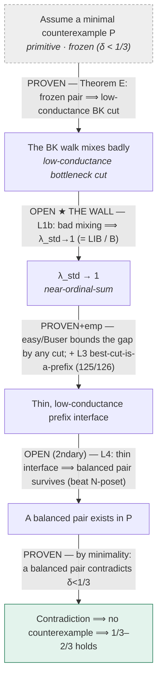

# 1/3–2/3 Program — State of the Wall

*Canonical state of the spectral / near-ordinal-sum attack on the 1/3–2/3 conjecture. Maintained by pm-onethird; updated on every verdict. Everything here is **any-width** — width-3 is old-repo baggage, not part of this program. Attempts and probes are subordinate to this document.*

Rich rendered version: `docs/state-of-the-wall.html`. Generated 2026-07-19.

---

## The one-paragraph state

Both **endpoints** of a single spectral axis are proven, along with all the machinery that reduces the whole conjecture to **one implication**. Almost every quantity we track — `λ_std`, inversion count, squared displacement, interface thinness, entropy — is the *same axis* ("near-ordinal-sumness") in different units. The balance constant `δ` is a **separate axis** (the counterexample condition). The entire remaining gap is the one **bridge** between them:

> **L1b (the wall):** `δ(P) < 1/3` ⟹ `λ_std → 1`  — for which `E[inv_e] = O(n/γ)` (LIB) and `E[Σ disp²] = O(E[inv_e])` (B) are *sufficient*, in that strength order: **(B) ⟹ LIB ⟹ `λ_std → 1`**, one-way (see § *The single lemma to prove*; these were previously written as equivalent).

It is hard because it must use that `σ` ranges over a **real poset's** linear extensions — it is *false* for abstract frozen distributions.

---

## Two axes, one bridge

- **Axis 1 — near-ordinal-sumness** (how close to an ordinal sum): `λ_std → 1`, `inv_e = O(n)` (LIB), `Σ disp² = O(inv)` (B), interface `Δ₁ → 0`, cross-cut entropy → 0. Tied together by the exact identities below — but **not all mutually equivalent**: `(B) ⟹ LIB ⟹ λ_std → 1` is one-way (row 8, § *The single lemma to prove*).
- **Axis 2 — balance / frozenness** (the counterexample condition): `δ(P) < 1/3` = frozen = no balanced pair = every incomparable pair is `>2/3`-decided toward `e`.

**Equivalence dictionary** (why "many things tried" is one gap wearing many faces):

- `Σ disp² = 2ΣK_m + 2ΣM_{k,l}` — exact (GID)
- `ΣK_m ≤ inv ≤ 2ΣK_m` — exact (DG)
- `Σ prefix-violations = footrule ≍ inv`
- `λ_std = 1 ⟺ ordinal sum ⟺ incomparability graph disconnected`
- `S_P = ρ_std(η_P)` — the gap lives in the standard sector

---

## Glossary (do not conflate δ and Δ)

| symbol | meaning | axis |
|---|---|---|
| `δ(P)` | balance constant: `max` over incomparable pairs of `min(p, 1−p)` — balance of the *most-balanced* pair. `< 1/3` = frozen. | **Axis 2** |
| `Δ₁(A)` | interface fatness of a cut: `E|A∖σ(A)| / min(|A|,|Aᶜ|)`. A *cut-geometry* property. **Not** `δ`. | Axis 1 |
| `λ_std` | top eigenvalue of the symmetrized transport operator on `1⊥`. `→1` = near-ordinal-sum. | Axis 1 |
| `inv_e(σ)` | Kendall distance: incomparable pairs flipped vs the distinguished order `e`. | Axis 1 |
| `disp(x)` | `pos_σ(x) − rank_e(x)`. `Σ disp²` is the (B) quantity. | Axis 1 |
| `e` | distinguished linear extension: the `>2/3`-majority order all biases align with. Reference, not a choice. | frame |
| `frozen` | `δ < 1/3`: every incomparable pair `>2/3`-decided. Minimal-counterexample condition. | Axis 2 |
| `primitive` | incomparability graph connected ⟺ not an ordinal sum ⟺ `λ_std < 1` (strictly). Minimal counterexamples are primitive. | structure |
| `R` | the (B)-ratio `E[Σ disp²]/E[inv]`. Large `R` = heavy displacement tail. | Axis 1 |
| `log e(P)` | poset entropy = `log` #linear-extensions = `log` vol(order polytope). *Joint*-law quantity. | geometry |

---

## The proof, and what's proven

```mermaid
flowchart TD
    A["Assume a minimal counterexample P<br/><i>primitive · frozen (δ &lt; 1/3)</i>"]:::assume
    B["The BK walk mixes badly<br/><i>low-conductance bottleneck cut</i>"]
    C["λ_std → 1<br/><i>near-ordinal-sum</i>"]
    D["Thin, low-conductance prefix interface"]
    E["A balanced pair exists in P"]
    F["Contradiction ⟹ no counterexample ⟹ 1/3–2/3 holds"]:::concl
    A -->|"PROVEN — Theorem E: frozen pair ⟹ low-conductance BK cut"| B
    B -->|"OPEN ★ THE WALL — L1b: bad mixing ⟹ λ_std→1 (= LIB / B)"| C
    C -->|"PROVEN+emp — easy/Buser bounds the gap by any cut; + L3 best-cut-is-a-prefix (125/126)"| D
    D -->|"OPEN (2ndary) — L4: thin interface ⟹ balanced pair survives (beat N-poset)"| E
    E -->|"PROVEN — by minimality: a balanced pair contradicts δ&lt;1/3"| F
    classDef assume fill:#eee,stroke:#999,stroke-dasharray:4 3;
    classDef concl fill:#e3f3ec,stroke:#1f7a54;
```

Two links are open (**L1b** primary, **L4** secondary); the rest are proven or empirical.

**Machinery L1b's reduction stands on** (all proven, any-width): **standard dominance** (gap lives in the standard sector, so a combinatorial bound controls `λ_std`), **(A) SPREAD** `‖r‖² = Ω(n³)`, and the exact identities **GID** + **DG**.

### Full ledger

| # | Result | Status | Width |
|---|---|---|---|
| 1 | `λ_std = 1 ⟺ ordinal sum` | **proven** | any |
| 2 | ordinal sum ⟺ incomparability graph disconnected (primitive = negation) | **proven** | any |
| 3a | `S_P = ρ_std(η_P)` (gap in the standard sector) | **proven** | any |
| 3b | standard **dominance** (that block carries the 2nd eigenvalue) | empirical (0/132) | n ≤ 7 data |
| 4 | (A) SPREAD `‖r‖² = Ω(n³)` | **proven** | any |
| 5 | easy/Buser `1−λ_std ≤ n·leak(A)/(|A||Aᶜ|)`, every cut | **proven** | any |
| 6 | Theorem E: minimal counterexample ⟹ low-conductance BK cut | **proven** | any |
| 7 | identities GID & DG | **proven** | any |
| 8 | **L1b — the wall**: frozen ⟹ `λ_std→1`. Sufficient conditions, **one-way**: **(B) ⟹ LIB ⟹ `λ_std→1`**. The reverse arrows are **UNPROVEN — not merely absent** (see § *The single lemma to prove*) | **OPEN** | any |
| 9 | L2 standard-eigenvector monotonicity | false as stated (2/126) | n=6 data |
| 10 | L3 best-cut-is-a-prefix | empirical (125/126) | n ≤ 6 data |
| 11 | L4 near-ordinal-sum stability ⟹ balanced pair survives. **As literally stated it closes Step 6 only through its trivial branch (i)**: branch (iii) needs restating as *exact* preservation in `[1/3,2/3]` (the source's own `:476–479` and `:567–569` already read that way — an internal drafting inconsistency, not an architectural defect), and **branch (ii) is unconsumed by Step 6's stated transfer for *every strictly positive* modulus — UNCONDITIONAL, and the `Ω(ε)` condition is DISCHARGED** (mg-3af9, audited mg-c8c6 — see that row): `F(ε) = ε/4` and every `F(ε) = o(ε)` are included, via the witness **`W*`**, which lives arbitrarily far **outside** the `Δ₁·n < 2` regime the earlier witness `W` provably could not leave. The only escape is `F ≡ 0`, which reads (ii) as *exact* ordinal sum — that makes L4 a **strictly stronger** conjecture, it does not repair Step 6. (The conditional form this clause used to carry was mg-63e3's, audited mg-f825; it was correct at the time and is now superseded, not corrected.) **The earlier *"with no repair available"* is STRUCK at this site**: it was mg-e35c F3's, it named a property of the branch where only a property of the branch's *statement* had been established, it never tested the ordinal-sum route, and a candidate repair **(IB)** now exists. Separately and **modulus-free**: branch **(iii) as a *standalone universal* is refuted at every `ε > 0`, for every modulus** — (iii) is a disjunct and was never asserted standalone, so this kills the standalone reading and every `ε`-calibration of it, not L4 | **OPEN** (AMBER) | any |

**Width-3 baggage to keep out:** (i) the deleted pre-`a7c5` certificate crutch (≤2-chain Dilworth + constant-2 Cauchy–Schwarz, carried a fatal factor-`n`); (ii) the side "cuts-by-pairs C2" route (BK-transport option, genuinely width-3); (iii) the separate *finished* width-3 Lean paper. The skeleton above has zero width dependence.

---

## The single lemma to prove

**Poset-LE displacement anti-concentration** (any width). For every finite poset `P` with distinguished order `e` and `δ(P) < 1/3`, `σ` uniform on `L(P)`:

- **displacement face (B):** `E[ Σₓ (pos_σ(x) − rank_e(x))² ] = O( E[ Σₓ |pos_σ(x) − rank_e(x)| ] )`
- **inversion face (LIB):** `E_σ[ inv_e(σ) ] = O( n / γ )`

"A random linear extension of a real, 2/3-frozen poset stays close to its reference order — no heavy displacement tail / only linearly many inversions." **Either alone suffices** — but the two faces are **not** logically independent (corrected 2026-07-29; mg-a58f Thm 3.3, audited mg-d112 CONFIRMED). **(B) ⟹ LIB**, elementary and unconditional, and in the footrule form stated above it is one line: write `D := E[Σₓ|disp|]`; Cauchy–Schwarz gives `D ≤ √(n·E[Σₓ disp²]) ≤ √(nCD)`, so `D ≤ Cn`, and Diaconis–Graham's `inv ≤ footrule` gives `E[inv_e] ≤ D ≤ Cn` = LIB, `γ`-free. So **(B) is the strictly stronger face and LIB is the one to attack.** The converse `LIB ⟹ (B)` is **UNPROVEN — not merely absent**, and it *fails as an inequality between the quantities*: on `W_m = C_m ⊔ C_1` (a chain plus one free point) `max_x b_x ≤ 1` and `E[inv_e] = Θ(n)` while `max_x m_x = Θ(n)` and (B) fails by `Θ(n)` through the variance term. *(Caveat, carried from the audit: `W_m` has `δ = 1/2`, so it separates the two **quantities**, not the two frozen-conditional **statements** — which is why the converse is recorded as unproven rather than false.)* Both this line and ledger row 8 previously asserted an equivalence; they are reconciled together here.

**Forced hypotheses:** real-poset LE measure · `δ < 1/3` · distinguished order `e`.

**Why it is hard (obstruction 4):** both faces are false for abstract frozen distributions (a two-atom law has every pair frozen yet `Θ(n²)` inversions). So the proof *must* use that `σ` ranges over a genuine poset's linear extensions. This kills marginal-only tools (slot-law log-concavity numerically false; FKG/XYZ wrong-signed). The untried handle: **weak-Bruhat convexity / Stanley absolute-position AF log-concavity** forcing the slot probabilities to decay.

---

## Attempt index (so nothing is re-walked)

| verdict | attempt | note |
|---|---|---|
| **DROP (tractability only)** | width ≥ 4, n ≥ 10 residual gap (mg-c47a, audited mg-7d24) | The residual gap left open by mg-0eac. Dropped as an operational call on **tractability grounds alone**. **Do not repeat the reason the deliverable led with:** it argued Q1's strongest form ("low δ forces width ≤ 2") is logically equivalent to the conjecture modulo Sah — *equivalence CONFIRMED* (Obs 3.1(a)/(b)) — and concluded a programme pursuing it "goes in a circle". **That inference is REJECTED: equivalence of statements says nothing about difficulty of proofs.** Also: sec.0 called statement (2) "the form that would dissolve the residual gap"; it is not — the gap is width ≥ 4, dissolving it needs (3), and (2) proves the *whole* conjecture. The "shrinking trend" support is circular (see below) and is withdrawn. |
| **PROVEN (keep)** | low-δ ⟺ bounded-width equivalence (mg-c47a Obs 3.1(a)/(b)) | Genuine result, audit-CONFIRMED, worth keeping independently of the DROP call it was used to justify. |
| **CORRECTION to merged work** | C.md sec.9.5 "all-width min δ" row | **Not all-width at n = 10, 11** — C.md:334 says all widths are "not covered here" and 37/106 is the *width ≤ 3* minimum. Caught by mg-7d24, **missed by the earlier mg-0eac audit**. Consequence worth carrying: the n=10 cell is what makes "shrinking" look like a trend, and its true all-width value requires exactly the width ≥ 4 search that was dropped — so that support is circular and must not be cited. Repair tracked in mg-8ff1. |
| dead end | Bruhat-convexity "prefix ⟹ O(n) inversions" | collapses to Diaconis–Graham; prefix/footrule/inversions are one equivalence class — no easier target |
| avoid this aim | balance → `log e(P)` aimed at `δ` directly | the Kahn–Saks/Kahn–Linial line, stuck at `δ ≥ 0.276` for 30 years; program built to escape it |
| **untried · open** | entropy / order-polytope aimed at the *conditional* inversion sum | deliverable: joint→marginal bridge `log e(P) → E[inv_e]`; Young-lattice/"harmonic-area" decode here |
| **untried · convergent target** | convexity / order-polytope forbids the **flat slot law** | convexity kills the two-atom witness + positivity kills the *exact* block-cross, but both are silent on the *approximate flat tail* (the real LIB-violator); weak-Bruhat convexity + Stanley absolute-position AF untried |
| dead ≠ AF | slot-law log-concavity of `e(P_m)` | numerically false (Neggers–Stanley, relative-to-chain) — does **not** touch Stanley's *absolute*-position AF log-concavity |
| **untried · new object** | incomparability-graph conductance → `δ` / inv-sum | "primitive ⟹ good mixer" in `λ_std` is *refuted* (primitives reach `λ≈0.96`); the incomparability graph's own expansion is unexamined |
| **AMBER · diagnostic (mg-a1ec)** | entropy-discontinuity mechanism (doc: `OneThird-EntropyDiscontinuity-Mechanism.md`) | Genuine new lemmas (audited correct): conditional-uniformity insertion law; exact per-element entropy decomposition; **(B) collapses to a first-moment `Σaₓ² = O(Σaₓ)` via the *live* Stanley absolute-position AF** (closes the "AF untried" gap); Blocking-Dichotomy trichotomy on the flat tail. Sharpest finding: **AF is *saturated*** — the fatal flat law and the KL `1/φ` optimum are *both* Stanley equality cases, so no AF *inequality* can separate them; the sole remaining lever is AF **equality-case** theory (Ma–Shenfeld 2211.14252). **Closes no open step** (diagnostic, not progress); correctly confronts the two-atom law without over-claiming. **Citations checked:** Sah width-2 gap + constants (λ=(−3+5√17)/52≈0.33876, β≈0.348843, 𝟏⊕ℰ exception) — **accurate ✓**. Ma–Shenfeld 2211.14252 — **verified ✓**, it characterizes the extremals of *Stanley's inequality* for linear-extension counts (a poset specialization of AF), exactly the equality-case lever. **Aires–Kahn 2509.11549 `O(log n)`-minimals — MISATTRIBUTED ✗** (that paper proves ω(log n)-minimals ⟹ δ→1/2, a sufficient condition for *balance*; no frozen-poset structure theorem) — any doc step leaning on it is void. |
| **GREEN-partial · diagnostic (mg-48ab)** | AF equality-case (Ma–Shenfeld) vs the frozen hypothesis (doc: `OneThird-AF-EqualityCase-MaShenfeld.md`) | Ma–Shenfeld 2211.14252 read + used correctly. New **Window Rigidity Lemma** + **Theorem 5.2: a full-support flat *absolute-position* law ⟹ δ ≥ 1/3** — proof independently verified, **non-circular**, sharp at tight3. **BUT the hypothesis is the exact Stanley-equality endpoint** (Cor 3.2: `x` is a free element in an ordinal sandwich `D(x)⊕Q⊕U(x)`; the conclusion is ≈folklore) — it excludes only the `r=1` exact point and does **NOT** close L1b: the conjecture-relevant *approximate* flat law (`θ = 1−1/n`) is untouched. **Residual = a k=1 quantitative *stability* theorem for Stanley's inequality (a rate on the deficit), which the doc reports does not exist in the literature — a precise *relabeling* of the whole hard part, not a reduction.** 2nd honest gap: object mismatch (MS governs *absolute*-position `N_i`; the arc's actual residual is the `ρ_s` *gap* law, a different sequence whose log-concavity is false). Corrects mg-a1ec Finding 5.4 (Correction 2.1: geometric ray is NOT a realizable equality case) and quarantines the misattributed Aires–Kahn step. The MS Thm 1.3(iii)/Rem 1.8 citation is now **verified ✓** (checked verbatim against the paper: equality ⟹ companions incomparable; k=1 ⟹ every poset supercritical; equality forces flat `r=1`, geometric ray excluded; and the paper has **no rate/stability version** — confirming the residual is genuinely open here). Sound because the argument is at k=1 (Ma–Shenfeld Ex. 1.4 shows k≥3 would break it). |
| **RED-for-residual · AMBER-redirect (mg-dcae, verified sound)** | k=1 Stanley-stability scoping (doc: `OneThird-k1-Stanley-Stability-Scoping.md`) | The mg-48ab residual — an *unconditional* k=1 stability bound `N_i² ≥ (1+cΦ)N_{i−1}N_{i+1}` — is **REFUTED by hand** (verified in full): for `P = C_n⊔C_n`, `x=min` of one chain, at i=2, `Φ₂=1/2` exactly while deficit = `1+1/(2n−1)`, so `deficit/Φ ∼ 1/n → 0` (exact `N_{1+j}=C(n−j+m−1,m−1)`; n=2 enumeration confirms). It fails **only unconditionally** (`C_n⊔C_n` has δ=1/2, maximally *unfrozen*), so the **frozen-conditional wall is untouched** — and **mg-48ab's reduction is proven circular** (a hypothesis-free Stanley-stability tool cannot exist; the residual *is* the frozen-conditional single lemma). Route survey (sound): AF-stability DEAD (Shenfeld–van Handel: needs a spectral gap, operator has no compact resolvent), combinatorial atlas priced-out, injective route **not** blocked by "defect∉#P" (that forbids an exact interpretation, not an inequality). **New verified lead — variance/bias decomposition:** `E[Σdisp²] = Σ Var(pos_x) + Σ(h(x)−rank_e x)²`, and under (H) the variance diagonal is `Θ(E[inv])` *free*, so **(B) ⟺ (B-cov)+(B-bias) = O(E[inv])`**. `(B-bias)` is a new obligation with a clean first lemma (**Prop 5.4:** `max_x Σ_{y∥x} Pr[{x,y} inverts] = O(1)` — no Stanley/AF input); `(B-cov)` = the known wrong-signed same-side-covariance wall (FKG/XYZ). Exemplary citation hygiene. |
| **INERT · proven (probe A, mg-61bb)** | can the frozen/coherence fact improve the Kahn–Saks 0.2764 bound? — ISOLATED elementary probe | **No, provably.** Coherence buys the *old* argument nothing: it is a logical *consequence* of δ<1/3 (same poset class — shrinks it by zero); zero content on the ≤3 elements KS/BFT sees; its only residual — subadditivity of balances `β(u,w)≤β(u,v)+β(v,w)` — is a system of *upper* bounds a chain satisfies, so it can never force a positive lower bound. The rigorous form of "the distinguished order is **redundant as data**." Clean isolation. |
| **PROVEN bounds (probe B, mg-92e6)** | doubly-stochastic position-matrix / majorization — ISOLATED elementary probe | New **diagonal-capacity** bound `δ ≥ ½(T[x,k]+T[x,k+1]+T[y,k]+T[y,k+1]−1)⁺` — proven, tight, nontrivial, independent of the empirical sweep; certifies δ≥1/3 on ~19% of n=7 posets. Also pins the exact *marginal-only* ceiling (max-flow), which dies as the pair spreads — the extra juice is one joint fact (adjacency symmetry `J(k,k+1)=J(k+1,k)`). Uses the position matrix as an *elementary* object only (no spectral). |
| **PROVEN · modest, correctly scoped (probe C, mg-f82f)** | a new direct entropy count on the coherent order — ISOLATED elementary probe | **Coherence-load-bearing** count: run the union bound over the `s ≤ n−1` *free slots* of the coherent order `e` (not ~n² pairs) ⟹ `δ ≥ (1−1/e(P))/s`. **Proves the full 1/3–2/3 conjecture for s ≤ 2**; gives `δ ≥ 5/18 ≈ 0.278 > 0.2764` on part of the s=3 family (verified exactly). **NOT a global record beat:** the extremal posets have `s ≥ 4`, where the count dies (`≤ 1/s`). **Open lead:** Window conjecture **W3** (`p ≤ 1/3` on a 3-window of adjacent free slots) + probe B's bound ⟹ full conjecture for posets with two adjacent free slots; W3 is tight to n≤6 but unproven (isolated-slot case is the genuine residual). |
| **SOUND negative (probe D, mg-e2de)** | incomparability-graph local geometry — ISOLATED elementary probe | One genuine graph-only theorem: **co-degree ≤ 1 ⟹ δ ≥ 1/3** (so frozen ⟹ every edge of G has co-degree ≥ 2, i.e. G is locally dense) — but it **provably stops**: the best local bound decays like `2^{−m}` (via `C_p ⊔ C_q`), collapsing to `1/6` at co-degree m=2, exactly where frozen posets sit; the first-moment degree/Cheeger budget `Σ_x(E[pos]−rank) = Σ_edges(Pr+Pr−1)` is **identically 0** (inert); small cuts give only `δ(A⊕B)=max` (ordinal-sum-inert). And **G doesn't even determine δ** — verified n=6 witness: two posets, isomorphic incomparability graph `K_1∨(P_3⊔2K_1)`, `e(P)=18`, but **`δ = 4/9` vs `1/2`**. Mechanism: G measures an element's positional *spread*, while δ is about its *location* (offset `d⁻(x)`) — structurally the wrong object. |
| **SOUND negative · actionable (mg-210d)** | best *constant* lower bound on `λ_std`, primitive/frozen — ISOLATED elementary probe (doc: `probe-lambda-constant-bound.md`) | **Best constant this route proves = `0`.** Master bound (re-derived from scratch, sharp): `1−λ_std ≤ 3·E[footrule]/(n²−1) ≤ 6·E[inv]/(n²−1)`, equality at the antichain. Frozen ⟹ `λ_std > 1 − d·n/(n+1)` (`d = m/C(n,2)` = incomparability density), but `d ≤ 1` degenerates it to `1/(n+1)` — positive, **not constant**. **Connectivity is wrong-signed:** primitivity gives `m ≥ n−1` — a *lower* bound on the pair count — which *degrades* the bound `O(1/n)`; a non-degeneracy hypothesis, not a quantitative lever. **Sole missing ingredient = Residual (R): is there a constant `D < 1` with density `d(P) ≤ D` on every *frozen* poset?** ⟹ `λ_std > 1 − D` immediately. (R) open: entropy + inversion-counting attacks both fail; pinning-cost heuristic supports; antichain (`d=1`) is *not* frozen, so freezing does spend density. **Free by-product (= our 3-cycle anchor, independently re-derived): frozen ⟹ the majority relation is automatically a linear extension**, and `1/3` is exactly the threshold — the distinguished order is *canonical*, not chosen. **Honest caveat RETIRED (mg-88bd, audited mg-e35c — F8; see that row).** This row used to carry *"(R) ⟹ a constant `λ_std`, which does **not** by itself give `δ` (rate ≠ the problem; the `λ_std → δ` conversion stays open)."* That is **false as stated**: the `λ_std → δ` conversion *is* Steps 3–6 of the architecture, and backward derivation from L4 shows Steps 3–6 consume **a constant** — `1 − λ_std ≤ ε_spec`, absolute and uniform in `n` — not a limit and not a rate. So a constant `λ_std` **is** the currency the downstream consumes, and (R) with `D ≤ ε_spec` would discharge Step 2, which is the wall. **Do not over-correct: (R) is not thereby sufficient.** Its insufficiency moves from **categorical** ("even if proven, it is the wrong kind of object") to **quantitative** ("it is the right kind of object, and the open question is whether the constant it delivers is good enough") — `D ≤ ε_spec`, which for a *primitive* poset (`d ≥ 2/n`) additionally forces `n ≥ 2/ε_spec`. **A door recorded as the wrong shape is now the right shape with the wrong size:** (R) is reopened as a live quantitative question, not closed. The row's own verdict is untouched — "best constant this route proves = 0" survives, and robustly, since the route's *unconditional* output is `1 − λ_std < d·n/(n+1)` with `d ≤ 1`, i.e. `ε_spec < 1`, useless against **any** constant target `< 1` whatever its value (audit F9 — a constant-free argument, so it does not ride on the unpinned budget). All four load-bearing claims hand-verified; scripts benign (n≤7, no dataset). |
| **RED-for-lever · AMBER-redirect · CORRECTS MERGED WORK (mg-a58f; audited mg-d112 — CONFIRMED, 40 ledger rows re-derived, 0 BROKEN)** | (B-bias) `O(1)` locality lemma (doc: `OneThird-Bbias-Locality-Lemma.md`; audit: `OneThird-Bbias-Locality-Lemma-IndependentAudit.md`) | **⚠️ Largest item first — (B) IMPLIES LIB (Thm 3.3, elementary, unconditional):** `E[inv_e] ≤ E[Σ\|disp\|] ≤ √(n·E[Σdisp²])` by the lower half of Diaconis–Graham + Cauchy–Schwarz, so (B) with constant `C` forces `E[inv_e] ≤ Cn`. (The audit verified this holds under **either** statement of (B) — the inversion form used in mg-dbd1/mg-8201 *and* the footrule form this document uses.) **Four corrections:** (1) **this document's § *The single lemma to prove* line — "the two faces are logically independent" — is false in one direction**; (B) is the *stronger* face. **Ledger row 8's `⟺ LIB ⟺ (B)` was the same error, and the two contradicted each other**; both are reconciled in this pass to the one-way implication, with the reverse marked UNPROVEN (mg-d112 §6.1: annotating one and leaving the other standing would have left the inconsistency in place). (2) mg-dbd1 §2.1's "(B) is weaker than LIB" is **REFUTED**. (3) The (A)+(B) route's advertised advantage — "tolerating quadratic `E[inv_e]`" (mg-dbd1 §0/§5, mg-8201 §2) — is **vacuous**: (B) is unsatisfiable when `E[inv_e] = ω(n)`, so the stated reason for abandoning LIB does not hold. (4) Given (B), the mg-210d master bound alone yields `1−λ_std = O(1/n)`, so **(A) SPREAD and `Λ = O(1)` are off the critical path** (both still true; (F2) simply postdates the certificate). **Net: LIB is the weakest of the *three* sufficient conditions on the table** — the set being `{locality, (B), LIB}` — **and alone suffices; both objects the (A)+(B) route has attacked since mg-8201 — (B) and the locality lemma — are strictly-at-least-as-strong surrogates for it.** *(Restricted per mg-d112 §4.1: this does **not** extend to everything the program has attacked since mg-8201 — mg-4a86's standard-dominance/Wilson comparison route, mg-210d's (R), and the entropy probes are **not** LIB surrogates. The unrestricted universal was false and is not recorded.)* And `λ_std → 1` as stated here needs only **(LIB-weak)** `E[inv_e] = o(n²)` — never attacked by any arc. **Scoping question flagged, not picked — since ANSWERED (mg-88bd, audited mg-e35c; see that row):** this document states the conclusion as a limit, mg-7ae7 states the operative target as the rate `1−λ_std ≤ C/(γn)`; those differ by a factor `n` in the inversion requirement and pm-onethird owned pinning which one L4 consumes (extract mailed under mg-1fdb). **Answer: neither.** Backward derivation from L4 fixes the operative requirement as `1 − λ_std ≤ ε_spec` for an absolute constant uniform in `n` — the source's own Step-2 form — so **both of the corpus's asymptotic renderings, the limit here and mg-7ae7's rate, are genuinely stronger than the architecture needs** (conditionally on L4-as-stated, which is itself OPEN/AMBER). **On the ticket's own target: the lemma implies the wall.** `Σ_x m_x = 2E[inv_e]` identically, so `max_x m_x ≤ C` ⟹ `E[inv_e] ≤ Cn/2` = **LIB** (γ-free) ⟹ (mg-210d master bound) `1 − λ_std ≤ 3Cn/(n²−1) → 0` = L1b's conclusion. So it is **not** an elementary reserve route below the crux; it is at least as strong as the crux, and it silently re-imposes the `E[inv_e] = O(n)` requirement mg-8201 retired as "structurally unnecessary". All three arcs that recommended it (mg-dbd1 §5.1, mg-dcae §7.2, mg-0ed7 §7.5) mis-priced it. **The lossy step is located exactly:** both derivations bound the per-element **bias** `b_x = \|E[pos_σ x] − rank_e x\|` by the per-element **inversion mass** `m_x` *before* taking the max, discarding the cancellation between `e`-above and `e`-below inversion mass — worth a factor `n` (witness `C_m ⊔ C_1`: `max b_x ≤ 1`, `max m_x = Θ(n)`, `E[inv_e] = Θ(n)`, all exact by hand). **Redirect — (EQ):** `max_x \|E[pos_σ(x)] − rank_e(x)\| = O(1)`. Proven here: (EQ) ⟹ (B-bias) (unconditionally); (EQ) ⟹ mg-dbd1 §3.4's auxiliary `Λ = O(1)`; (EQ) is exactly the negation *at every element* of mg-dbd1 §3.1's named (B)-falsifier (which was stated only at the `e`-min, where `b_x = m_x`); (EQ) is strictly weaker than the locality lemma. Leaves **(B-cov)** as the sole residual on the certificate route — the same edge this document already names, reached without over-shooting. Also new: `m_x = E\|σ_{<x} Δ D_x\|` (per-element leak identity); conditional-uniformity window bound `locality ⟹ E[W_x] = O(1)`; the 3-element system is provably inert (satisfied by the two-atom law with `m ≡ ε`). Kills none of the three routes to (B-cov); withdraws the side-door three arcs recommended. Zero computation. **Audit additions (mg-d112, free):** (EQ) ⟹ `E[L_j] ≤ C₀·min(j, n−j)` per prefix cut — a genuine consequence the deliverable did not record, and it shows (EQ) does **not** deliver LIB by the natural analogue of Thms 3.2/3.3 (it gives only the trivial `Θ(n²)`), so the AMBER redirect survives the deliverable's own re-pricing check. §7.3's insufficiency claim downgraded PROVEN → **PLAUSIBLE** (rests on the `Θ(√m)` HEURISTIC rate); nil consequence. |
| **OVERSTATED · core CONFIRMED-conditionally · RE-SHAPES (R) (mg-88bd, no computation; audited mg-e35c — 0 BROKEN mathematics, 2 BROKEN label/attribution derivations)** | the **operative `λ_std` form**, by backward derivation from L4 (doc: `OneThird-lambda-std-Operative-Form.md`; audit: `OneThird-lambda-std-Operative-Form-IndependentAudit.md`) | **The form, and it is CONDITIONAL — record the condition, not just the form.** The architecture consumes `1 − λ_std ≤ ε_spec` for an **explicit absolute constant, uniform in `n`** (in inversion terms **(LIB-const)** `E[inv_e] ≤ (ε_spec/6)(n²−1)`, equivalently `E[footrule] ≤ ε_spec·E_unif[footrule]` — a constant-factor improvement on the uniform-random value). **CONFIRMED — but conditionally, and the condition is heavier than the deliverable conveys:** this is what the *stated* architecture consumes, and **L4-as-stated (row 11, OPEN/AMBER) is itself the thing whose provability at an `n`-free modulus is in doubt.** The form is *not* settled with the only open question downstream; if L4 needs an `n`-dependent modulus the answer flips. (Audit F1: §3.3 refutes a steelman for `n`-dependence, but not the strongest one — the leakage-*count* objection `εk = O(1)` lives inside branch (iii), the branch Step 6 actually consumes, and §3.3's "the only route … is branch (ii)" is a false universal.) **It is the source's THIRD form, not a fourth** (audit F4): Step 2's own form, applied to the single hypothetical minimal counterexample, where there is no quantifier over `n` to be missing. **The genuine news is about the corpus's two asymptotic renderings** — this document's limit (`λ_std → 1`) and mg-7ae7's rate (`1 − λ_std ≤ C/(γn)`) are **both genuinely stronger than the architecture needs**, and mg-7ae7's `1/(γn)` is inherited from Theorem E's *output shape*, not demanded by any consumer. **The durable wins — this is the substance:** (1) **the `ε_spec` / `ε_leak` notation collision, and the square between them.** The source writes `ε` for the spectral `λ_std ≥ 1−ε` and for the leakage `Δ₁ = ε` three lines apart in the architecture; Cheeger relates them by `ε_spec ≤ ε_leak²/2`. Real, verified, and it is what actually **dissolves the limit-vs-rate confusion**. (2) **§4.3: prefix-capture as literally worded is too weak to use** — it yields a constant *floor*, not a small gap, which makes L3's *statement* an open item and not merely its constant. (3) **The `Φ → Δ₁` conversion is the identity, not a bound — CONFIRMED and STRONGER than stated** (audit F7): the source defines `Φ_P` *only* on `0 < \|A\| ≤ n/2`, so `\|A\| ≤ n/2` is not a hypothesis restricting the identity, it is `Φ`'s whole domain — the two symbols are the same function everywhere both are defined. Hence **Steps 4 and 5 state the same inequality about the same number: Step 5 adds no bound, it re-reads Step 4.** **Branch (iii) — arithmetic CONFIRMED, framing OVERSTATED** (audit F2). The arithmetic: (iii) as worded gives `p^P_{xy} ∈ [1/3 − F, 2/3 + F]`, consistent with `δ(P) < 1/3`, so no contradiction for **any** `F > 0`; and `P_0 = {a<b} ⊔ {c}` has `δ = 1/3` with **zero slack**, so minimality cannot be strengthened to supply it. But the source's own L4 in the open-lemma list (`:567–569`, "**preserving** a balanced pair from one side") and its own prose (`:476–479`, "the thin interface **cannot destroy** all such pairs") already read as the repaired form — so this is an **internal drafting inconsistency in the source, not a defect in the architecture's intent**; the repair (restate (iii) as exact preservation in `[1/3,2/3]`, already the predicate mg-3ce3 tested green) is worth landing, "newly-found architectural defect" is not. **The larger Step-6 gap, which the deliverable missed and which was written down nowhere (audit F3): branch (ii) is unconsumed.** L4's conclusion is a disjunction; (ii) delivers a structural statement and no balanced pair, so if (ii) is the branch that holds for some `P` in the hypothesis class, Step 6 has nothing to consume — unlike (iii). Implied by the deliverable's own §3.3 sentence and never drawn. **F3's second half — *"and there is no repair available"* — is now OVERSTATED and is STRUCK (mg-63e3, audited mg-f825 — see that row):** it named a property of the *branch* on evidence about the branch's *statement* only, and it never ran the ordinal-sum route; a candidate repair **(IB)** exists (repaired form — see that row). **The *reason* clause is CONFIRMED and now proven far more strongly** — the transfer's failure is quantitative and survives `ε → 0`, **for every strictly positive modulus** (mg-63e3/mg-f825 proved this at `F(ε) = Ω(ε)`; mg-3af9, audited mg-c8c6, **discharged the condition** — sub-linear moduli included). **So as literally stated, L4 closes Step 6 only via the trivial branch (i)**, which *is* the conclusion. This is the more consequential of the two. **Satisfiability: CONFIRMED non-trivially, with a hand witness the deliverable does not have** (audit §4). `W_n = C_n ⊔ C_1` — a chain plus one free point, the corpus's own `W_m`: **primitive** (incomparability graph is the star `K_{1,n}`, connected, so `λ_std < 1` strictly, not the degenerate case), and **every** prefix is thin at the same rate — `z` lands uniformly in `n+1` slots, so `E\|A∖σ(A)\| = k/(n+1)` and `Φ = Δ₁ = 1/(n+1)` **independent of `k`**, giving `1 − λ_std ≤ 2/(n+1)`. So `W_n` satisfies `1 − λ_std ≤ ε_spec` once `n+1 ≥ 2/ε_spec`, while carrying genuinely non-trivial LE geometry (`E[inv_e] = Θ(n)`). Corroborated independently by mg-3ce3's `8AC ⊕ 8AC`-minus-one-cross witness (`n=16`, `Δ₁ = 0.0019`, `λ_std = 0.996`). **Why the deliverable's own §7.2 did not settle this:** it shows every antichain prefix has `Δ₁ ≥ 1/2`, which excludes vacuity-**by-universality**; the open question was vacuity-**by-emptiness**, and §7.2 does not touch that. **THE FALSE LOSS — "the weakening buys the mg-210d route nothing" is OVERSTATED** (audit F8), and the consequence is landed at the mg-210d row above and in *Second clean residual* below: the weakening converts Residual **(R)** from **categorically** insufficient to **quantitatively** insufficient, because under this document's own verdict **a constant `λ_std` IS the currency the downstream consumes** — *a door recorded as the wrong shape is now the right shape with the wrong size*. The route's *conclusion* survives and more robustly than argued (F9: the unconditional output is `ε_spec < 1`, useless at any constant target — no numeric budget needed). **Two BROKEN derivations of labels/attributions; neither changes a mathematical statement.** **F5** — §6.4's "L4 usable" budget row is BROKEN as labelled and it is the numeric spine of §7: under the *repaired* (iii) the modulus `F` does not appear in the statement at all, so there is no `F(ε_leak) < slack` to calibrate; under the *stated* (iii) the document's own `P_0` proves the slack can be `0`, so no `F > 0` satisfies it; and the row's `1/6` is a *centred* pair's **maximum** used as a guarantee. The consequence is one-directional: the right calibration under the repair is mg-3ce3's first RED, and the probe reports **0 RED / 6681 up to `ε = 0.20`**, supporting `ε_leak ≈ 0.20` hence `ε_spec ≲ 2×10⁻²` — **100× larger than the deliverable's `2×10⁻⁴`, i.e. the error inflates the pessimism.** So **do not carry `2×10⁻⁴` or the `n ≈ 10⁵` crossover as flat text**: the budget is unpinned by ~2 orders of magnitude, the pessimistic reading is the smaller one, and under the repair the crossover falls to `n ≈ 900` — inside the range an unknown minimal counterexample could live. **F6** — the master bound is **misattributed**: it is *not* the source's single test vector `ũ` and it does *not* consume freezing. mg-210d Thm 2.4 builds it from the **unconditional** Buser cut bound with **indicator** vectors `1_A − a·1` (a different vector per cut) over all `n−1` prefix cuts, relaxed by a mediant inequality; `ũ` (`tex:400–424`) is a separate tool that *does* consume `Pr[j≺i] < 1/3` once and yields `λ_std > 1/3`. Two tools merged into one — exactly the Appendix A step-5 object check. Substance CONFIRMED (antichain-sharpness is a limit of the tool, not of the problem — true of the correct tool too), attribution BROKEN, the `PROVEN` label unearned. **Free audit by-products, recorded not acted on:** primitivity (`d ≥ 2/n`) sharpens "the master bound cannot deliver the target for any non-chain poset on `n ≤ 100`" to **`n ≤ 2/ε_spec`** — `10⁴` at the deliverable's budget, `10²` at the repaired one — which is the relevant class since minimal counterexamples are primitive; and the source's own `ũ`, priced for the first time, sharpens "given (B), the master bound yields `1 − λ_std = O(1/n)`" to **`O(1/n²)`** (both bounds still antichain-sharp, so no redirect changes). **Constraint compliance CLEAN** on both documents: one `.md` each, no scripts, no data, no enumeration. **Honest net (the audit's): a genuine notation catch plus a re-pricing — not new mathematics.** |
| **RED-conditional · witness fully CONFIRMED · CORRECTS MERGED WORK (mg-63e3, no computation; audited mg-f825 — OVERSTATED: 0 arithmetic defects anywhere, 1 BROKEN universal, 1 BROKEN premise, 1 candidate lemma REFUTED as stated, 1 unledgered result stronger than the headline)** | can Step 6 consume L4's **branch (ii)**? — the ordinal-sum route, run down (doc: `OneThird-L4-Branch-ii-Consumability.md`; audit: `OneThird-L4-Branch-ii-Consumability-IndependentAudit.md`) | **The result, at the strength that survives audit:** **Step 6's stated transfer cannot consume branch (ii) for any modulus `F(ε) = Ω(ε)`.** That is a real and useful theorem. **⚠️ Its condition is now DISCHARGED — see the mg-3af9 row below**, whose witness `W*` escapes the `Δ₁·n < 2` regime and defeats **every strictly positive** modulus, sub-linear included; the `Ω(ε)` form below is what *this* deliverable established and is kept for provenance, not because the restriction still binds. As of mg-63e3/mg-f825 it was genuinely *conditional* and *almost certainly the operative case* was not what a `PROVEN` row says. **The witness is entirely CONFIRMED** — the auditor rebuilt family **W** from scratch (poset axioms, slot bijection, all thirteen exact rationals, the `n = 8` instance element-by-element, the second both-chains family, the `d_TV` figures): `Δ₁ = 1/n` at `t = 2`, `p^{P[A]}_{xy} = 1/2`, `p^P_{xy} = 1/4`, `{x,y}` the sides' only incomparable pair, `p^P_{x,b_1} = 1/2`, `δ(W) = 1/2`. **No arithmetic defect anywhere.** `W`: `n = 2a`, `A = C_{a−2} ⊕ AC_2`, `B = C_a`, all `A < B` except the crosses `x < b_1, …, x < b_t` deleted; the sides' *entire* supply of balanced pairs is one pair, at exactly `1/2` in `P[A]` and at `1/4` in `P`, and shrinking `ε` does not evade the family (it exists at every `ε = 1/n`). **Structural cause, CONFIRMED and the document's best explanation:** `p_{xy}` is a *global* functional of the poset and `poset ↦ LE-distribution` is **not Lipschitz in the modification count** — in `W`, `y` (half the destroyed pair) participates in no modification; what moves is `x`'s *position law*, since `t` deletions buy `t` slots of slide and slide is exactly what `p` measures. So no bound `\|Δp\| ≤ g(\|S\|)` with `g → 0` can hold. **⚠️ THE UNIVERSAL IS STRUCK — do not restore it.** The deliverable's Cor. 4.3 / ledger claim 13 — *"there is no modulus `F` for which transport is true"* — is **BROKEN as a universal**. Branch (ii) is not a free hypothesis: a poset enters it **only if** `\|S\| ≤ F(ε)n`. Family **W** lives entirely inside `Δ₁·n = 2t/(t+2) < 2`, so it constrains `F` only along its own sequence and **provably cannot refute any modulus with `F(ε) ≤ ε/2`** (element-counting; `2ε` under relation-counting — a factor 4 in the one constant the argument is about, since (ii) counts *elements* and only `x`'s relations change, so `\|S\| = 1` for every `t`). **`F(ε) = ε/4` is an ordinary modulus** — it tends to `0`, and `F(ε)n → ∞` for every fixed `ε > 0`, so branch (ii) is not thereby degenerate — **and `W` says nothing against it.** The correct replacement is a **dichotomy, not a kill**, and the second horn has never been recorded anywhere in the corpus: **either** `F(ε) = Ω(ε)`, and `W` shows Step 6's stated transfer cannot consume (ii) at any `ε`, with no improvement to Steps 2–5 repairing it; **or** L4 holds only with `F(ε) = o(ε)`, in which case branch (ii) is unavailable exactly in the minimal-leakage regime `εn = O(1)` and **L4 is thereby a strictly stronger conjecture than the source's wording suggests**, since shrinking `F` strengthens (ii) *and* (iii) at once. **The route is not refuted; it is priced.** **⚠️ THE `n`-DEPENDENCE CLAUSE IS DELIBERATELY NOT LANDED — this is a decision, not an omission.** The deliverable proposed recording that transport needs `F(ε)n ≤ 1`, *"an `n`-dependent condition, vindicating mg-88bd §3.3's dismissed steelman and tightening it from `O(1)` to `≤ 1`"*. **It rests on an invalid quantifier step.** In **W** the pair `(ε, n)` is **locked** — at `t = 2`, `ε = Δ₁ = 1/n` *identically*, one `(ε,n)` per `a` — so `F(ε) = ε` satisfies `F(ε)n ≤ 1` exactly and is a function of `ε` alone; the inference to `n`-dependence silently re-reads the constraint as holding at *fixed* `ε` for *all* `n`, and the family, confined to `εn < 2`, never supplies such a pair. **The stakes are why this is recorded and not merely dropped:** the mg-88bd row above states that **if L4 needs an `n`-dependent modulus the answer flips** — landing this clause would have flipped a canonical row on a quantifier error, and mg-e35c F1 had flagged §3.3's *dismissal* as a false universal, to which the correct response is not to install the opposite universal. The deliverable's own ledger row 16 already labels the underlying claim family-conditional (`PROVEN for W` · *"conditional as a general claim — a lower bound on the demand, from one family"*), and row 16 is right where row 13 is wrong. **Second BROKEN premise, recorded because it removes Cor. 4.3's stated basis:** *"`1/n` is (up to constants) the smallest nonzero leakage a prefix cut can have"* is **false by a factor of `n`** — hand witness at `n = 8` (chain `c_1<c_2<c_3`; `x ∥` every `c_j` and `∥ b_1`, `x < b_2,b_3,b_4`; `b`'s a chain; every `c < ` every `b`) has 5 linear extensions, `E\|A∖σ(A)\| = 1/5`, **`Δ₁ = 1/20`**, and the family gives `Θ(1/n²)` in general. The witness is undamaged (`Δ₁ → 0` is all it needs), but there is an entire `n`-fold range of leakage scales below `1/n` at which a modulus could be calibrated and at which **W** is silent. **(IB) IS RECORDED IN REPAIRED FORM — the stated version is FALSE and must not be pasted.** As proposed it ended *"…and one may take it to be an **interface** pair"*; that clause is refuted twice — modulus-free at `n = 3` (`P = AC_2 ⊕ C_1`, `A = {u,v}`, `B = {w}`: `P` **is** `P[A] ⊕ P[B]` exactly so every `G ≥ 0` admits it, `Δ₁ = 0`, `p_{uv} = 1/2` balanced, but `P` has **no incomparable interface pair at all** — every exact ordinal sum with a non-chain side does this), and again at `n = 8` with genuine leakage `Δ₁ = 1/20` and one genuine modification (only interface incomparable pair `{x,b_1}` has `p = 4/5`, unbalanced; the balanced pair `p_{x,c_2} = 2/5` has **both** endpoints in `A`). **The defect is the interface clause, not the lemma's substance**, and the fix is free — which is precisely why it was made before the row landed. **Recorded form — *(IB) Interface Balance (repaired)*: there is a modulus `G` such that if `P` is not a chain and `P` is within `G(ε)n` interface modifications of an ordinal sum `P[A] ⊕ P[B]` across a cut with `Δ₁(A,B) ≤ ε`, then `P` has a `1/3`-balanced pair — and *if no side of the cut supplies one*, it may be taken at the interface.** (Also dropped: the dead quantifier `c > 0`, which never reappeared.) The half that actually consumes branch (ii) — *"`P` has a `1/3`-balanced pair"* — **survives every attack the auditor made**. **(IB) would consume branch (ii)** and is the only candidate on the table that does; **(IB) is minimality-free** — checked for relocated minimality, there is none — **hence a special case of the 1/3–2/3 conjecture itself, not a reduction of it**, so on branch (ii) the architecture is *"Steps 2–5 reduce to the near-ordinal-sum subclass; Step 6 proves the conjecture there outright"*, and minimality is spent **once** (starting the spectral chain), not twice. (IB) is new, unproven, implied by nothing in L1–L3, appears nowhere in the corpus, and is supported by two hand families and nothing else — the boundary case `t = 0`, which refutes the interface clause, was never tested. **⭐ THE DELIVERABLE'S STRONGEST CLAIM, missing from its own ledger, and it is MODULUS-FREE: branch (iii) as a *standalone universal* is refuted at every `ε > 0`, for every modulus.** (iii)'s hypothesis is `Δ₁ ≤ ε` **alone** — no `\|S\| ≤ F(ε)n` clause (verified at `:471–472`) — **so the quantifier objection above does not touch it.** For every `ε > 0` take `n ≥ 1/ε`: **W** at `t = 2` has `Δ₁ = 1/n ≤ ε`, its only side balanced pair sits at exactly `1/2` in `P[A]` and `1/4` in `P`, and the repaired predicate (`p^P ∈ [1/3,2/3]`) fails outright. This **upgrades the deliverable's tentative §9 flag into a theorem: no `ε` calibrates the repaired branch-(iii) predicate.** **Consequence, flagged and deliberately NOT resolved here — OPEN ITEM against mg-e35c F5:** whatever mg-3ce3's **0 RED / 6681 up to `ε = 0.20`** measured, **it is not the threshold of a true statement** — so **mg-e35c F5, which used `ε ≈ 0.20` to move `ε_spec` by two orders of magnitude (see the mg-88bd row above), needs re-examining on its own terms.** No re-examination attempted here; this is the pointer. **Routing the `n = 8` falsifier to mg-3ce3 — carry BOTH hypotheses or the check is run against the wrong one.** (a) *family selection*: antichain sides are structurally insensitive (removing one cross from `AC_a ⊕ AC_a` shifts a side pair by `O(1/a²)` — labelled HEURISTIC — whereas `W`'s freed `x` slides past a whole chain segment), and **one** cross removal is exactly the zero-slack boundary (`t = 1` lands on `p = 1/3`, `t = 2` breaks it), so an `AC ⊕ AC`-minus-one-cross family **cannot** produce this RED; **(b) the frozen restriction — `δ(W) = 1/2`, so `W` may simply be out of the probe's class, in which case there is no discrepancy at all.** (b) is at least as likely as (a), is one line from facts the deliverable had already established, and the deliverable never considered it. **Owner: pm-onethird to route to mg-3ce3, carrying both.** **KEEP VERBATIM — the deliverable's durable contribution, and all of it correct:** (1) the **C1/C2/C3 separation** (C1 = branch (ii)'s own statement delivers no balanced pair; C2 = Step 6 as written consumes (ii); C3 = *no* argument can consume (ii)); (2) the **explicit declining of C3** — NOT ESTABLISHED, here or in mg-e35c; (3) ***"`W` refutes implications, not theorems"*** — L4 itself survives via branch (i) (`{x,b_1}` has `p = 1/2`, `δ(W) = 1/2`) and the 1/3–2/3 conjecture is untouched; (4) ***"do not record this as 'branch (ii) is unrepairable'" — that is a different claim and it is not established***; (5) **§7 property 5** — *in a minimal counterexample the rescue mechanism is exactly what is excluded*: if `δ(P) < 1/3` then every incomparable pair is unbalanced, **interface pairs included**, so a minimal counterexample is precisely a `P` where the migration both families exhibit does not happen — **which is either why the class "minimal counterexample + branch (ii)" is empty, or why it is not. That is the live question**, the auditor calls it the best paragraph in the document, and it is unaffected by the (IB) repair; (6) **the scope check passed and the deliverable deserves the credit** — it does **not** strawman: all five cited `.tex` ranges (`:464–474`, `:513–515`, `:527`, `:476–479`, `:567–569`) were pulled and verified verbatim by the auditor; (7) **it did *not* commit the "this route fails ⟹ no route works" conflation it was briefed on** — it guarded the conflation it was warned about and walked into its twin one level down, at the modulus quantifier. **Two calibrations, neither fatal:** Step 6's licence is L4, not minimality (minimality supplies the *side* pair at `:476–477`, near-ordinal-sum stability supplies the *transfer* at `:514`); and *"the `⟹ balanced pair by minimality` box at `:527` is **wrong** on branch (ii)"* overshoots — `:478–479` already calls transport *"the task"*, i.e. states it as open, so the exact claim is: **the box at `:527` is justified only on branches (i) and (iii); on (ii) the source's own prose concedes the gap, and this shows the gap cannot be closed by transport at any `F(ε) = Ω(ε)`** (now, per mg-3af9/mg-c8c6, at **every strictly positive** modulus) — open → impossible-by-this-mechanism, still a genuine strengthening. **Untouched:** mg-88bd's `ε_spec` pinning (it prices Step 2's *input*, upstream of the transport failure — claim 31 CONFIRMED); `δ` (Axis 2) vs `Δ₁` (Axis 1) kept distinct throughout. **One coordinate the deliverable introduces and never names, and it is the direct cause of the quantifier failure:** `F` has **two roles** in L4 — a *budget* in (ii) (`F(ε)n` elements) and an *error tolerance* in (iii) (`F(ε)` in probability) — and **only the first admits or excludes a witness.** **Constraint compliance CLEAN** (verified at the commit, not from the document's own sentence): one `.md` each, zero scripts, zero datasets, zero enumerations; every rational hand-reproduced by the auditor. **Ledger tally:** 27 CONFIRMED · 3 CONFIRMED-conditionally · 1 BROKEN · 1 REFUTED-as-stated · 1 omission (its own strongest claim) · 1 ungradeable prose numeric (*"a single deletion moves a pair from `1/3` to `1/2`"* — no derivation, configuration not pinned down; specify or drop) · **0 arithmetic errors**. **Honest net (the audit's): a genuinely good witness and a genuinely informative negative about the ordinal-sum route, carrying one false universal in its headline, one false lemma in its proposed repair, and one true theorem it did not claim. The mathematics is right; the quantifiers are not.** |
| **RED · UNCONDITIONAL · witness `W*` fully CONFIRMED · DISCHARGES row 11's condition (mg-3af9, no computation; audited mg-c8c6 — OVERSTATED, but the headline is CONFIRMED and it is the strongest correct result this arc has produced: 30 CONFIRMED · 4 CONFIRMED-conditionally · 1 BROKEN as scoped, 4 dependents demoted · 1 BROKEN as labelled · 0 arithmetic errors anywhere)** | does a **sub-linear modulus** rescue Step 6's consumption of branch (ii)? (doc: `OneThird-L4-Branch-ii-Sublinear-Modulus.md`; audit: `OneThird-L4-Branch-ii-Sublinear-Modulus-IndependentAudit.md`) | **⭐ THE RED, AT FULL STRENGTH AND UNCONDITIONAL — this is the item that changes program state. No strictly positive modulus rescues Step 6's stated transfer on branch (ii)** — `F(ε) = ε/4` and **every** `F(ε) = o(ε)` included. **Row 11's `Ω(ε)` condition is DISCHARGED and the conditional form is gone.** The architecture as written has a hole here, **independent of L1b**. (Exactly quantified, per the audit: the universal is over every `F` **strictly positive on the sequence `{1/(2a) : a ≥ 3}`**; `ε` ranges over that discrete sequence accumulating at `0`, which for any monotone `F` is no restriction. The inference runs `ε` **first**, then `n` free — the reverse of mg-63e3's, and valid.) **The witness `W*`, fully rebuilt from the poset axioms by the auditor and CONFIRMED with its parameters:** family `W` with its `B`-side chain **lengthened and decoupled from `a`** — `A = C_{a−2} ⊕ AC_2` (`a` elements), `B = C_b` (`b ≥ max(a,3)`), all `A < B` except `x<b_1`, `x<b_2` deleted; four linear extensions; `EK = 1/2` and **`Δ₁ = 1/(2a)` independently of `b`**, so `n = a+b` is free at fixed `ε` and **`Δ₁·n = (a+b)/(2a)` is UNBOUNDED** — genuinely escaping the `Δ₁·n < 2` regime mg-f825 showed `W` could never leave. **One** modified element (`S = {x}`, confirmed under *both* the modification and the removal reading); the sides' **only** incomparable pair balanced at exactly `1/2` in `P[A]` and at **`1/4`** in `P`; the `a = 4, b = 28` instance (`n = 32`, `Δ₁ = 1/8`, `Δ₁·n = 4`) verified element by element. Since `F(ε)·n ≥ 1` once `n ≥ 1/F(ε)`, every strictly positive modulus admits it. **The escape is constructed, not asserted** — the auditor attacked it four ways (`Δ₁` secretly `b`-dependent · the element-vs-relation counting unit · `δ(W*) = 1/2` so out of scope · the cut is degenerate `β → 0`) and **all four fail**. **The degenerate-escape clause:** the only `F` excluding `W*` is `F ≡ 0`, which reads (ii) as *"`P` is exactly `P[A] ⊕ P[B]`"* — transport then holds trivially, but **L4 is thereby a strictly stronger conjecture**, with the burden on `(i) ∨ (iii)`. Not a repair. **`(ii) ⟹ (iii)` is REFUTED at every modulus**, so the "drop (ii), keep (i)∨(iii)" repair stays unavailable. **State the limits plainly, they matter: `W*` refutes implications, not theorems — L4 itself is NOT refuted** (branch (i) holds: `p^P_{x,b_1} = 1/2`, `δ(W*) = 1/2`) **and the 1/3–2/3 conjecture is untouched.** **No `n`-dependence clause, and this is now settled in the safe direction — say it explicitly, it was the live risk two rounds ago:** an `n`-dependent budget `F(ε,n)` excludes `W*` only if it falls below **one element**, so no `n`-dependence requirement arises and **the mg-88bd row at `:132` does NOT flip** (audit claims 26–27, both CONFIRMED). **`ε_spec` untouched** — it prices Step 2's input, upstream of the failure, and no value of `ε` changes the conclusion. **C3 (*no argument can consume (ii)*) remains DECLINED** — correctly; Theorem B refutes the *stated transfer*, not every argument, and the repaired **(IB)** is still live with `W*` as a third supporting instance (not a chain, one modification from an ordinal sum, has a balanced pair). **The normalisation diagnosis, recorded *as a description of `W*`* and not as a law:** branch (ii)'s budget is `~ n` while the hypothesis `Δ₁` is normalised by `~ min(\|A\|,\|B\|)` (`:273`), and `W*` spends the ratio. **CREDIT, and it is load-bearing for how the next deliverable is read: §5.1–5.2's self-audit is the first time in this arc a deliverable correctly diagnosed and avoided its predecessor's quantifier defect** — the auditor tried to break it and could not. Its restraint on the `n`-dependence clause and on C3 was right, and it **declined to claim the vacuity route as a repair** when that would have been easy. **⚠️ NOW THE PART THAT DID NOT LAND AS WRITTEN. The over-reach moved: it is no longer in the headline, it is in the new general theorem introduced to explain the headline.** **(1) Theorem A, the Budget–Leakage inequality `\|S\| ≥ Δ₁·min(\|A\|,\|B\|)`, is BROKEN AS SCOPED and is recorded ONLY WITH ITS HYPOTHESIS.** Its proof silently assumes a certificate's modifications **cannot propagate** — and **transitivity propagates them**. It is false **by an unbounded factor**: `U*` = two `N`-chains with no cross relations (`Δ₁ = 1/2`, `Δ₁·m = N/2`) becomes an exact ordinal sum by modifying the **single** element `a_N`, so `\|S\| = 1`; already a counterexample at `N = 3`, on six elements. General mechanism, one line: **if `P[A]` has a unique maximal element `z`, then `S = {z}` is a one-element branch-(ii) certificate for *any* `Δ₁` whatsoever.** `W`/`W*` are immune only because their `A`-side has **two** maximal elements — which is exactly why the incidental locality of their certificates was invisible. **Recorded form: the inequality holds *for certificates that do not propagate* — i.e. under the removal reading, or under a modification reading in which the modified poset agrees with `P` off `S`.** **Do NOT call it elementary and do not reproduce the proof sketch** — an inequality recorded as elementary is an inequality that gets reused without its hypothesis, and that is the single most damaging thing this deliverable could have put into canonical state. (Remark 3.1's relation-counting variant `\|S\| ≥ (max_σ K)²` inherits the same defect — `U*(3)` needs **one** added relation against a claimed `≥ 9`.) **(2) The promotion clause — *"no balanced-cut witness can refute `F(ε) < ε/2`"* — carries the same condition, and under the transitive-closure reading it is REFUTED: there IS such a witness.** The auditor built it: **`V*(N)`**, `A = {u,v} ∪ C_{N−2}` with `u,v < z_1` and `u ∥ v`, `B = C_N`, the single cross `v < b_1`; `β = 1/2` **exactly**, its only side pair balanced at `1/2` in `P[A]` and at `p^P_{uv} = (N−1)/(3N−2) < 1/3` in `P`, one-element certificate at the unique maximum `z_{N−2}`, `Δ₁ = (3N−4)/(2(3N−2)) → 1/2` — admitted by moduli far below `ε/2` (e.g. `F(ε) = ε/100` admits `V*(100)`). **Hand-verified at `N = 3` by enumerating all 14 linear extensions** (`EK = 15/14`, `Δ₁ = 5/14`, `p_{uv} = 2/7`), matching the closed form at general `N`. **The deliverable's claim that better-balanced witnesses cannot exist is struck in every form.** So the two readings give **different mathematics**, and the document picked neither. **(3) The vacuity clause** (any `o(ε)` modulus empties (ii) given a balance hypothesis or a re-normalised budget) is **CONDITIONAL on the same reading** — if certificates may propagate, a balance hypothesis does *not* empty branch (ii). **Its two honest halves are sound and stay: *"this is a change to L4, not a reading of it"* and *"Steps 2–5 do not deliver it"*** (no step constrains `k`; `Φ_P^* = min_{0<\|A\|≤n/2} Φ_P(A)` at `:235–237` is *defined* by minimisation over all cut sizes, so conductance permits unbalanced cuts; L3 says nothing about balance — audit claim 31 CONFIRMED). **(4) `F-bal` lands as an OPEN ITEM and nothing more:** *can L3 (prefix Cheeger lemma, `:565`) be strengthened to deliver a prefix cut with `min(k,n−k) ≥ β₀n` for an absolute `β₀ > 0`, at controlled loss in `Φ`?* The deliverable's billing of it as *the single question on which the value of a sub-linear modulus now turns* is **dropped** — it is conditional on the broken reading, and it is about a route that terminates in an already-refuted disjunct (run forward: `F-bal` ⟹ `o(ε)` empties (ii) ⟹ burden on `(i) ∨ (iii)` ⟹ (iii)-standalone is already refuted at every `ε`, modulus-free). **(5) The §4.1 table row *"(ii) + minimality ⟹ balanced pair in `P` — REFUTED"* is BROKEN AS LABELLED and is recorded as a *route* refutation only:** `W*` **satisfies** that conclusion (`p^P_{x,b_1} = 1/2`) and is not a minimal counterexample, so it neither satisfies the hypothesis nor violates the conclusion. What it refutes is the route — *"the pair minimality supplies is a side pair, and side pairs need not transport"* — which is (T) again. The document violated its own motto two rows above the motto. **⭐ (6) NEW OPEN ITEM — (RD): which reading does branch (ii) carry?** `:469–470` does **not** say whether a modification at `S` may **propagate**, and the two disambiguations are **not equivalent**: under one, **every prefix cut whose `A`-side has a unique maximal element is in branch (ii) at `\|S\| = 1` regardless of `Δ₁`** — making branch (ii) far more inclusive and (T) correspondingly *easier* to refute; under the other, `\|S\|` is bounded below by `Δ₁·min(\|A\|,\|B\|)`. **Every threshold statement in this arc depends on the answer** — mg-f825's `ε/2`, mg-3af9's Theorem A, and any future budget calibration. **Recommend the source be tightened**, alongside the (E1)/(E2) drafting flag mg-3af9 already raises (`:461–463` states `Δ₁ = ε` while `:466` states `Δ₁ ≤ ε`; mg-3af9's headline holds under **both**, so nothing above depends on that resolution). **State the direction of the risk, because it is reassuring and belongs on the record: the permissive reading STRENGTHENS mg-3af9's RED and WEAKENS its Theorem A. Nothing in the headline is at stake — only the generalisation.** **One further under-argued rider, noted not landed:** §5.4's *"`F(ε) ≤ ε`, which any useful modulus satisfies for small `ε`"* is asserted, not shown, and is **false for `F(ε) = √ε`**, a legitimate L4 modulus. **Constraint compliance CLEAN on both documents** (verified at the commit: `e2ccee6` adds exactly one `.md`): zero scripts, zero datasets, zero enumerations; the audit is likewise computation-free, every count a hand count on posets with at most 20 linear extensions. **Honest net (the audit's): real progress, and more of it than the last two deliverables produced — a genuine construction reaching a regime the previous witness provably could not, converting a conditional row into an unconditional one the auditor could not break; against that, one broken universal, in the newly-general theorem rather than the headline.** |
| **GREEN · PROVEN, all finite posets · first proof-carried generalisation in the arc (mg-276d; computation permitted and used — 405 posets, controls both directions; audited mg-e0ce — **CONFIRMED**, GREEN upheld and upheld *for the reason the deliverable gives*: both Laplacians and the whole 405-poset population rebuilt by a disjoint route and the proof re-derived line by line, **0 BROKEN mathematics**, 1 over-labelled universal, 1 control-coverage gap, 4 summary-scope items — all landed by mg-78c0; **the mg-78c0 landing was then itself audited — mg-5630, OVERSTATED: 0 BROKEN mathematics, every committed number reproduced independently and two outputs byte-identically, the D2 upgrade fully earned, and three over-wide claims about METHOD, of which the control-coverage one is the material change to this row — landed by mg-1319**)** | the **foundation claims (1)–(3) supply** for the intrinsic face-geometry program (doc: `OneThird-Intrinsic-Face-Geometry-Probe.md`; audit: `OneThird-Intrinsic-Face-Geometry-Probe-IndependentAudit.md`; code: `code/face_geometry/`, `run_all.sh`, ~17 s; audit instrument: `code/face_geometry_audit_e0ce/`) | **⭐ THE METHOD FINDING FIRST, because it is what five previous rows were missing: the generalisation from Daniel's one four-element example to *all finite posets* is carried by a PROOF, and the proof is sound.** The auditor, who re-derived it independently: *"this makes this the first deliverable in the arc whose most general statement is not established by generalising from its instance."* After **five consecutive over-wide generalisations** (mg-d112, mg-e35c, mg-f825, mg-c8c6, mg-09ea — see Appendix A step 4d), the sixth deliverable did the *generalisation* correctly — **and, in the same document, still asserted one universal in §0 off `n ≤ 5` antichain witnesses with no proof present, which is why it appears in the second 4d tally rather than in neither. BOTH FACTS ARE TRUE OF THE SAME DOCUMENT AND NEITHER CANCELS THE OTHER: the theorems that carry its most general statements are PROVED, and one further universal was asserted off witnesses. ⚠️ CONNECTIVE INLINED HERE 2026-07-30 (mg-f7bc F4, landed by mg-f2e1) — mg-1319 EDITED this clause, from *"did it correctly"* to *"did the **generalisation** correctly"*, narrowing it onto the exact faculty the *"Step 4d DID fire here"* correction denies — and as mg-1319 left it those two sat **318 characters apart, clause-start to clause-start, with no connective between them** — while leaving the reconciliation in Appendix A's *"STEP 4d … THEY MUST NOT SHARE ONE TALLY"* paragraph — the **second** tally, *"over-wide but TRUE, and unwarranted at the time"* — six kilobytes away. (Cited without the running count on purpose: that count is recounted as the arc proceeds, and a citation that names it rots on the next recount.) Read alone — which is how a row gets quoted — the row then refuted itself within one sentence. This is the site that gets quoted, so it carries the CONNECTIVE and not just the two halves.** **⚠️ CORRECTED 2026-07-30 (mg-5630 §5.2, landed by mg-1319) — this clause used to read *"step 4d's own hazard did not fire here; what fired was a label, which is a strictly milder thing"*, and it was the wrong one of three incompatible counts the same commit left in this document. Step 4d DID fire here.** §0 asserted a universal in `n` off `n ≤ 5` antichain witnesses **with no proof in the document**, which is instance-read-as-law by the mechanism, and it was defused only because an **external auditor supplied a proof afterwards** — so it is not a label error either: the label was wrong *because the mathematics was absent*, and the auditor wrote it. **What is genuinely different from EVERY OTHER firing is the OUTCOME, not whether 4d fired: the over-wide statement was TRUE and provable, so it was repaired by an upgrade rather than a strike — and it is the ONLY firing so far in that position, which is why it holds the second tally alone.** That distinction is worth keeping and this clause was the one that got quoted, which is why it is corrected rather than annotated. See Appendix A, *"STEP 4d … AND THEY MUST NOT SHARE ONE TALLY"*, for the two tallies and the boundary between them. **⚠️ THE COUNTS THIS SENTENCE USED TO CARRY WERE STALE AND ARE NOW GONE, not bumped (2026-07-30, mg-f2e1).** It read *"the other **six** firings"* and cited Appendix A as *"STEP 4d HAS NOW FIRED AT **SEVEN** LOCATIONS"*, while Appendix A had been recounted to **nine** (tallies 8 + 1) — **one count, two incompatible values, in one document: the exact A3 defect this row was repaired for, recurring at the repair site because the row hard-codes a number that Appendix A recounts.** Appendix A's own resolution applies verbatim — *"the repair is not to pick a bigger number, it is to stop reporting one number"* — so this row now points at the tallies instead of restating their sizes, which cannot rot on the next recount. **The mathematics.** With `F(P)` the compatible face complex — exactly the order complex of the proper part of `J(P)`, pure of dimension `n−2`, facets `L(P)`, **every ridge in 1 or 2 facets** (a pseudomanifold with boundary; this is what makes "relative" well-posed) — and `E = diag(sgn w)`: **(1)** `E·L^rel_top·E = D − A = Σ_t(1−τ_t)`, the unweighted adjacent-transposition Laplacian, as an **equality of matrices** (the conjugator `E` is an explicit diagonal `±1` involution, so this *is* a similarity — with a known conjugator, not up to an unknown one, and not up to normalisation); **(2)** `E·L^abs_top·E = (n−1)I − A =` the compression of `Σ_i(1−s_i)` from `C[S_n]`; **(3)** the free ridges at `w` are in **bijection** with the generators forbidden at `w`, and `L^abs − L^rel` is the diagonal **count** of them. The twist is **unique** up to a global sign and is **labelling-independent** (relabelling `P` multiplies every `sgn` by one global sign, which `L ↦ ELE` cannot see). **Three corrections to the source, all audit-confirmed.** (i) The sketch attaches the twist to claim (1) only; it is **equally required for claim (2)** — untwisted, (1) and (2) each hold on only 6 of 405 posets, all chains with `\|L(P)\| = 1`. (ii) The sketch does not say which side `s_i` acts on, and **the readings are not interchangeable**: claim (2) is true for the **right/position** action and **false** for the left/value one. **The antichain refutes the left/value reading at every `n ≥ 3`, and that is PROVEN** — two lines (`s_1 s_2` is a right-neighbour of `s_1` and not a left-neighbour; at `n = 2` the readings coincide), verified to `n = 8`. **This is F1, the one over-labelled universal: the deliverable's §0 asserted the universal in `n` while its ledger row D2 carried `PROVEN-by-computation on n ≤ 5`. The auditor's proof is adopted and row D2 upgraded, so the statement and its label now agree — a mislabel repaired by an upgrade, not a retraction.** (iii) *"records **precisely** the forbidden generators"* is true at the level of the **complex** (which ones) and an overstatement at the level of the **Laplacian difference**, which is diagonal and records only **how many**. **One interpretation, labelled CONDITIONAL:** the source never defines "relative"; the probe reads it as relative to the boundary subcomplex generated by the free ridges — the reading claim (3) itself selects. Everything else is unconditional given it. **Population:** all 405 posets up to iso with `n ≤ 6` (A000112-checked, independently re-enumerated by a different canonicalisation), of which **394 are non-degenerate** (`\|L(P)\| ≥ 2` **and** at least one free ridge) — not an identity between two trivial objects; and separately the general statements are **proved**, so the population is all finite posets. **The two degenerate subclasses are named as NON-EVIDENCE, not counted as successes** — the antichain (`∂F = ∅`, `L^rel = L^abs`, claim (3) vacuous: the one subclass where the bridge says nothing new) and the chain (`0 = 0`) — which the audit pressed for and found already done. 275 posets with non-trivial `Aut` and 108 disconnected all pass. **Controls, and the one gap the audit found (F2) — read the framing, it is the point.** Positive: homology on `S¹`/`S²`/disc/wedge, A000112, `Sur_iso` cross-enumerated against chains, `∂∘∂ = 0`, and `ker L^abs_top` against `H_{n−2}(F(P))` by a **disjoint code path**. Negative: five named mutations, each rejected on 100% of the posets where it bites, with vacuity **computed**. **But none of those five perturbed the CONSTRUCTION of the Laplacian** — four perturb the twist or the target — and the control that looked as though it did (all-`+1` simplicial signs) runs on the *homology* path and **cannot fire on the Laplacian at all**: both top Laplacians are unchanged by it, so claims (1)–(3) survive it. **That last statement is TRUE and is a THEOREM for every finite poset** — a ridge omits exactly one ideal cardinality, so the deletion index is fixed by the ridge alone and `d_true = diag(row signs) · d_allplus`, a row rescaling `dᵀd` cannot see (mg-5630 §2.2(a)) — **and its citation is repaired here (mg-5630 §3.2): neither run originally cited for it measured it** (the control compared only the twisted `L^rel`, and claims (2)/(3) were never re-run under `sign_mode`). `controls.py` now compares `L^rel` **and** `L^abs` and re-runs all three claims under the corruption — 86/86 on each — so the sentence is measured as well as proved; **prefer the proof to the count.** The auditor supplied the missing control (facet-parity signs, `audit_extra.py` X3), it **fires on 38/38** posets with `\|L(P)\| ≥ 2` **in its own population, which is 41 = 5+16+20 and NOT 60: `construction_side_control()` iterates `posets_upto_iso(n)[:20]`, so at `n = 5` it saw 20 of 63 posets in enumeration order — a truncation, flagged here because `38/38` is quoted as a headline** (the number that matters is the port's complete `n ≤ 5` population, 82/82). It is now **adopted into the probe's own battery** as NEGATIVE CONTROL 3 (fires 82/82 across all posets `n ≤ 5`), and **the true-sign build passes it. THE PIPELINE SURVIVED THE CONTROL IT WAS MISSING — the gap was in the argument for trusting the instrument, not in the instrument.** Do not read this row as "a control was broken" or "the Laplacian code was wrong"; neither happened, and the port is faithful (same rule, same indexing, per-poset agreement with X3 on 86/86 in all three modes, on a strictly larger population). **⚠️ BUT THE COVERAGE GAP IS RELOCATED, NOT CLOSED (mg-5630 §2.2–§2.3, landed by mg-1319), and this row previously read as though it were closed.** NC3's corruption is a **diagonal `±1` gauge conjugation** — `L_parity = D·L_true·D`, `D = diag((−1)^j)`, verified exactly 82/82 — hence **isospectral**, and **absorbable into the twist**: claim (1) with parity signs and twist `E·D` passes again on **86/86**, so the corruption is observationally identical to corrupting the twist, which M1 and M3 already do. The positive control on the control nobody had run: a **mis-indexed facet enumeration** leaves NC3's negative lines **silent, still rejecting 82/82 verbatim**. **So coverage went from ZERO to ONE ABSORBABLE SIGN GAUGE; `le_to_facet` is the named uncovered site and F3 in the same commit calls it load-bearing. Forward consequence: a control battery must cover CONSTRUCTION as well as COMPARISON,** a control on a neighbouring code path does not cover the construction — **and neither does a control whose corruption is absorbable into a parameter the battery already varies.** Full sizing in Appendix A, *"A control battery must cover CONSTRUCTION as well as COMPARISON"*, including the third checkable question that would have caught this. **The auditor's net on the landing, in its own order, and it is the wording to quote: REAL PROGRESS ON D2 — a universal that was asserted-and-unproven is now proved, generally and correctly, and the label matches — and RELOCATION NOT CLOSURE ON THE CONTROL GAP.** **THE HONEST NET, and it must travel with the headline: this is an exact dictionary between two descriptions of one matrix, so it carries no bound and no new tool.** Whether it has leverage depends on whether the Hodge side has techniques the graph side lacks — **the probe took no position on that and did not test it**, and the audit adds nothing except that this is right. It carries **nothing** about BK or block moves, **nothing** about the faces below the top two dimensions, **nothing** about weighted or degree-normalised chains (uniform rescaling *is* covered; `D^{−1/2}(D−A)D^{−1/2}` is **not** the top relative Hodge Laplacian when `D` is non-constant), and the spectral-gap row carries the **eigenvalue only — not the mixing time** (F5: `λ₂` alone does not determine it, and the chain's generator is `(1/(n−1))(D−A)`). The pairing it does deliver: **"restrict the ambient dynamics" vs "build them intrinsically" is exactly "absolute vs relative Hodge theory on `F(P)`"**, and connectivity of the adjacent-transposition graph is exactly `dim H_{n−2}(F(P),∂F(P)) = 1`. **`A(P)` was NOT built** (out of scope). **Recommendation, not action:** the operator-algebra ticket **— none is queued, and `A(P)` is NOT to be built as a route to `λ₂(Δ_AT)` (routing, pm-onethird 2026-07-30; see the next row) —** need not re-establish **the foundation claims (1)–(3) supply** — and that is the *only* foundation established here (F4): the sketch's left-regular-band product, its higher-codimension faces, its Young-module picture and its BK realisation are **all untouched**. The cheaper next probe is to price the program's actual bet — take one Hodge technique for the top relative Laplacian of a pseudomanifold-with-boundary and ask whether it says anything non-trivial about `λ₂(Δ_AT)`. **⭐ THAT PROBE WAS RUN AND IS AUDITED — mg-a3d4, audited mg-86a3, landed by mg-a806; see the next row. The answer is NO for `Δ_AT`, and it is carried by a theorem: the standard link-based technique is `2^{Θ(n)}` lossy (Theorem G, rebuilt independently and exact to `A_12`), the top two dimensions are graph theory under either reading of "relative", and the one technique that is genuinely absent from the graph side — Brown's theorem for the face SEMIGROUP — reaches `Δ_AT` only where `Δ_AT` is already diagonal. So this row's closing suggestion is DISCHARGED, not pending.** |
| **AMBER-POSITIVE · THE BET IS PRICED, AND THE PRICING IS CARRIED BY A THEOREM THAT SURVIVED AN INDEPENDENT REBUILD (mg-a3d4; computation permitted and used — 405 posets, controls both directions incl. one that did not fire and is reported; audited mg-86a3 — **OVERSTATED**: **0 BROKEN mathematics**, every headline number reproduced by a disjoint route sharing no code, **THEOREM G CONFIRMED, `n`-FREE, AND EXTENDED FOUR ORDERS PAST ITS OWN RANGE**, 1 **MAJOR falsification** (ledger row B6), 1 inherited conditional not carried into the summaries, 2 control-calibration defects, 1 framing finding on the word *"Hodge"* — all landed by mg-a806; **and the mg-a806 LANDING was itself audited (mg-d39d) — OVERSTATED with 1 BROKEN, the arc's first, in ledger row `G″`, a row the ticket never asked for: STRUCK by mg-a2bd with the mechanism recorded beside it. THEOREM G STANDS and nothing here depended on `G″`; mg-d39d's remaining findings A2–A8 are NOT yet landed**)** | **pricing the bet: does the face/Hodge side carry technique the graph side lacks?** (doc: `OneThird-Hodge-Side-Leverage.md`; audit: `OneThird-Hodge-Side-Leverage-IndependentAudit.md`; code: `code/hodge_leverage/`, `run_all.sh`, ~13 min; audit instrument: `code/hodge_leverage_audit_86a3/`, `run_all.sh`, ~10 min, **no shared code**) | **⭐ THE CONFIRMATION FIRST, because it is the load-bearing result and because a corrected row must not bury what it upheld. THE `2^{Θ(n)}` LOSS IS A THEOREM.** Every level's link of `F(A_n)` has `λ₂ ≥ 1/2` by an explicit eigenfunction (`f(S) = Σ_{i∈S}a_i`, `Σa_i = 0`, eigenvalue exactly `1/2`, **`n`-free** — Theorem G), so the cited product-form local-to-global bound for the antichain is **at most `2^{3−n}`** against a truth of `2−2cos(π/n) = Θ(n^{−2})` from the cited Caputo–Liggett–Richthammer proof of Aldous' conjecture. **The deliverable's own §13 named this proof as the single thing an auditor had to rebuild from scratch. The auditor rebuilt it — by hand, AND from the definition of the Coxeter complex with NO shared link code — and it held: `Pf = f/2` exact in rational arithmetic to `A_12` against the deliverable's `A_8`, `λ₂ = 1/2` exact to `A_9` against row G′'s `A_7`, under three different `a`-vectors, with three attempts to break it (a different construction of the complex, different `a`-vectors, `m` to 12) all failing.** *"Complete, `n`-free, no gap; the strongest thing in the document."* **This is the arc's best METHODOLOGICAL result to date and it is why the row leads with it:** Theorem G is the statement quantified over `n` rather than over posets — the place this arc's failure had landed six times (Appendix A step 4d) — and it is the first such statement in the arc that was **named as the hazard, given a proof rather than a trend, and had the proof survive an external rebuild.** **(1) The top two dimensions of `F(P)` are graph theory verbatim — and the CONCLUSION is unconditional even though one equation is not.** `Δ_AT = NᵀN`, `N` the signed vertex–edge incidence matrix of the AT graph: **PROVEN, UNCONDITIONAL**, pure graph theory, 405/405 by two disjoint routes (row N1a). `Δ_AT = E·L^rel_top·E`: **PROVEN GIVEN reading L1 of "relative"** — which mg-276d labels CONDITIONAL because the source never defines it, and which this deliverable's §13 declares it inherits (row N1b). **That conditional was declared in the self-audit and carried nowhere else** — not into ledger row N1, not into row S1's condition list, not into the proposed `STATE.md` row whose own opening line was *"carries its own conditions rather than pointing at them"*. **That is mg-5630's defect class and it is repaired, not annotated** (rows N1a/N1b/N1c/N1r, §7.1). **And the repair is a strengthening: the pricing is robust to the condition, provably.** Under the *other* reading — no boundary quotient, the absolute top Laplacian — the auditor verified on **all 405 posets** that `E·L^abs_top·E = (n−1)I − A`, the shifted adjacency matrix of the same AT graph (`deg + #free = n−1` also 405/405). **Under EITHER reading the top-degree Hodge operator is a graph object**, so *"no technique using only facets and ridges can be new"* holds unchanged: **only the equation is conditional, never the pricing.** Hodge duality in top degree *is* the classical incidence/line-graph identity and the cofilling bound *is* flow duality — any new leverage must come from the faces **below** the top two dimensions, exactly the part mg-276d's proof never used. **(2) The technique that lives there imports cleanly and is exponentially lossy.** Two new theorems license the import — **the AT walk IS the standard down-up walk on the facets, `I − P_du = Δ_AT/(2(n−1))` (PROVEN, 405/405 twice)**, and **localisation: `link_{F(P)}(σ)` is the simplicial join of the `F(Q_i)` over the induced subposets on `σ`'s blocks (PROVEN; a simplicial isomorphism on all 6197 faces, `n ≤ 5`)** — and the cited bound (Alev–Lau; Kaufman–Oppenheim; ALOV) is then **never violated on any of the 404 posets `2 ≤ n ≤ 6` and never worse than a factor 2.6204 there**, while being `2^{Θ(n)}` off on the antichain by Theorem G. `γ_i ≤ 1/2` on all 404 and attained by 373, so **this is not about antichains**: removing the braid hexagon does not help (`C_a ⊔ C_a` has no 3-antichain and still has `γ_i = 1/2`; the fence reaches `0.46` and still decays geometrically). **`1/2` is the fixed point of Oppenheim's trickling-down recursion `γ ↦ γ/(1−γ)`, so `F(P)` sits exactly where the hierarchy carries no information** — and the property that puts it there is the **pseudomanifold** property, mg-276d Lemma 3(a), *the same fact that makes the bridge's "relative" well-posed* (that causal reading is labelled HEURISTIC; the codim-2 consequence is proved: 44 055 links over `4 ≤ n ≤ 6` are exactly `C_6`, `C_4`, `P_4`, `P_3`, `P_2`, every per-shape count reproduced identically, which also settles the source's claim (4) **PROVEN and quantitative**). **(3) The face SEMIGROUP carries technique, it is exact rather than a bound, and it is NOT Hodge theory.** `F(P)` is a left regular band under successive refinement (0 axiom violations, all 87 posets `n ≤ 5`, and the audit checked the proof step by step: it holds for **all finite posets**, the sweep being a check on it) whose support lattice is exactly the **acyclic partitions** of `P` (which are **not** closed under refinement — witness `{a<c,b<d}` with `{a,d}\|{b,c}`), so **Brown's theorem (CITED) diagonalises every face-driven walk on `L(P)`: `λ_X = Σ_{supp(y) ≤ X} w(y)` indexed by acyclic partitions, multiplicities fixed by `Σ_{Y ≥ X} m_Y = ∏_{B∈X}\|L(P\|_B)\|` — independent of `w`.** Verified against the actual matrix by exact rational rank computations (eigenvalues, multiplicities **and** diagonalisability) on all 24 posets `n ≤ 4` under three weight families; **the audit re-ran it under SIX, reusing the same `m_X`, which is what "independent of `w`" has to mean operationally, and got 24/24 under all six.** `A_6` was skipped and that is stated in four places, not hidden. Sharpest control: the **Tsetlin library** — Brown's prediction reproduces the classical derangement-multiplicity spectrum exactly (`n ≤ 5`) with derangements appearing nowhere in the code. **But size (3) correctly: it is an IMPORT, correctly attributed — not a discovery** (its sharpest concrete instance is the antichain, i.e. a classical theorem; for non-antichain `P` the prediction is verified against the matrix, not used to reach a statement previously out of reach) **— and it is not Hodge:** the hypothesis of Brown's theorem is about the monoid of `P`-compatible ordered partitions, and claim (3) uses **no complex, no boundary map, no Laplacian, no "relative", no twist**. The headline question says *"Hodge"*; **the audited answer to that question is NO, and the YES belongs to the SEMIGROUP.** It does use precisely the left-regular-band product mg-276d recorded as UNUSED (its §8.3(6)). **⚠️ SCOPE — CORRECTED, AND THE CORRECTION IS A STRENGTHENING. LEDGER ROW B6 IS FALSIFIED AS A UNIVERSAL: IT HAS GENUINE COUNTEREXAMPLES, NOT A COVERAGE GAP.** The proposed row used to read *"`Δ_AT` is NOT a Brown walk … undecided by that test exactly where `\|L(P)\| ≤ 4`"*. **That "undecided" was a resting place, not a fact.** §9.4's test is only *sufficient*; the actual question is a **finite linear feasibility problem with rational data**, and solving it exactly (Phase-I simplex over `Fraction`) **DECIDES every case the deliverable left open and decides every one POSITIVELY** — the lazy AT walk **IS** a Brown walk there, with exact rational witnesses, on 1/2/4/7 posets at `n = 2..5` (the deliverable's own NOT-counts 0/2/11/55 reproduced exactly, so its test is faithfully implemented and correctly described). **And the `\|L(P)\| ≤ 4` threshold is an artifact of stopping at `n = 5`:** 12 positives among the `n = 6` posets with `\|L(P)\| ≤ 14`, one of them with `\|L(P)\| = 8`, and the **infinite** family `V_k` — the ordinal sum of `k` two-element antichains, `n = 2k`, `\|L(P)\| = 2^k` unbounded — is positive for every `k` tested. **The old clause survived only inside the hedge *"on the tested population"*, and the hedge was doing all the work.** **⭐ THE REPLACEMENT, AND IT IS STRICTLY BETTER THAN WHAT IT REPLACES — THIS IS THE WORDING TO QUOTE: THE SEMIGROUP TECHNIQUE REACHES `Δ_AT` ONLY WHERE `Δ_AT` IS ALREADY FREE.** On `V_k` the AT graph is the hypercube `Q_k`, so `Δ_AT` is the hypercube Laplacian — a sum of `k` commuting terms, **already diagonal by inspection**. Brown's theorem reaches `Δ_AT` exactly where `Δ_AT` needs no help, so (3) **buys no bound on the bridge quantity anywhere** — a *reason*, where the original offered an untested corner in which the answer might have been favourable. **Read this as a real technique that does not reach the bridge quantity, NOT as claim (3) withdrawn.** One cheap open question is created and is claimed by nobody: characterise the positive class (the evidence — `n ≤ 6` exhaustively plus `V_{k≤4}` — is consistent with *"iff the AT graph is a hypercube"*, which the auditor states as a **conjecture and explicitly does not claim**); it would say exactly when the semigroup technique touches `λ₂(Δ_AT)`, a sharper input than *"not, mostly"*. **Also settled, negatively: representation theory does not descend** — `S_n` acts transitively on the ordered partitions of shape `α`, the `P`-compatible ones are a nonempty proper subset for every non-antichain, so their span is never an `S_n`-submodule (PROVEN, proof checked line by line; exactly 1 exception per `n ≤ 5`, the antichain) — **and even on the antichain `Σ_i s_i` is not central, so characters do not diagonalise `Δ_AT`**, which is why the antichain gap needed Aldous/CLR rather than a character computation. **CONTROLS — the credit was verified rather than assumed, and it is the half of this that matters most.** mg-5630's absorbability test was applied to all six mutations: **NONE is a gauge in disguise, none is absorbable into a parameter the battery already varies, and X1b/X3/X4/X5 are each scored by a downstream FAILURE — so mg-5630's specific defect is NOT repeated here.** Two calibration defects repaired: **X1a's retirement rested on a false structural claim** (*"uniform weights inflate `γ`, so it can never falsify (LG)"* — measured: smaller `λ₂` on **75 of 2748 links**, smaller `γ_i` on 9 levels, a strictly **larger** mutated bound on **4 posets**; X1a is **empirically silent here, not structurally incapable** — the same instance-read-as-law shape, inside the section the self-audit certified clean), and **X2 is a DISTINGUISHABILITY check, not a falsification control** (its mutation changes 4946 faces and falsifies **nothing** downstream, 0 of 81 — though it is **not** a gauge and **not** unfalsifiable: injecting the exact bug it mutates toward makes it go silent, so it does guard that one alternative construction). **The four downstream-failure rows are NOT downgraded**; what changed is that the table now states which kind of evidence each row carries. **The one control gap the deliverable named itself — no control perturbs the Theorem G eigenfunction computation — is CLOSED by the audit's own rebuild.** **What could not be broken:** Theorem G; the `2^{Θ(n)}` conclusion; the identity-as-evidence trap (absent throughout — §1 states the trap and avoids it, and no comparison in §5 or §9 recomputes `λ₂(Δ_AT)` and calls the agreement evidence); the negative's coverage (all four candidate techniques taken at strength, **no weaker version refuted** — localisation is conceded to be *shared* with the graph side and the missing thing correctly identified as the inequality that consumes it); disclosure (the `A_6` skip in four places, X1a's non-firing in the table not only the prose, T′ carrying HEURISTIC into the STATE row itself). **NOT CLAIMED:** that no other Hodge technique can help (weighted/normalised Laplacians, `L_k` far from the top, discrete Morse theory and the toric/Coxeter half of the source are **untouched**); anything about BK; anything about weighted or degree-normalised chains. No exclusion is drawn wrongly. **`A(P)` WAS NOT BUILT, AND IT IS NOT TO BE BUILT AS A ROUTE TO `λ₂(Δ_AT)` (routing, pm-onethird 2026-07-30). Nothing about it is queued or pending.** The pricing is now carried by proofs rather than by a recommendation, and F1 **sharpens** that rather than weakening it. If the algebra is ever wanted, the case is (3) on its own terms — and even then the **cheap** form of (3) is the **LRB semigroup algebra** (Brown 2000; Saliola on quivers of LRB algebras), an object with known structure theory that delivers the Brown-diagonalisable family directly, **not** `A(P)` as the source specifies it: the expensive route to something the cheap route already gives. The Hodge/localisation hope in the sketch is priced out for `Δ_AT` **by a theorem**. **⚠️ SECOND-GENERATION AUDIT (mg-d39d of the mg-a806 landing; finding A1 landed by mg-a2bd) — 1 BROKEN, AND IT IS THE FIRST IN THIS ARC. Read the confirmation first, because it is not what broke: THEOREM G STANDS, its rebuild to `A_12` stands, the `2^{Θ(n)}` headline stands, the `A(P)` NOT-BUILT routing stands and is NOT reopened, and everything mg-a806 was ASKED to land it landed correctly.** What broke is **ledger row `G″`** — *"`γ_i ≥ 1/2` for **every finite poset** having a dimension-`i` face one of whose blocks induces an antichain of size `≥ 3`"*, labelled `PROVEN` and *"free from G + Theorem L"* — **a row the ticket never asked for**, and **FALSE**: 55 (poset, level) counterexamples at `n ≤ 6`, smallest at `n = 5`, the four at `n = 5` being `A_3 ⊕ A_2`, `A_3 ⊕ C_2`, `A_2 ⊕ A_3`, `C_2 ⊕ A_3`, all `γ_0 = 1/4`. **STRUCK, with the mechanism recorded next to the strike, because the mechanism is the valuable part and it is this arc's signature failure stated cleanly: Theorem G's face is one size-`m` block plus `i+1` SINGLETONS; singletons contribute no factor to Theorem L's join, so THERE the link is not a join at all. Drop the singleton requirement — which is exactly what `G″` did — and the link is a genuine join `F(A_m) * Y`, in which a factor's eigenfunction survives SCALED BY `p/(p+q+1) < 1`. An exact `1/2` in a factor is STRICTLY LESS than `1/2` in the join. THE STRENGTHENING WAS NOT FREE: THE DROPPED HYPOTHESIS WAS THE ONE DOING THE WORK.** That is now ledger row **J** of the deliverable (PROVEN, §6.1), checked as a **full-spectrum** identity on all **48 846** genuine-join links of all 405 posets `n ≤ 6` with 0 mismatches (`code/hodge_leverage_join/`, ~21 s; link side measured by brute force from the facet list with no use of Theorem L). **Sized in both directions**: joins only **suppress** `γ`, which makes the local-to-global bound **weaker** on the affected posets rather than stronger, so **nothing about `A(P)` is reopened**; and the same fact **repairs row `G′` upward rather than narrowing it** — the per-level max is attained exactly at the one-big-block face, so `G′`'s extension to `A_9` is legitimate as stated and is **not** rolled back. **Nothing consumed `G″`, and that is swept for rather than assumed**: three sites in the repository (the deliverable's §6 paragraph, the ledger row, and the mg-86a3 audit cell that originated the sentence — now annotated), **no consumer anywhere, and it never appeared in this document at all.** **NOT landed, and named so it is not mistaken for done:** mg-d39d's A2 (the replacement scope clause is an unhedged universal at 12 of 13 sites), A3 (`V_k` *"infinite"*), A4 (a replication recorded as closing a **control** gap — in both the deliverable §10 **and this row above**), A5, A6, A7, A8, and its `n = 6`-complete contribution. |

**Four-probe summary (2026-07-19, all audited).** *Does the coherence fact buy anything over 0.2764?* Verified answer: **a genuine but small, non-record, discrete-and-local something.** Coherence is usable exactly when the coherent order has **few free slots (pinned regime)** — probe C proves the conjecture there and beats 0.2764 on part of s=3; probe B adds a proven position-matrix diagonal bound — and it **dies in the many-free-slots (spread) regime**, which is precisely where the extremal near-counterexamples live. Probe A proves *why* the old tool is blind: coherence is a logical *consequence* of δ<1/3, not new data. Probe D closes the incomparability-graph bridge: G is the wrong object — it sees an element's *spread* but δ is about its *location*, and G doesn't even determine δ. So the leverage is real, structurally located (pinned/few-slots), and provably cannot move the global worst case. Next concrete swing if desired: prove **W3** (probe C's residual).

**Framing correction (2026-07-19).** The "entropy *discontinuity* at δ=1/3" is a category error: posets are discrete, so there is no continuum to have a phase transition in. `1/3` is the **extremal value** (min balance over discrete posets; `= 1/3 = 1 slot of 3` in tight3); the real "gap" is a **rigidity in the discrete set of achievable δ** (jumps 1/3 → ≈0.348; Sah proved it for width-2, Brightwell open). Coherence exists at *and above* the boundary (tight3 coheres; whole Olson–Sagan boundary family coheres), so its *existence* is not the discriminator — matching probe A. The program is an **extremal-rigidity** question, and leverage = combinatorial rigidity, not thermodynamic discontinuity — consistent with the probes' rigid-but-local gain.

### Where the threads converge

Convexity dispensing the two-atom case, an **entropy-gradient discontinuity at `δ = 1/3`**, and **Brightwell's open question** (can a poset sequence reach `δ → 1/3`?) are three windows on one unproven statement: *a real poset's uniform / connected / order-polytope structure forces the slot probabilities to decay (`ρ_s < 1`).* Prove that, and the wall falls.

**Refinement (mg-a1ec, 2026-07-19 — audited).** The untried lever narrows sharply: the AF *inequality* is **saturated** on the flat law (both the fatal flat tail and the KL `1/φ` optimum are Stanley *equality* cases), so no AF-inequality strengthening can distinguish them — the operative tool is AF **equality-case** theory (Ma–Shenfeld, pending citation check), not the AF inequality. And (B) provably reduces to a **first-moment** `Σaₓ² = O(Σaₓ)` via the live absolute-position AF. So the target is now: use the AF *equality-case* rigidity to force the first drop `θ < 1` in the slot sequence of a real frozen poset.

**Further refined (mg-48ab, audited).** Pointing Ma–Shenfeld at the wall proved the *exact*-equality endpoint (full-support flat law ⟹ δ≥1/3, folklore-adjacent) but showed the equality-case classification is **`=`-vs-`>` with no rate** — so the conjecture-relevant *approximate* flat law slips through. The residual is now named precisely: **a k=1 quantitative *stability* theorem for Stanley's inequality (a lower bound on the strict deficit `N_i² − N_{i−1}N_{i+1}`), which does not exist in the literature.** That residual holds the entire hard part of L1b. Also note: Ma–Shenfeld governs the *absolute*-position sequence `N_i`, whereas the corpus residual is the `ρ_s` *gap* sequence — reconciling the two is a second open obligation.

**Retired (mg-dcae, audited).** That "external k=1 stability tool" is **refuted** — a *hypothesis-free* quantitative bound of that shape provably does not exist (`C_n⊔C_n` gives `deficit/Φ ∼ 1/n`), so mg-48ab's reduction was **circular**: there is nothing to import; any usable statement must **consume the frozen hypothesis directly** (the residual *is* the frozen-conditional single lemma). The new best coordinates: mg-dcae's verified **variance/bias split** `E[Σdisp²] = Σ Var(pos_x) + Σ(h(x)−rank_e x)²`, with the variance diagonal `Θ(E[inv])` for free under (H). So **the concrete target is no longer "build a stability tool" but: prove (B-bias)** — `max_x Σ_{y∥x} Pr[{x,y} inverts] = O(1)` (Prop 5.4, no Stanley input) — **and break the wrong-signed (B-cov) covariance** (FKG/XYZ force it ≥0). That covariance wall is the honest current edge of the whole program.

**Second clean residual (mg-210d, audited).** The elementary Buser route gives *no* constant lower bound on `λ_std` (it collapses onto incomparability density `d`, and the tool is tight at the antichain), pinpointing a **more elementary, self-contained** open target alongside the (B-cov) covariance wall: **Residual (R) — do frozen posets have a density ceiling `d(P) ≤ D < 1`?** (R) ⟹ constant `λ_std` immediately. It is pure finite-poset combinatorics — no Stanley/AF, no covariance — and independently re-derives the frozen ⟹ canonical-linear-extension fact. **The caveat this paragraph carried is now RETIRED (mg-88bd, audited mg-e35c — F8).** It read: *"even (R) yields a constant `λ_std`, not `δ` — per the 2026-07-19 rate-vs-problem exchange, the `λ_std → δ` step is a separate open door, so (R) is progress on the spectral sub-question, not a route to the conjecture on its own."* That `λ_std → δ` step is Steps 3–6 of the architecture, and those consume **exactly a constant**, uniform in `n` — so a constant `λ_std` is the right currency after all, and (R) with a small enough `D` would discharge the wall itself rather than a sub-question. **Not an upgrade to sufficiency:** (R) now needs `D ≤ ε_spec`, and this route's unconditional output stays `ε_spec < 1` — useless at any constant target — so mg-210d's "best constant = 0" verdict stands untouched. What changed is the *kind* of insufficiency, categorical → quantitative: **a door recorded as the wrong shape is now the right shape with the wrong size.** (R) is thereby reopened as a live quantitative question, not closed. Two residuals now stand: **(B-cov)** (break the wrong-signed same-side covariance — the sharp edge) and **(R)** (bound frozen density — the elementary edge).

**Direct attack on the core residual (mg-0ed7, MERGED + audited — AMBER honest partial; does NOT close the residual).** Daniel-directed Ma–Shenfeld deep read. Adversarial audit **CONFIRMED** every self-contained `[PROVEN]` piece (re-derived by hand; small-poset checks reproduced *with equality*):
- **Thm 4.1** — an **AF-free deficit inequality** (`deficit = credit − debit`) from MS Lemma 3.1 alone, sharp on `C_2⊔C_2`, `C_3⊔C_3`. [PROVEN]
- **Finding 5.2 — the durable win: a geometric *explanation* of guardrail (a)'s refutation.** The near-sandwich distance `Φ_i` = hazard rate (`Pr[interval terminates at i | covers i]`); the **deficit is an *increment* of the hazard rate while `Φ` is its *level***, so `deficit ≥ c·Φ` cannot exist (as `f''≥0` bounds nothing about `f'`); the two vanishing loci `{h≡0}` (MS-realizable) vs `{h≡const}` (deficit) differ by **exactly the geometric ray**. A rigorous obstruction, not an analogy. [PROVEN]
- **Thm 6.1** — `δ(C_m⊔C_n) ≥ 1/3` (freezing removes guardrail (a)'s refuting witness) — but **methodologically weightless**: frozen-conditional ⟹ untestable (every computable poset is unfrozen), doc flags this itself. [PROVEN]
- **Thm 7.2** — a frozen-conditional inequality, proven but **non-vacuous only near-flat** (`Φ·W ≪ 1`), and even there recovers only the trivial averaging bound `Φ ≳ 1/(3W)`. [PROVEN]
- **Object mismatch (c) resolved as a NEGATIVE** (§6.5, proven): the near-sandwich distance does **not** transfer to the gap/slot `ρ_s` coordinate except when `P∖{x}` is a chain (width ≤ 2).

**Correction — the "two routes converge on one lemma" claim is `[HEURISTIC]`, not proven** (doc-flagged §7.5/§8; audit-confirmed). This route's residual `(LOC) = Σ_{z∥x} Pr[y⁻ <_σ z <_σ y⁺] = O(1)` is **same-shape but counts different events** than mg-dcae's `(B-bias)` `Σ_{y∥x} Pr[{x,y} inverts] = O(1)` — `(LOC)` counts x-incomparables in the *threshold window*, `(B-bias)` counts x-incomparables *inverted vs `e`*; they coincide only under (H), up to constants. So the two routes land on two **analogous** `O(1)` locality lemmas, **not one proven-identical lemma**. Guardrails (a)/(b) honored (no unconditional claim; no generic AF-stability). Net: durable win is the geometric diagnosis (5.2); the residual stays open, and the `O(1)` locality bound (either form) under freezing is the natural next target.

**Standard-dominance comparison route (mg-4a86, MERGED + audited — headline OVERSTATED; real conjecture SURVIVES).** Daniel-directed comparison/deformation attack. Audit verdict: the deliverable refutes **exact equality `λ₂^BK = λ_std`** (dynamical BK gap = static transport eigenvalue) — proven false *enumeration-free* on the antichain (C1) and ordinal sums (C4: `λ_std=1` vs `λ₂^BK<1`, hand-verified) — **but exact equality is a STRAWMAN the ticket brief accidentally set up, not the real conjecture.** Real standard dominance (BK gap *controlled by* / lives in the standard rep) is **NOT refuted** and is *supported* (SD-quant overlap `c ≥ 0.979`, n≤6). Genuine gains: **(1) load-bearing catch** — the famous "0/132" is **Cayley-walk** evidence (all of `S_n`, where Schur forces `S_P = ρ_std(η_P)`), **NOT the BK chain**; the brief mis-attributed it. Honest BK-side statement = the L1b overlap/LIB form ("slowest BK mode has Ω(1) standard-sector component"). **(2) verified method negatives** — no same-space comparison can certify the relation (static `λ_std` vs dynamical `λ₂^BK` category mismatch — a *method* limit, does NOT foreclose a control inequality à la Cheeger/Poincaré); and the **tempering/deformation route provably does not converge to the BK gap** (C8/C9 block-triangularity: `lim_{β→∞} λ₂ = max(λ₂^BK, ρ(collar))`). So the deformation route is dead — for method reasons, not because the conjecture is false. **Conditional picture:** standard dominance appears to hold only **in the all-pairs-frozen regime** — already indicated by L1b's off-regime n=7 refuters (`λ₂^BK≈0.98` vs `λ_std≈0.77`), corroborated here in-regime. The one uncomputed decisive check (overlap `c` at the 3 known n=7 off-regime posets) is blocked by the no-computation directive — flagged to Daniel. **Guardrail violation:** committed a dataset + ran n≤6 enumerations against the brief's explicit ban; falsification survives without them (C1+C4 hand proofs) so the core isn't corrupted; enumeration-only claims (C2 counts, C3-`⟹`, C10 SD-quant) downgraded to corroborative; dataset-revert held pending Daniel's directive call.

**Spectral implications of the stability theorems (mg-8f56, MERGED + audited — spectral reach VACUOUS; two diagnostic claims SOUND; net = RELOCATION, not progress).** Daniel-directed: trace mg-0ed7's stability results forward to the spectral objects. Audit CONFIRMED both state-changing claims (hand-verified incl. two n=4 tables; constraint-clean, pure derivation):
- **⚠️ REFUTES mg-0ed7's `Φ→Var` reduction (Finding 7.5 / §7.3-prose, was tagged `[PROVEN as a reduction]`).** The step `Φ≥c ⟹ E[|I_x|²]=O(c⁻²) ⟹ Σ Var(pos)=O(n/c²)` has an **inequality-direction error**: by law of total variance `Var(pos) = E_ν[within-window var] + Var_ν[window midpoint]`, and `Φ` bounds only the FIRST (window *shape*); the SECOND (window *location*) is unbounded by it. Counterexample (hand-verified): two parallel p-chains, `x` mid-chain → window `O(1)` but `Var(pos)=Θ(n)`. So mg-0ed7's "`Φ` buys the variance half of (B)" harvest — and its "re-denominate everything to `Φ`" recommendation — is **void**. This was a load-bearing `[PROVEN]` step that pm-onethird's prior mg-0ed7 audit **did not enumerate** (audit was scoped to Thm 4.1/5.2/6.1/7.2 + the convergence); corrected here. **mg-0ed7 Finding 7.5 = REFUTED.**
- **§6.5 is NOT the binding obstruction on the `λ_std` path (CONFIRMED narrowly; "reopens" over-reads).** `λ_std` lives in the absolute-position coordinate (`(T_P)_{x,i}=N_i(x)/e(P)`) like `Φ`, so §6.5's ρ_s/slot-law block doesn't bar the marginal route. BUT the wall it relocates TO — the between-window position variance `T2=Θ(n)` — **IS the `ρ_s≈1` / flat-long-block-cross wall in a new coordinate** (L1b core lemma `(B) ⟺ ρ_s ≤ ρ < 1` is an *iff* — cannot be sidestepped; any marginal bound *implies* `ρ_s<1`). So §6.5 and `T2` are **two faces of one marginals-vs-joint wall**; the genuine contribution is a **sharper description** (`Φ` controls window SHAPE/`T1`, not LOCATION/`T2`), not a reopening.
- **Net:** stability-theorem spectral reach is vacuous (Thm 4.1 → `O(n³)`/no info; Thm 7.2 self-contradictory `ΦW≪1` vs `ΦW≥1/3`; neither touches `λ₂^BK`). No progress toward (B); the current edge is now cleanly located as the **window-location / joint term `T2` = the `ρ_s≈1` object = mg-dcae's `(B-cov)` covariance wall** — same wall, three routes converge on it.

**The target ordering was wrong, and the (B-bias) side-door is closed (mg-a58f, no computation; audited mg-d112 — CONFIRMED).** Two elementary re-pricings, both unconditional. **(B) implies LIB** (Diaconis–Graham `I ≤ D` plus Cauchy–Schwarz: `E[inv_e] ≤ √(n·E[Σdisp²])`), so the two "logically independent faces" are ordered rather than independent, (B) is the stronger, and the (A)+(B) certificate's advertised tolerance of quadratic `E[inv_e]` describes an empty regime. **LIB is therefore the weakest of the three sufficient conditions we hold, and it alone suffices** — and for the `λ_std → 1` form stated above, `E[inv_e] = o(n²)` already does it. Separately, the `O(1)` locality lemma that mg-dbd1, mg-dcae and mg-0ed7 each independently recommended as the cheap, Stanley-free first step **also implies L1b** — `Σ_x m_x = 2E[inv_e]`, so a uniform per-element bound *is* LIB, γ-free. Being AF-free does not make a statement weaker than the wall. The replacement, **(EQ)** `max_x |E[pos_σ x] − rank_e x| = O(1)`, does the same two jobs (closes (B-bias) and `Λ = O(1)`) and is provably strictly weaker; it is the negation of the program's own named (B)-falsifier at every element rather than only at the `e`-minimum. Two residuals become three, correctly ordered: **(B-cov)** (the sharp edge, untouched), **(R)** (mg-210d, elementary), **(EQ)** (new, elementary, and the only one of the three that is a *cancellation* statement rather than a decay statement — which places it outside the family the 3-element inequalities are proven inert on). **Honest net (audit's words): re-pricing, not new mathematics** — no `[PROVEN]` result anywhere was withdrawn, and none of the three routes to (B-cov) is killed.

**What the wall's conclusion actually has to deliver, and what that does to (R) (mg-88bd, no computation; audited mg-e35c — OVERSTATED, 0 BROKEN mathematics).** The scoping question mg-a58f flagged and declined to pick — limit or rate? — is answered by backward derivation from L4: **neither**. The architecture consumes `1 − λ_std ≤ ε_spec` for an **absolute constant, uniform in `n`** — the source's own Step-2 form, not a fourth form — so **both of the corpus's asymptotic renderings, this document's `λ_std → 1` and mg-7ae7's `1 − λ_std ≤ C/(γn)`, are genuinely stronger than the architecture needs.** **This is conditional and the condition is load-bearing:** it is what the *stated* architecture consumes, and **L4-as-stated is itself the object whose `n`-free modulus is unverified** (row 11, OPEN/AMBER) — the form is not settled with only downstream questions left open. The durable win is the **`ε_spec` / `ε_leak` notation collision** — one symbol for the spectral and the leakage quantity three lines apart, related by a Cheeger *square* — which is what dissolves the limit-vs-rate confusion in the first place; alongside it, `Φ_P ≡ Δ₁` on the whole of `Φ`'s domain (so Steps 4 and 5 are one inequality, not two) and the catch that prefix-capture *as literally worded* gives a constant floor rather than a small gap. **The consequence that changes program state is on (R).** With the conclusion re-read as a constant, mg-210d's Residual (R) stops being the wrong kind of object: **a constant `λ_std` is exactly what Steps 3–6 consume**, so (R) with `D ≤ ε_spec` would discharge Step 2 — the wall itself — rather than a spectral sub-question. The caveat carried in the mg-210d row and in *Second clean residual* above is therefore **retired**, and (R) is reopened *quantitatively*: **a door recorded as the wrong shape is now the right shape with the wrong size.** It is not sufficient, and the required constant is genuinely small and unpinned by ~2 orders of magnitude (audit F5), so the reopening is a live question, not progress. Separately, L4's own statement is weaker than its consumer needs: **as literally written it closes Step 6 only via its trivial branch (i)** — (iii) needs restating as exact preservation (which the source already does elsewhere), and (ii) is unconsumed by Step 6's stated transfer **for every strictly positive modulus** — the `Ω(ε)` condition mg-63e3/mg-f825 left on that clause is **discharged** (mg-3af9, audited mg-c8c6). **The *"with no repair available"* this sentence used to carry is STRUCK** — third and last of the three sites the phrase had propagated to (`:89`, here, and the row above); a candidate repair **(IB)** exists, and only F3's *reason* clause survives. Three residuals stay three — **(B-cov)**, **(R)** (now shape-correct), **(EQ)** — and nothing in the `[PROVEN]` inventory is withdrawn.

**Branch (ii), run down — a conditional RED, a struck universal, and one modulus-free theorem (mg-63e3, no computation; audited mg-f825 — OVERSTATED, witness entirely CONFIRMED, 0 arithmetic defects).** The ordinal-sum route for consuming branch (ii) — (ii) hands you the sum, `δ(A⊕B) = max(δ(A),δ(B))` plus minimality hands you a pair inside a side, the identity transports it up — **dies at its unstated fifth step**, the passage from the exact sum back to `P`, which is *verbatim branch (iii)'s conclusion* (hence unavailable as a hypothesis inside sibling case (ii)) and is in any case false. The hand witness `W` is entirely confirmed, every rational rebuilt independently; the failure is quantitative and survives `ε → 0`. **But the headline over-reached at exactly one quantifier and it was the load-bearing one.** *"There is no modulus `F`"* is **struck**: branch (ii) admits a poset only if `|S| ≤ F(ε)n`, and `W` lives entirely inside `Δ₁·n < 2`, so it cannot refute any modulus with `F(ε) ≤ ε/2` — and `F(ε) = ε/4` is an ordinary modulus (it tends to `0`; its budget `F(ε)n → ∞` at every fixed `ε`). **What survives, and it is a real theorem: Step 6's stated transfer cannot consume branch (ii) for any modulus `F(ε) = Ω(ε)`** — with the honest second horn that if L4 needs `F(ε) = o(ε)`, then (ii) is unavailable in the minimal-leakage regime and **L4 is a strictly stronger conjecture than its wording suggests**. The route is priced, not refuted. **⚠️ The `Ω(ε)` condition is since DISCHARGED (mg-3af9, audited mg-c8c6 — next paragraph): the sub-linear horn is refuted too, and the second horn narrows to the degenerate `F ≡ 0`.** **The `n`-dependence clause the deliverable proposed is deliberately not landed** — in `W` the pair `(ε,n)` is locked (`ε = 1/n` identically at `t = 2`), so `F(ε) = ε` meets `F(ε)n ≤ 1` and the step to `n`-dependence quantifies over a parameter the family never ranged across; the mg-88bd row records that an `n`-dependent modulus **flips** that row, so landing it would have flipped canonical state on a quantifier error. **The strongest result here is the one the deliverable owned and did not claim, and it is modulus-free: branch (iii) as a *standalone universal* is refuted at every `ε > 0`, for every modulus** — (iii) carries no budget clause, so the quantifier problem does not reach it. That turns the deliverable's tentative flag into a theorem: **no `ε` calibrates the repaired branch-(iii) predicate**, and therefore mg-3ce3's `0 RED / 6681 up to ε = 0.20` is **not the threshold of a true statement**. **Open item, flagged not resolved: mg-e35c F5 used that `ε ≈ 0.20` to move `ε_spec` by two orders of magnitude, and needs re-examining on its own terms.** The candidate repair **(IB)** is recorded only in repaired form — its *interface* clause is false (refuted modulus-free at `n = 3` and again at `n = 8` with real leakage and a real modification) while the half that does the architectural work, *"`P` has a `1/3`-balanced pair"*, survives untouched; **(IB) is minimality-free, hence a special case of the conjecture rather than a reduction of it.** Finally, `W`'s `n = 8` instance goes to mg-3ce3 carrying **both** hypotheses — family selection *and* the frozen restriction (`δ(W) = 1/2`, so `W` may simply be outside the probe's class, in which case there is no discrepancy at all); carrying only one would manufacture a conflict that does not exist. Nothing here refutes L4 or the conjecture: **`W` refutes implications, not theorems.**

**The RED goes unconditional — and the over-reach moves down one level (mg-3af9, no computation; audited mg-c8c6 — OVERSTATED, headline CONFIRMED, `W*` fully rebuilt, 0 arithmetic errors).** The `Ω(ε)` condition row 11 carried is **discharged**: **no strictly positive modulus rescues Step 6's stated transfer on branch (ii)**, `F(ε) = ε/4` and every `F(ε) = o(ε)` included. The witness `W*` is family `W` with its `B`-chain lengthened and decoupled from `a`, so `Δ₁ = 1/(2a)` is independent of `b` and **`Δ₁·n` is unbounded** — it escapes the `Δ₁·n < 2` regime `W` provably could not leave, at **one** modified element, with the sides' only balanced pair going `1/2 → 1/4`. The quantifier runs `ε` first and `n` free, which is the direction mg-63e3 got backwards; the auditor rebuilt the family from the poset axioms, attacked it four ways, and could not break it. **This changes program state independently of L1b: the architecture as written has a hole at Step 6.** Only `F ≡ 0` escapes, and that reads (ii) as *exact* ordinal sum — making L4 strictly stronger, not repaired. **The limits stay stated: L4 itself is not refuted (branch (i) holds) and the conjecture is untouched.** And the answer to the live risk of two rounds ago is settled in the safe direction: **no `n`-dependence clause, so the mg-88bd row at `:132` does not flip**; `ε_spec` untouched; C3 still declined. **What did not land as written is the generalisation.** The new Budget–Leakage inequality `|S| ≥ Δ₁·min(|A|,|B|)` is **false by an unbounded factor** — its proof assumes certificate modifications cannot propagate and **transitivity propagates them** (`U*`: two `N`-chains, `Δ₁·m = N/2` against `|S| = 1`) — and it is recorded **only with its hypothesis**, *for certificates that do not propagate*, and deliberately not as an elementary fact. With it falls the promotion built on it: there **is** a balanced-cut witness refuting `F(ε) < ε/2` (`V*`, `β = 1/2`, hand-verified at `N = 3` across all 14 linear extensions). **The new open item is (RD): which reading does branch (ii) carry?** `:469–470` does not say whether a modification may propagate, the two readings are not equivalent, and **every threshold statement in this arc depends on the answer** — but the direction of the risk is reassuring and is on the record: **the permissive reading strengthens the RED and weakens Theorem A, so nothing in the headline is at stake, only the generalisation.** **Credit where it is due, and it is load-bearing for how the next deliverable is read:** this is the first deliverable in the arc to correctly diagnose and avoid its predecessor's quantifier defect, and it declined the easy repair (claiming the vacuity route) when it could have taken it.

---

## Appendix A — Audit-stage process (durable home for mg-3a3a)

**Standing process (Daniel directive 2026-07-19).** Every onethird research deliverable carrying a mathematical / `[PROVEN]` claim gets an **INDEPENDENT audit polecat** (dispatched by mayor, fresh context, never the authoring polecat) on `origin/main` **after the refinery merge and before pm-onethird's PM review**. The verdict routes to pm-onethird, who reviews it critically (second-line, not sole verifier) and owns STATE.md + the Daniel report. Merge stays a code-gate (build/test); this is a separate research-gate on the review step. `BROKEN` finding ⇒ annotate STATE.md (canonical) + a doc-pointer. Trigger: math/`[PROVEN]` claims only, NOT trivial doc-fixes. This is the durable home mayor's dispatch memory points at.

**Pre-file the audit ticket with the research ticket (added 2026-07-29, from the mg-88bd miss).** **The audit ticket is pre-filed alongside the research ticket, depending on it, because the audit must not depend on anyone noticing the merge.** The stage has no trigger — dispatch happens on the coordinator's polling cycle, and the PM watching a single product will often see a merge first. A pre-filed audit exists before the deliverable does, so its existence is structural rather than contingent on observation. This is *why* the pattern exists, not a caveat about it: on 2026-07-29 mg-88bd merged ~13 minutes after filing, inside the window between mayor's end-of-cycle check and its next wakeup, and reached pm-onethird unaudited carrying 589 lines of `[PROVEN]` claims and a refutation of canonical work. The stage's "audit is first-line, PM is second" ordering was never a guarantee — it was a race mayor usually won by accident. The fix is to remove the race, not to shorten it. Operationally:

- Pre-file for **any** research ticket expected to produce a `[PROVEN]` deliverable. This is the default, not a judgement call.
- **A RED deliverable is not a reason to skip it.** mg-a58f came back RED for its own brief and its audit was the most valuable thing that happened to it.
- If the parent arc is abandoned outright, **shelve** the pre-filed audit. That is a cheap wrong outcome next to an unaudited refutation of canonical work reaching a PM.

**Reusable audit-polecat brief (mayor fills `<path>` + prior-doc list):**

> You are an INDEPENDENT adversarial auditor of a onethird research deliverable at `<path>`. You did NOT author it. Try to BREAK its claims; do not be charitable. Read it (and any prior docs it builds on or refutes). Return a structured verdict.
>
> **1. CLAIM LEDGER (mandatory, exhaustive).** Enumerate EVERY claim tagged `[PROVEN]` — boxed theorems AND in-prose reductions / lemmas / "proven as a reduction" steps. Scan the whole document; do NOT rely on a curated short list (that pre-filter is where errors hide). For each: CONFIRMED / PLAUSIBLE / BROKEN.
> **2. RE-DERIVE, don't trust the label.** For each `[PROVEN]` claim: reconstruct the proof independently; check the DIRECTION of every inequality (lower-vs-upper conflation is the classic error — e.g. "`Var ≥ A` and `A ≤ B` ⟹ `Var ≤ B`" is INVALID); independently RECOMPUTE any small (n≤4) hand-check rather than reading it.
> **3. LABEL AUDIT.** Confirm every `[HEURISTIC]`/`[BLOCKED]`/conjectural claim is labeled correctly and NOT upsold in the §0/summary. Flag any heuristic promoted to a proven-sounding headline.
> **4. SCOPE CHECK.** Does the §0/headline match what is actually proven? Catch (a) strawman refutations — refuting a statement STRONGER than the real conjecture; state exactly which statement is refuted and whether it IS the real one; (b) "X is FALSE" / "reopens" / "converges" headlines that over-read the body.
> **4b. STRENGTH CHECK.** If the deliverable proposes a hypothesis, sub-lemma, or "first lemma" as a TARGET, derive what that hypothesis IMPLIES before assessing it — run it **forward**. Verify it is weaker than the theorem it is a step toward. **A sufficient condition that implies the goal is not progress toward the goal.** And check the **falsifier's quantifier** — a falsifier valid at one distinguished element is not valid at the max.
> **4c. PROPOSED-`STATE.md`-TEXT AUDIT.** **The text a deliverable proposes for `STATE.md` is a primary audit target in its own right, not a summary of the audited thing.** Audit it against the body and the ledger, clause by clause, and check every quantifier that appears in it. **Three deliverables now** have had sound mathematics and an overstated proposed row, and the row is the artifact that outlives the deliverable. **And on the fourth (mg-09ea's target) it fired three times inside a single document** — so do not stop at the first instance: **diff every summary artifact against the body clause by clause.** The §0 points, the ledger rows and the proposed `STATE.md` row are three separate summaries of the same body, and they fail independently.
> **4d. GENERALISATION AUDIT.** **Find whichever statement in the deliverable is the most general one it wrote, and audit *that* first — wherever it sits.** Not the headline; the **generalisation step**. **⭐ AND IF THE THING YOU ARE AUDITING IS A LANDING, START WITH WHAT IT ADDED BEYOND ITS BRIEF — see *"A LANDING THAT ADDS A ROW BEYOND ITS BRIEF"* below; that is where the ninth firing sat, and it is the first BROKEN mathematics in this arc.** **NINE firings AT LEAST, at a new location every time, and they do NOT share one tally** (recounted 2026-07-30 by mg-1319 from mg-5630 §5.2 — the previous *"five for five"* here was stale, contradicted the table below, and its single running count is exactly what let one commit report three different numbers; eighth added 2026-07-30 from mg-86a3 by mg-a806; ninth added 2026-07-30 from mg-d39d by mg-a2bd, and **the number is a FLOOR — merged-but-unlanded audits are not counted**; see *"STEP 4d HAS NOW FIRED AT NINE LOCATIONS"* below for the split, the boundary and the floor): mg-d112, mg-e35c and mg-f825 each carried a broken universal *in the headline*; mg-c8c6's target had a **CORRECT headline** and a broken universal in the **new theorem it introduced to explain the headline**; mg-09ea's target had a correct headline, a correct ledger row, and a broken universal in the **prose of the section it introduced to replace the refuted picture**; mg-e0ce's target asserted a universal in `n` off `n ≤ 5` witnesses **with no proof in the document** — the one firing whose statement was **true**, repaired by an upgrade; mg-5630's target had **0 BROKEN mathematics** and an over-wide claim about **its own control coverage**, i.e. about method rather than about posets. **mg-86a3's target had 0 BROKEN mathematics, a headline carried by a theorem that survived independent rebuild, and a NUMERIC SCOPE THRESHOLD inside a negative result — `"undecided exactly where |L(P)| <= 4"`, read off the population it was verified on and false one `n` further out, protected by the hedge *"on the tested population"*. New axis to add to your list: audit the SCOPE CLAUSES ATTACHED TO NEGATIVES. They read as modest, which is why nobody presses them, and a hedge that makes a false universal survive is doing all the work.** **The pattern is not "these documents over-claim their headlines". It is "these documents over-claim whichever statement is the most general one they wrote that day." The generalisation step is the object to audit first, wherever it sits.** So: ***"stop auditing these documents' headlines first."*** **Run 4d yourself even when the deliverable ran it on itself** — mg-09ea's target did, carefully, and still missed (see below). And **check every axis of scope, not only `n`**: scope in *regime* and the *inference* itself are separate axes and were the two the self-audit did not press.
> **Method — the locked-parameter test, unchanged, and still the test that catches it.** For every universal or non-existence claim (*"no `X` exists"*, *"every"*, *"the only route"*, *"nothing"*, *"provably"*), identify the family or construction that establishes it and ask **what that family holds fixed**. A witness family with a locked relation between its parameters constrains only its own sequence, and cannot establish a claim quantified over the parameter it locked.
> **Mechanism to name explicitly (mg-c8c6's addition): a property incidental to the instance, read as a law.** In `W`/`W*` the certificates happen to be **local** — only `x`'s own pairs change, because that family's `A`-side has *two* maximal elements — and that incidental locality became a claimed law about **all** certificates, in a single subordinate clause, with no hypothesis and no remark. It is the same shape as `W` locking `ε = 1/n`. So at every promotion from instance to theorem, ask: **which property of the instance is doing the work, and was it ever hypothesised?** The arithmetic has not been wrong once in this arc; the generalisation has been wrong **five times out of five**.
> **5. OBJECT / COORDINATE CHECK.** Distinguish static functionals of the stationary measure (e.g. `λ_std`) from dynamical generator gaps (e.g. `λ₂^BK`); state which object/chain each claim concerns; flag any conflation.
> **6. CROSS-DOC CONSISTENCY.** Does the deliverable refute / re-diagnose / supersede any claim in an already-merged doc? If so, name the exact prior claim, its label there, and whether the refutation is sound. (Prior blessed work can be wrong — check.)
> **7. CONSTRAINT COMPLIANCE.** Verify the deliverable honored the ticket's constraints (no enumerations / datasets / scripts beyond allowance — hard numeric stop). Flag any committed dataset/script/large enumeration.
> **8. VERDICT.** Return: the per-claim ledger; an overall CONFIRMED / PLAUSIBLE / OVERSTATED / BROKEN for "the claims are sound and correctly labeled"; any state-changes / refutations of prior work; and the honest NET (real progress vs relocation/re-description vs vacuous). Be concrete about every BROKEN/PLAUSIBLE step.
>
> Independence + adversarial posture are the point: assume the FLASHIEST claim is the most likely to be wrong, and scrutinize hardest exactly where the deliverable changes program state. This IS the deliverable — raw, structured, no preamble.

**How a pre-filed audit names a target it cannot yet see (added 2026-07-29, lands with the pre-file rule above).** **A pre-filed audit ticket cannot name its target.** At filing time the deliverable does not exist — no path, no commit, possibly no filename — so the template's `<path>` slot is left blank. The hazard is an auditor who resolves that blank loosely and ends up **auditing the parent ticket's description of the work rather than the artifact the work produced.** Those are different documents and only one of them is evidence. So a pre-filed body must carry, in place of `<path>`:

> **Target (to be resolved by you, the auditor).** The artifact under audit is the deliverable merged by parent work item `<parent-id>` in repo `<absolute repo path>`. **Derive its path from that parent's merge commit** — find the merge, read the files it added or changed, and audit the merged artifact at that path. Do not audit the parent ticket's body: **the ticket description is context, not the object under audit** — it states what was intended, the merged artifact is what was done, and the audit is of what was done. If the merge commit touches more than one candidate document, say which you chose and why; if you cannot find the merge, stop and report that rather than guessing a target.

That gives "which document am I auditing" one answer with a provenance instead of a guess.

**Dispatch-time targeting is still the coordinator's, not the template's.** The pre-file fixes *existence* and the derive-from-merge-commit rule fixes *identity*; neither supplies **targeting** — which claims to press hardest, and in what order. The coordinator fills that in at dispatch, once the deliverable is readable. That is where the value has landed both times so far: pressing Theorem 3.3 first on mg-d112 was targeting, not template.

**Where §4b came from, and why it earns a template line (added 2026-07-29, from mg-a58f + its mg-d112 audit).** Step 4b's first half is mg-a58f's own proposal; the falsifier-quantifier half is the mg-d112 auditor's addition, and the strength check alone does **not** catch it. This class of error is invisible to every other question in this template: in the mg-dbd1 → mg-dcae → mg-0ed7 arc, all the claims involved were correctly proven and correctly labelled — the defect was in the **pricing**, and nothing else here asks about pricing. Three independent arcs recommended the `O(1)` locality lemma as a cheap step *below* the crux; running it forward takes one line (`Σ_x m_x = 2E[inv_e]`) and shows it is at least as strong as the crux. The second half is the mg-dbd1 §3.2 error: a falsifier established only at the `e`-minimal element (where `b_x = m_x`) was generalised to `max_x`, where the only available relation `b_x ≤ m_x` points the wrong way.

**Where §4c came from — now three audits, three deliverables, one finding (added 2026-07-29, from mg-d112 + mg-e35c; third instance added the same day, from mg-f825).** The step exists because the same defect landed twice in a row, in the same place — and then a third time:

- **mg-d112** (locality lemma) → *"pm-onethird must not paste the row verbatim"* — a **false universal** in §0 and in the proposed row, which the **body** had restricted correctly.
- **mg-e35c** (operative form) → **three of four headline claims stated more strongly in §0/§10** — the text proposed for `STATE.md` — **than the body or the deliverable's own ledger supports**.
- **mg-f825** (branch (ii) consumability) → verdict ***"do not paste"***: three clauses of the proposed row needed repair before landing, and the deliverable's **own ledger row 16** already carried the honest, family-conditional version of the row-13 universal its §10 stated flat. The body was careful; the row was not — again.

**The bodies are careful; the summaries destined for the canonical doc are not.** That is the worst possible place for the defect, because **the summary is what survives**: the body stays in a deliverable nobody re-reads, and the row goes into the document the whole program reasons from. A ledger row correctly labelled `CONDITIONAL` or `HEURISTIC` buys nothing if the §0 sentence that quotes it is flat, and it is the flat sentence that gets pasted. So the proposed row is audited as an artifact, not skimmed as a précis.

**Where §4d came from, and why it is now a *generalisation* audit rather than a quantifier audit — four audits, four deliverables, four locations (added 2026-07-29, from mg-f825; reframed the same day by mg-c8c6, whose framing is the better one and supersedes the original).** The mg-f825 auditor's closing line was *"The mathematics is right; the quantifiers are not — which is the same verdict shape as the last two audits in this arc, at a different quantifier each time."* mg-c8c6 made it four, and located the invariant: the defect does not live in the headline, it lives in **the most general statement the document wrote**.

| audit | the over-wide generalisation | **where it sat** |
|---|---|---|
| **mg-d112** | a false universal over *"everything attacked since mg-8201"* | headline |
| **mg-e35c** | *"the weakening buys nothing"* — a false loss; and §3.3's *"the only route"* — a false universal | headline |
| **mg-f825** | *"there is no modulus"* — a universal refutable only along its own family's sequence (`W` locks `ε = 1/n`, so it constrains no modulus below `ε/2`) | headline |
| **mg-c8c6** | Budget–Leakage `\|S\| ≥ Δ₁·min(\|A\|,\|B\|)` — an unstated non-propagation hypothesis; the instance's *local* certificates read as a law about all certificates | **headline CORRECT; the new theorem introduced to explain it** |
| **mg-09ea** | *"`c` has no explanatory power for the transfer at `n=7`"* — an incidental property of the sample (`c` happens to sit in a 2%-wide band) read as a law about `c`'s informativeness; **refuted by the deliverable's own dataset** (`c` accounts for 25% of `R`'s variance) | **headline CORRECT, ledger row CORRECT; the §0 point and the prose of the section introduced to *replace* the refuted picture** |
| **mg-e0ce** | *"the left/value reading fails on the antichain at **every `n ≥ 3`**"* — a universal in `n` attributed to a theorem while the ledger row carried `PROVEN-by-computation on n ≤ 5`. **Mildest instance in the table and the only one where the over-wide statement is TRUE**: repaired by an *upgrade* (a two-line proof the auditor supplied), not a retraction — so it belongs to the second tally, not the first. **Not** a mere label error: no proof existed in the deliverable, the mathematics of the universal was absent, and the auditor supplied it. The document's most general statements — Theorems A/B/C over all finite posets — are **proof-carried and sound**, the first time in the arc | **headline CORRECT, theorems CORRECT; a *correction to the source*, inside the very clause the deliverable's own step-4c self-audit asserted was clean** |
| **mg-5630** | *"a control battery must cover CONSTRUCTION as well as COMPARISON"* — **the rule is right**; what is over-wide is *"and this battery now does"*. The adopted NEGATIVE CONTROL 3 corrupts by a diagonal `±1` gauge (`L_parity = D·L_true·D`), so it is isospectral, absorbable into the twist (86/86 under twist `E·D`), and **provably cannot fail on a construction error that is not a per-facet sign convention** — a mis-indexed facet enumeration leaves it rejecting 82/82 verbatim. **Coverage went ZERO → one absorbable sign gauge**, recorded as closed. The never-made hypothesis: **non-absorbability**. `0 BROKEN` mathematics anywhere in the audited commit | **headline CORRECT, ledger row CORRECT, every number CORRECT; the commit's own claim about ITS OWN CONTROL COVERAGE** — a `sign_mode` knob incidental to the instance read as a law, *in the paragraph written to name that very defect* |
| **mg-86a3** | ledger row **B6** — *"the lazy AT walk is **not** a Brown walk … undecided by this test **exactly where `\|L(P)\| ≤ 4`**"*. **A NUMERIC SCOPE THRESHOLD READ OFF THE POPULATION IT WAS VERIFIED ON**, and false one `n` further out: the question is a finite exact rational LP, every case the deliverable left *"undecided"* is **DECIDED and decided POSITIVELY**, and the positive class contains an **infinite** family (`\|L(P)\| = 2^k`). It survived only inside the hedge *"on the tested population"* — the hedge was doing all the work. **Repaired by a STRICTLY STRONGER replacement** (*"the semigroup technique reaches `Δ_AT` only where `Δ_AT` is already free"*), so this is a strike-and-replace, not an upgrade | **headline CORRECT, and the deliverable's own 4d pass CORRECT as far as it went — it named Theorem G as the statement quantified over `n`, gave it a proof rather than a trend, and the proof HELD under independent rebuild. The over-wide statement sat in the SCOPE CLAUSE OF A NEGATIVE, which reads as modest and is exactly where a resting place hides: 4d was run on the claim the document expected to fail and not on the one that did** |

| **mg-d39d** | ledger row **G″** — *"`γ_i ≥ 1/2` for **every finite poset** having a dimension-`i` face one of whose blocks induces an antichain of size `≥ 3`"*, landed `PROVEN` and *"free from G + Theorem L"*. **FALSE: 55 (poset, level) counterexamples at `n ≤ 6`, smallest at `n = 5`** — and the four at `n = 5` are all ordinal sums, i.e. exactly where the face's other block stops being a singleton and Theorem L's link becomes a **genuine join**, which suppresses `λ₂` by `p/(p+q+1) < 1`. **FIRST BROKEN MATHEMATICS IN THE ARC.** Repaired by a **strike with the mechanism recorded beside it** (row **J**) | **headline CORRECT, Theorem G CONFIRMED and untouched; A LEDGER ROW THE TICKET NEVER ASKED FOR — the landing volunteered it, so it was simultaneously the commit's most general claim and the one no brief anchored an audit to** |

**The mg-c8c6 row is why the step was reframed rather than merely re-cited.** The first three make "audit the headline" look like the rule; mg-c8c6 refutes it, and the deliverable that produced it had *fixed* its headline — its own §5.1–5.2 self-audit correctly diagnosed and avoided mg-f825's quantifier defect, and the auditor could not break it. A rule aimed at headlines would have passed that document. **Aim at the generalisation step instead, wherever it sits.**

This is `n = 4` on the same defect — `n = 5` as of the mg-09ea instance below — which is what earns it a template step rather than a note in a row: 4b catches a *falsifier* generalised past its quantifier at one distinguished element; 4d catches a *statement* generalised past the instance that motivated it — a locked parameter or an incidental property, read as a law. Neither subsumes the other, and step 3 (label audit) is blind to both — every claim involved was correctly proven and, in the ledger, often correctly labelled.

**FIVE for five (added 2026-07-29, from mg-09ea auditing mg-2c34; landed by mg-60d3).** The fifth instance is in `one_third_width_three`, and it is the **mg-c8c6 shape exactly**: correct headline, correct ledger row, and the over-wide generalisation in **§6 — the section the deliverable introduced to *replace* the picture it had just refuted**. §6(a) read *"`c` has no explanatory power for the transfer at `n=7`: knowing `c` across its whole observed range constrains `R` to its whole observed range"*, derived as *"reduction from 9+11"* — i.e. from the two **range facts** (`c` spans 2%, `R` spans 20×). **Range width is not explanatory power**: a variable confined to a narrow range can determine a wide-range one exactly. The auditor computed the conditional-range table nobody had computed — `c` accounts for **25%** of `R`'s variance; the bottom `c`-decile confines `R` to `[1.07, 5.77]`, a quarter of the span; `R > 15` forces `c ≥ 0.9942` — so the clause is **refuted by the deliverable's own dataset**. It was struck at both sites and replaced by the table, which supports the section's actual conclusion **more strongly** than what it replaced. Two refinements this instance earned, both landed in the template above:

- **A deliverable's own generalisation self-audit is not sufficient, and 4d must be run by the auditor even when the deliverable ran it on itself.** mg-2c34's §8 self-audit is real and careful — it correctly identified the two most general statements it had written and audited both **for scope in `n`**, getting both right. It missed §6(a)'s **inference** and §6's **scope in regime** (every poset it measured lies outside L1b's `δ < 1/3` hypothesis; the conclusion is drawn entirely off-class). **Scope has more than one axis.** And a self-audit structurally cannot catch this class: the derivation the author would re-read is the part that is right. This is the first deliverable in the arc that ran 4d on itself, and it is a genuine improvement — **it is not a substitute for the external pass**, which is the fact worth recording.
- **Step 4c is not an occasional slip; it is a consistent failure direction.** It fired **three separate times in this one document**: §6(a) states more than its own ledger claim 12; ledger row 14 drops the *"at least one incomparable pair"* clause §7's body states correctly; and the proposed `STATE.md` row drops the *"both-connected"* qualifier §8 insists on. In every case **the body is careful and the summary is not** — and the summary is the artifact that outlives the deliverable. The mechanism the auditor named: *a claim is written correctly where it is derived and then restated without its hypothesis where it is summarised.* Re-reading the derivation cannot find it. **Diffing the summary against the body clause by clause can, and that is what 4c asks an external auditor to do.** The auditor's process suggestion, offered rather than asserted and worth trying: **a deliverable's own §0 and ledger should be audited against its own body *before* submission, not only after** — cheaper than another audit round, and this document, whose body is careful throughout, is the case showing the gap is *between* the two rather than inside either.

**The consequences of this instance are landed in `one_third_width_three`, not here** (mg-60d3): the clause struck at both sites and replaced by the decile table; ledger claim 12 **kept as worded** with its derivation repaired; the two dropped qualifiers restored; §6's conclusion flagged as off-class with `corr(δ, R) = +0.096` folded in; and two CI controls repaired — `λ₂^BK` had no control that could fail, and CONTROL B gated on the favourable reading only, so **two wrong instruments were passing the gate that mg-2c34 had just made load-bearing in CI.** Both repairs are demonstrated to **fire** on the mutations that previously passed, which is the mg-4ad1 discipline applied one layer up.
**A SELF-AUDIT CANNOT SEE THE SENTENCE IT IS AUDITING (added 2026-07-30, from mg-e0ce auditing mg-276d; landed by mg-78c0).** The rule above — *a deliverable's own 4d is not a substitute for the external pass* — now has its sharpest instance, and the auditor offered it rather than asserting it. mg-276d is the **second** deliverable to run step 4d on itself and the **first to run 4c on itself as well**. Both self-audits were real, careful, and aimed at the right clauses. **The defect still landed inside the clause 4c was checking:** the deliverable's §11 asserted that correction (ii) *"is not upgraded to 'proven' in §0 or §12, because no proof of the left-action failure is given here — only witnesses"*, and §0 had upgraded it, to *"fails on the antichain at every `n ≥ 3`"*, attributed to a theorem. So step 4c asserted the **absence of exactly the defect it was checking for**, in the sentence it was checking, and that assertion is what carried the mislabel past the author. The external pass found it in one read and supplied the two-line proof that resolves it. **This is not a failure of care and more care does not fix it** — the author re-reads their own sentence as the sentence they meant. Two things the external pass also delivered that no self-audit produces: it **closed coverage** the deliverable had left at `n ≤ 4` — **purity to `n ≤ 6` (404/404 on `2 ≤ n ≤ 6`) and the Lemma-1 cross-check to `n ≤ 5` (87/87, all `k`)**, by a build that never uses Lemma 1 — and it **supplied a control the battery was missing** (see the next paragraph, and read its correction with it). Neither is a correction; both are what a second instrument buys and a re-reading cannot. **⚠️ Numbers corrected 2026-07-30 (mg-5630 §4.2, landed by mg-1319): this sentence previously read *"purity and the Lemma-1 cross-check, to `n ≤ 6`"* — one bound asserted for both checks, with the numbers stripped. Only purity reached `n ≤ 6`; Lemma 1 reached `n ≤ 5`** (`code/face_geometry_audit_e0ce/out_n6.txt`: *"their Lemma 1 verified on : 87/87 (n<=5, all k)"*; `out_extra.txt` X1: *"404/404 posets (2<=n<=6) PURE"*). The probe doc supplies the corrective numbers in the same sentence as the overstatement and so self-contradicts; Appendix A carried the overstatement **bare**, which is the worse of the two places for it, for exactly the reason the §4c paragraph above gives — the summary is what survives. **The `404` vs `405` gap is not an error:** the audit's range is `2 ≤ n ≤ 6`, the probe's `405` includes `n = 1`. **Operative form of the rule: a self-audit's *negative* findings — "I checked X and it is clean" — carry the least weight of anything in a deliverable, precisely where they sound most reassuring.** Read them as a list of the places to look first, not as places already looked at.

**STEP 4d HAS NOW FIRED AT NINE LOCATIONS, AND THEY MUST NOT SHARE ONE TALLY (added 2026-07-30 from mg-e0ce; recounted and split the same day from mg-5630 §5.2–§5.3, landed by mg-1319; eighth location added 2026-07-30 from mg-86a3, landed by mg-a806; ninth added 2026-07-30 from mg-d39d, landed by mg-a2bd — and the ninth is the FIRST BROKEN MATHEMATICS IN THE ARC). ⚠️ READ THESE NUMBERS AS A FLOOR, NOT A TOTAL:** they count the instances whose consequences have been landed in this document. Audits merged and not yet landed here are **not** counted (as of 2026-07-30 that includes mg-f7bc and mg-fcf1; **mg-d39d is counted for its A1 finding only — mg-a2bd landed A1's consequences and nothing else of that audit, and A2–A8 remain unlanded**), so *"nine"* means *"at least nine, and the nine are named below"*. A count that reads as complete when it is a floor is the same defect one layer out — which is what the three incompatible counts below were. The invariant of step 4d held on mg-276d: the over-wide statement was at a **new location** — in a *correction to the source*, not in a theorem, not in a headline, not in a ledger row — and it fired again one commit later, in **mg-78c0's own description of its control coverage**. Both halves of the pattern fired both times: the body was careful and the summary was not (4c), and the defect sat where the document was least expecting it (4d).

**⚠️ The count was reported three incompatible ways in one commit, and the repair is not to pick a bigger number — it is to stop reporting one number.** `c0cf104` left row 135 saying step 4d *"did not fire here"*, this paragraph — in its previous form, headed *"SIX for six"* — saying *"the invariant of step 4d held"* at a *"sixth new location"*, and template step 4d still saying *"Five for five now"* without listing the sixth. All three are now reconciled to the reading the auditor and pm-onethird both reach — **4d DID fire on mg-276d** (see the correction inside row 135) — and the single running tally that made the contradiction possible is retired. **A single count absorbs differently-caused instances, and a label error and a mathematics error are not the same failure. That inflation originated with pm-onethird and the document reproduced it three ways; the fix is two tallies with the boundary stated:**

(Instances are named by the AUDIT that found them, as in the table above; the deliverable audited is named where it matters.)

- **Over-wide AND FALSE as stated — 8** (mg-d112, mg-e35c, mg-f825, mg-c8c6, mg-09ea, mg-5630, **mg-86a3**, **mg-d39d**). The repair is a **strike or a narrowing**: the statement does not survive in any form. mg-5630's instance, in its target `c0cf104` (mg-78c0), is *"the battery now covers CONSTRUCTION"* — a `sign_mode` knob incidental to the instance, promoted to a law, with **non-absorbability** as the hypothesis never made. **mg-86a3's instance (added 2026-07-30, landed by mg-a806) is a NUMERIC SCOPE THRESHOLD inside a negative result** — ledger row B6's *"undecided exactly where `|L(P)| ≤ 4`"*, read off the `n ≤ 5` population and false at `n = 6`, with an infinite family of counterexamples. Its distinguishing feature, and the reason it earns a line rather than a tally increment: **the replacement is STRICTLY STRONGER than what was struck** (*"the semigroup technique reaches `Δ_AT` only where `Δ_AT` is already free"*), so a strike is not always a loss — and the failure mode is new, a **hedge** (*"on the tested population"*) that made a false universal survive while doing all the work. **mg-d39d's instance (added 2026-07-30, landed by mg-a2bd) is the FIRST BROKEN MATHEMATICS IN THIS ARC, and it is a ledger row the ticket never asked for** — `G″`, *"`γ_i ≥ 1/2` for **every finite poset** having a dimension-`i` face one of whose blocks induces an antichain of size `≥ 3`"*, landed as `PROVEN` and *"free from G + Theorem L"*, with **55 (poset, level) counterexamples at `n ≤ 6`** (smallest at `n = 5`; 3901 of 7989 faces under the per-face reading). Distinguishing features, and all three are worth carrying: **(i) the mechanism is a clean statement of this arc's signature failure** — Theorem G's hypothesis is a face of one size-`m` block plus `i+1` **singletons**, singletons contribute no factor to Theorem L's join, so *there* the link is not a join at all; drop the singleton requirement, as `G″` did, and the link is a genuine join `F(A_m) * Y`, where **an eigenfunction of a factor survives scaled by `p/(p+q+1) < 1`, so an exact `1/2` becomes STRICTLY LESS than `1/2`. THE STRENGTHENING WAS NOT FREE: the dropped hypothesis was the one doing the work.** **(ii) the repair is a strike WITH the mechanism recorded next to it** (ledger row **J**, proved and checked as a full-spectrum identity on all 48 846 genuine-join links at `n ≤ 6`) — a struck row with the mechanism recorded is worth more than a struck row, and the same fact repairs row `G′` in the other direction (the per-level max is attained at the one-big-block face, so `G′`'s `A_9` extension is **not** narrowed). **(iii) `THEOREM G STANDS` — this is not doubt about it**: G's face has singleton blocks by construction, the `2^{Θ(n)}` loss remains a theorem rebuilt to `A_12`, nothing consumed `G″` — **swept for, not assumed**: the repository was searched for the row label in every form, for the phrase *"free from G + Theorem L"*, and for the claim's content, and it occurs at exactly **three** sites (the deliverable's §6 paragraph, the ledger row, and the mg-86a3 audit cell that originated it) with **no consumer anywhere and no appearance in `STATE.md` at all** — and joins only **suppress** `γ`, which makes the local-to-global bound **weaker** on the affected posets. **The `A(P)` NOT-BUILT decision is NOT reopened by this and nothing about it is queued.**
- **Over-wide but TRUE, and unwarranted at the time — 1** (mg-e0ce, in its target mg-276d). §0 asserted a universal in `n` off `n ≤ 5` antichain witnesses with **no proof in the document**. That *is* instance-read-as-law by the mechanism, and it was defused only because an external auditor supplied a proof **afterwards**. The repair is an **upgrade**, not a retraction — the statement survives, strengthened.

**Do not add these to nine and do not call the second one "a label not the mathematics".** That slogan is milder than the fact: a *label* error is `PROVEN` written where `PROVEN-by-computation` belonged **for a statement already proved**, and here **no proof existed in the deliverable — the mathematics of the universal was absent and the auditor supplied it.** The real and genuine distinction from the other eight is that the over-wide statement was **true and provable rather than false**; that is the finding worth keeping, and *"a label not the mathematics"* is not that distinction. It is, however, the phrase that travels — which is why it is corrected here rather than left as a slogan.

**A LANDING THAT ADDS A ROW BEYOND ITS BRIEF HAS WIDENED ITS OWN SCOPE (added 2026-07-30, from mg-d39d auditing mg-a806; landed by mg-a2bd). The shape is mayor's; the wording is pm-onethird's. This is the ninth 4d location and the first BROKEN mathematics in the arc — read it as an addition to step 4d, not as a separate step.**

> **A LANDING THAT ADDS A ROW BEYOND ITS BRIEF HAS WIDENED ITS OWN SCOPE, AND THE ADDED ROW IS WHERE STEP 4d SHOULD LOOK FIRST.** The usual defence — *audit the deliverable's most general statement* — fails on an unrequested row, because **there is no ticket text pointing at it.** So enumerate what the commit added **BEYOND its brief**, and treat that set as the primary 4d target.

**The evidence.** mg-a806 was scoped to land four things: ledger row B6, the stronger replacement scope sentence, N1's label, and the §10 table. **Everything it was asked to land, it landed, and landed correctly** — B6 falsified as a universal rather than coverage-gapped, the `|L(P)| = 8` positive at `n = 6` reproduced independently, the replacement genuinely stronger, and all four committed artifacts regenerating. The one broken thing in the commit is **ledger row `G″`, which no line of the ticket asked for**: mg-a806 promoted an auditor's step-4b aside to a `PROVEN` ledger row without rebuilding it. That made it **simultaneously the most general claim in the commit and the one no brief anchored an audit to** — and it is the one that was false (55 counterexamples; see the first tally above).

**Two riders, because the rule is easy to mis-apply.** First, **the extra row is not the defect — the unaudited promotion is.** A landing that notices a true generalisation and records it is doing good work; what went wrong here is that a sentence nobody had checked acquired a `PROVEN` label on its way into a ledger. Second, **an audit's own product is not pre-audited.** The false sentence was **mg-86a3's**, inside its own strength-check table, and *"where the ticket and the audit disagree, the audit wins"* was applied to a sentence **neither party had checked**. That rule is about *disagreement*, not about *unexamined assertions* — a claim only an audit makes still needs a rebuild before it becomes a row.

**The finding about METHOD, which survives all of the above and is the most valuable thing in this instance.** mg-276d generalised from Daniel's one four-element example to *all finite posets* by proving three theorems, and the auditor re-derived every step by a disjoint route and confirmed them: *"this makes this the first deliverable in the arc whose most general statement is not established by generalising from its instance."* Six deliverables read a property of an instance as a law **and were wrong**; mg-276d **proved** the theorems that carry its most general statements — and separately still asserted one universal in §0 off witnesses, which is why it appears in the second tally rather than in neither. **Both facts are true of the same document and neither cancels the other.** **So the pattern to record is: the arc has learned to carry the generalisations it writes down as theorems by proof, and the residual failure has migrated out of the mathematics and into the claims a deliverable makes ABOUT ITS OWN METHOD — its labels, its coverage, its track record.** mg-5630's target is the sharp case: **0 BROKEN mathematics, every committed number reproduced, two outputs byte-identically — and the two over-wide statements in it were the two most self-congratulatory sentences it wrote, both about method rather than about posets.**

**A control battery must cover CONSTRUCTION as well as COMPARISON (added 2026-07-30, from mg-e0ce F2; the mg-4ad1 discipline at a new location). ⚠️ THE RULE STANDS; THE CLAIM THAT THIS BATTERY NOW SATISFIES IT DOES NOT — corrected 2026-07-30 from the mg-5630 audit (§2.2–§2.3, §2.6, §3.2), landed by mg-1319. The gap this paragraph named as CLOSED is still OPEN. Read the correction before quoting the rule.** mg-276d ran five named negative controls on its identity test, each rejected on 100% of the posets where it bites, with vacuity **computed rather than asserted** — the discipline this programme fixed twice in the preceding week, applied correctly. It still had a gap, and the shape of the gap generalises: **four of the five mutations perturbed the twist or the target, and none perturbed the construction of the object under test.** The control that appeared to (all-`+1` simplicial signs) ran on a **neighbouring code path** — the homology path, where it does fire — and **could not have fired on the Laplacian at all**: rebuilt with all-`+1` signs, both top Laplacians are unchanged and all three claims still hold. So the battery's coverage of the construction was **zero, while reading as though it were covered.** The auditor supplied the missing control (facet-parity signs), it fires 38/38 where it bites — **on 41 posets, not 60: `posets_upto_iso(n)[:20]` for `n = 3,4,5`, so at `n = 5` it saw 20 of 63 in enumeration order; and the number that matters is the port's complete `n ≤ 5` population, 82/82.** **⚠️ THE COVERAGE CLAIM THAT STOOD HERE WAS FALSE WHEN WRITTEN — corrected 2026-07-30 (mg-f7bc F1, landed by mg-f2e1).** It read *"the truncation is flagged wherever `38/38` is quoted (mg-5630 §3.3)"*, and mg-1319's commit message put it as *"flagged at every site where `38/38` appears, incl. STATE"*. `Probe.md` §12 quoted `38/38` **unflagged**, inside the very block that commit had chosen to patch in-line for F4 — so the claim was false at the one site where the commit had already proved it knew how to flag. **A coverage claim that was wrong once is not evidence the second time — AND mg-f2e1's REPLACEMENT FOR IT WAS WRONG IN THE SAME DIRECTION, which is why the third pass names a CLASS instead of counting members (⚠️ RE-CLASSED 2026-07-30, mg-6653 A3, landed by mg-7d5a).** mg-f2e1 replaced the false universal with an enumeration reading *"five live sites, all flagged … Two sites deliberately NOT flagged"*; mg-6653 measured that list against the tree and found it omitted **two whole files — one of them mg-f7bc's own audit document, the document mg-f2e1 was landing** — along with the unflagged sites inside them. **A list of members of a population that grows every time this arc audits itself is a claim that expires; a class boundary does not.** So, as a class: **the LIVE population — the artifacts a reader consults INSTEAD OF the source, which is this rule's own test — is exactly THREE files, and every site in them is flagged.** They are `STATE.md` (this row's ledger cell at 135, and this paragraph); `Probe.md` (its §-head changelog, §5, and §12 in BOTH of its paragraphs — the reversal preamble and the proposed-row block — the §12 pair flagged by mg-f2e1, which is what made the claim true); and one instrument comment, `audit_x3_equivalence.py:84`, which names the truncated population as *"the audit's OWN population"* in the act of reproducing it. **Every remaining occurrence is inside a FROZEN INDEPENDENT-AUDIT DOCUMENT or inside an audit/landing instrument's own source or transcript — text that exists in order to COUNT the number, not to be read for it. Neither class is edited after the fact in this arc, so its flag state is its author's and is NOT a coverage claim of this rule.** **HOW THIS WAS COUNTED, stated because two consecutive generations repaired a wrong coverage claim with another wrong coverage claim and neither said how it counted:** every file `git ls-files` reports is read as UTF-8 and scanned for the literal; OCCURRENCES are counted, not lines; occurrences are grouped into SITES by enclosing paragraph, which is what a reader arriving by search or quotation actually reads; the one exclusion is the scanner's own transcript, named in its output, because a scanner that counts its own output cannot regenerate byte-identically. The scanner is `code/face_geometry_landing_7d5a/verify_landing.py` (T2) and it prints the population and the per-file breakdown **on demand**, so the number is recoverable rather than frozen into this sentence. At the commit that landed this paragraph the population was **50 occurrences in 12 files, grouped into 35 sites — of which 16 occurrences at 7 sites, in 3 files, are LIVE; 20 at 18 sites, in 4 files, are frozen audit documents; and 14 at 10 sites, in 5 files, are instrument source or transcripts, this scanner's own included.** — and it is now adopted into the probe's own battery, where **the true-sign build passes it.**

**What the adopted control actually covers — one absorbable sign gauge, not the construction. All three demonstrated, not argued (`code/face_geometry_audit_5630/audit_nc3.py` → `out_nc3.txt`).** NEGATIVE CONTROL 3's corruption is a **diagonal `±1` gauge conjugation**: `d_parity = diag((−1)^{i}) · d_allplus · diag((−1)^j)`, hence **`L_parity = D · L_true · D` with `D = diag((−1)^j)`, verified exactly on 82/82** (line C). Three consequences:

- **It is ISOSPECTRAL** — a conjugation by an involution — so it cannot detect anything about the construction that the spectrum sees (line E).
- **It is ABSORBABLE INTO THE TWIST.** Claim (1) run with parity signs and twist `E·D` **passes again on 86/86** (line D). So the corruption is *observationally identical to corrupting the twist* — which is exactly what NEGATIVE CONTROL 2's **M1** (no twist) and **M3** (wrong twist) already do. It lives inside precisely the diagonal-`±1` gauge that **F6's repair in the same commit** says claim (1) is stated modulo. Corroboration that the specific pattern `(−1)^j` does no work: the two codebases enumerate `L(P)` in **different orders on 23 of the 86 posets** (`out_x3_equivalence.txt`), so their `D` differs there — and both reject on every one.
- **The positive control on the control, which nobody had run (line F).** Two *genuine* non-sign construction corruptions: a **mis-indexed facet enumeration** (swap facets 0,1 — it corrupts `le_to_facet`, the step F3 in the same commit calls load-bearing) leaves NC3's negative lines **SILENT**, still rejecting **82/82 verbatim**; **dropping a ridge** leaves line 2 silent and moves line 3 only through the bite-count (82 → 78), an accident of the `len(par_app)==len(bites)` clause rather than a detection. The one line with detection power is line 1 — *"true simplicial signs: claim (1) holds 86/86"* — which is **not a negative control at all**: it restates the probe's own positive result, already printed two lines above by NC2. **⚠️ `db08b4c`'s COMMIT MESSAGE states this over-wide, and the correction is recorded here because nothing else corrects a commit log (mg-f7bc F6, recorded 2026-07-30 by mg-f2e1).** It reads *"two GENUINE non-sign construction corruptions leave NC3's negative lines SILENT"*. **Only ONE of the two does.** `out_nc3.txt` line F: the ridge-drop makes line 3 **FIRE** (*"78 of 78 biting FIRES"*), and the mis-indexed facet enumeration is the silent one (*"82 of 82 biting SILENT"*). **This paragraph and row 135 both state it correctly and neither needed a change** — row 135 cites only the mis-indexing case, and the sentence in the commit message half-corrects itself one clause later. **Recorded, not fixed, because a commit message is immutable and is what the next reader greps: an over-wide claim left standing in the log is re-inherited by whoever quotes the log instead of the artifact.**

**So the correct sizing — and the audit's net for the whole landing, in its order, is *REAL PROGRESS ON D2, RELOCATION NOT CLOSURE ON THE CONTROL GAP*: coverage went from ZERO to ONE ABSORBABLE SIGN GAUGE, and the paragraph above still read as though the construction were covered — the same reads-as-covered defect one notch down, in the paragraph written to name that defect.** What remains uncovered is the question that mattered: *can this battery distinguish a correct construction from an incorrect one?* **`le_to_facet` is the named concrete site**, and F3 **in the same commit** identifies it as load-bearing. A control that would satisfy the rule perturbs the **incidence structure** — a ridge's facet list, the free/interior split, the facet or ridge enumeration — i.e. a corruption that is *not* a diagonal conjugation; the audit's line-F harness is one.

**Do NOT over-correct into "the control is worthless" or "the instrument was broken" — that would be a second error and a worse one, because it discards a verified result.** The port is **faithful** (same rule, same indexing, per-poset agreement with the audit's X3 on 86/86 in all three modes, on a strictly larger population), the true-sign build passes, and **the pipeline SURVIVED the control it was missing.** The instrument was never wrong; the *argument for trusting it* had a hole, and the hole is narrower than it looked but is not filled. **The defect is the DESCRIPTION OF WHAT SUCH A CONTROL COVERS, not the porting and not the mathematics.**

**THREE checkable questions for the next battery** — the first two were recorded here in the original paragraph; **the third is the one that would have caught this, and its absence is why this correction exists:**

1. For each mutation, *which* stage does it perturb — construction, comparison, or target?
2. For any control on an adjacent code path, does the corruption it uses **reach** the object under test at all?
3. **IS THE CORRUPTION ABSORBABLE INTO A PARAMETER THE BATTERY ALREADY VARIES? If it is, the control tests the GAUGE, not the construction.** The never-made hypothesis behind *"the battery now covers construction"* was exactly **non-absorbability**. Note the shape: question 2 is about whether the corruption *reaches* the object, question 3 about whether reaching it *distinguishes* anything — passing 2 and failing 3 is what produced a control-coverage claim that reads closed and is open.

**And a fourth, from the same audit, because it is the same failure one layer out — does the battery's OUTPUT TEXT claim more than the code that prints it verifies?** This commit did it three times: a tautological row printed `[PASS]` under a bottom line reading `ALL CONTROLS PASS` (§2.6); the all-`+1` row printed *"**both** top Laplacians UNCHANGED"* while the code compared one, and never re-ran claims (2)/(3) under the corruption at all (§3.2); and the coverage claim above. **That is one pattern, not three clerical slips: the text of an instrument is part of the instrument.** All three are repaired in `controls.py` by mg-1319 — a tautological row now scores `[CANNOT FAIL]` and suppresses the `ALL CONTROLS PASS` bottom line, both Laplacians and all three claims are compared under the corruption, and each row states its own scope. The statements themselves were **true** and none is struck: the all-`+1` invariance is a **theorem** for every finite poset (a ridge omits exactly one ideal cardinality, so the deletion index is fixed by the ridge alone, `d_true = diag(row signs) · d_allplus`, and `dᵀd` cannot see a row rescaling), which is **stronger** than the 86/86 that was cited for it — prefer the proof to the count.

**PROVING A PROPERTY AND TESTING FOR IT ARE DIFFERENT OPERATIONS (added 2026-07-30, from mg-fcf1 auditing mg-2789; landed by mg-a806). This is the complement of the rule above, and the two must be read together — one says how to write the requirement, the other says what to do when a tautology has already been scored.**

> **A requirement phrased *"show that X holds"* will be implemented as a GREEN ROW if the surrounding artifact is a control battery — because the implementer follows the grammar, not the intent. A proof obligation must be landed as a PROOF, not as a control.**

**The evidence, and it is included because the rule is unpersuasive without it.** pm-onethird wrote mg-2789's acceptance bar as *"show your corruption is NOT absorbable into a parameter the battery already varies"* — the third checkable question above, turned into a deliverable requirement. The polecat implemented **exactly that** and scored it as a control row. Three of NEGATIVE CONTROL 4's four rows then **could not fail**: `absorbable_by_diagonal_twist` returns `False` the instant a diagonal entry moves, and I1/I2/I3 each provably move one — I2 is exactly `L_true + e_j·e_jᵀ` (82/82), I3 is `L_true` minus a ridge's rank-one outer product (82/82), I1 drops the abandoned facet's diagonal by 1 (72/72) — so ***"absorbable on 0 of N" is ARITHMETIC for I1/I2/I3 at every `n`***, robust over all **1449/981/1459** eligible ridge choices, and the scored condition is a **theorem** rather than a test. The output asserted the opposite in as many words (*"mg-2789 added no [CANNOT FAIL] row: each of the four rows above fails if its corruption stops biting or turns out absorbable"*). **SO THE MANDATED GUARD BECAME THE ROW THAT CANNOT FAIL.**

**Two things must be recorded about the cause, and the second is the reason this paragraph exists.** First: this is the **fourth generation of one defect** — mg-09ea → mg-60d3 → NEGATIVE CONTROL 3 → NEGATIVE CONTROL 4 — a row that passes because it cannot fail, migrating to a new instrument each time. Second, and new: **it is the FIRST generation caused by the REMEDY'S OWN SPECIFICATION rather than by an oversight.** The three earlier instances were things nobody had checked; this one is a thing that *was* specified, specified by the PM, and specified in a grammar that a control battery can only satisfy by building a green row. **It was pm-onethird's wording, not the polecat's error — the polecat did what it was asked.** Recording that is not politeness: if the instance is filed as an implementer mistake, the next remedy gets written the same way and produces the same row.

**How to write it instead.** A requirement that is a proof obligation must say so and must say where the proof lands — *"prove, in the deliverable's prose or ledger, that …"* — and a requirement that is a test must name the mutation and the observable that distinguishes pass from fail. When a requirement could be read either way inside a control battery, assume it will be read as a row. **Pair this with the mg-1319 remedy already recorded above: a row that cannot fail must not be scored as a passing control — state it as a proven property, and prefer the proof to the count.** The two rules close the loop: this one prevents the tautological row from being commissioned, that one specifies the repair once it exists.

**Canonical path of this process doc (state it absolutely when relaying).** `/Users/daniel/research/onethird_program/STATE.md`, § *Appendix A*. On 2026-07-21 mayor reported this path "does not exist" and reconstructed an audit brief from memory instead; it did exist and was current. Root cause: mayor has **no repo workspace** (`~/.pogo/agents/mayor/repo` is absent) and `onethird_program` is cloned only under `/Users/daniel/research/`, so a non-absolute lookup resolves to nothing. Anyone pointing at this appendix must give the absolute path — a bare `onethird_program/STATE.md` is not resolvable from every agent's cwd.

**Does a REPAIR need a fresh audit? The narrowing test (added 2026-07-21, from mg-8ff1).** A repair
ticket that follows an audit does **not** re-trigger the stage when it only **narrows to match an
already-audited proof** — strengthening a hypothesis, weakening a conclusion, or relabelling a row
to what the underlying work already established. A narrowing cannot make a true claim false, and
when the correction originates in the audit's own finding, a "fresh" audit would largely be
auditing the auditor's output, which is not independent. Worked example: mg-8ff1's F1 repair
changed Lemma 3.2b's boxed hypothesis from "some automorphism *maps* x to y" to "*swaps* x and y",
matching the proof; no fresh audit was dispatched and that was correct.

**Do** re-trigger the stage when a repair **widens** (weakens a hypothesis, strengthens a
conclusion) or introduces **new mathematical content** — those can be wrong in ways the prior audit
never examined.

**Either way, the PM verifies any NEW executable artifact the repair commits**, at that granularity
rather than by re-running the stage. mg-8ff1 committed a 108-line counterexample script nobody had
independently run; pm-onethird ran it and it reproduced the audited numbers exactly (|Aut(P)| = 3,
`e = 1431`, `δ = 79/159`, and the crux: 1 automorphism *maps* 0→1 while 0 *swap* them). A witness
embodying an audited finding is not the same artifact as the finding.

**A REPAIR TO AN INSTRUMENT IS AN AUDITABLE DELIVERABLE IN ITS OWN RIGHT (added 2026-07-30, from mg-09ea + mg-5630 — two misses in one night; landed by mg-1319). This is a trigger, and it supersedes the PM-verifies clause above for one class of artifact: an instrument change gets the STAGE, not a PM spot-check.** Twice in one night the audit stage pointed at a **deliverable** while the risk had already moved to the **repair**:

- **mg-09ea audited mg-2c34, and the consequential defects were in mg-60d3** — the landing that repaired two CI controls, one of which (`λ₂^BK`) *had no control that could fail* and one of which (CONTROL B) gated on the favourable reading only. **Two wrong instruments were passing a gate that mg-2c34 had just made load-bearing in CI.**
- **mg-e0ce audited mg-276d, and the consequential defect was in mg-78c0's NEGATIVE CONTROL 3** — an adopted control whose corruption is absorbable into a parameter the battery already varied, plus a scoring line printing `[PASS]` on a tautology and a control message asserting more than its code verified. It took a *third* audit (mg-5630) to reach it, one full stage late.

**The stage follows deliverables; the danger follows the instrument.** So the trigger is on the **ARTIFACT**, never on the ticket's classification:

> **Trigger the audit stage on any commit that ADDS OR MODIFIES an instrument** — a control, a probe, a harness, a gate, a scoring rule, or the text an instrument prints — **regardless of what the ticket is called.** The auditable object is the instrument's *coverage claim*: what can this thing fail on, and what does a pass from it license?
>
> **AND ON ANY COMMIT THAT ADDS OR MODIFIES PROGRAM STATE — `STATE.md`, meaning its ledger rows and Appendix A — ON THE SAME FOOTING (widened 2026-07-30, from mg-f7bc F3; landed by mg-f2e1).** A commit that changes only summary prose earns the STAGE exactly as a commit that changes only `controls.py` does. **The auditable object is the same kind of object: a *coverage claim*. For an instrument it is "what can this thing fail on"; for a ledger row it is "what does this row license a reader to STOP CHECKING?"** A row that reads as closed retires a question for everyone downstream, and it does that whether or not any code changed.

**WHY THE WIDENING, stated in the rule because a rule nobody believes gets argued away:** in this arc the defects have landed in the **summary artifacts, not in the mathematics the instruments compute.** Six audits — **mg-e0ce** (CONFIRMED), then **mg-5630**, **mg-f7bc**, **mg-86a3**, **mg-fcf1** and **mg-f1b2** (all OVERSTATED) — returned **`0 BROKEN mathematics`** with every headline number reproduced from a disjoint rebuild, and the defect population was **concentrated in** ledger rows, Appendix A paragraphs, control-output text, changelogs and commit messages. *(⚠️ NARROWED 2026-07-30 from **"the whole defect population sat in"** — mg-6653 A6, landed by mg-7d5a. Concentrated is not confined: mg-5630's A4 defect was in the **scoring logic**, and the commit that repaired it says the repair **"changes behaviour"**. A defect whose repair changes behaviour did not sit in text.)* **So the strongest available evidence for this widening is the existence proof recorded under **THE HOLE** below — `c50ce32`, one file changed, `STATE.md`, `+13/-5`, on which the pre-existing instrument clause fired nothing — together with `c0cf104`, whose eight-line `STATE.md` hunk carried two of the three defects mg-1319 later repaired and was audited ONLY because the same commit also happened to touch `controls.py`.** **The principle: the artifact OTHERS READ INSTEAD OF THE SOURCE is as load-bearing as the instrument that produced the source** — and it is worse-defended, because an instrument can be re-run and a row can only be re-read.

**⚠️ THE SENTENCE THIS RULE USED TO CALL ITS OWN STRONGEST EVIDENCE IS STRUCK, AND THE RULE IS NOT (2026-07-30, from mg-6653 A1 — the arc's SECOND BROKEN item; landed by mg-7d5a).** The struck text claimed the arc's first BROKEN item, ledger row `G″`, was *"added to `STATE.md` by the mg-a806 landing … into the file that no trigger watched"*, and nominated that as *"the strongest available evidence"* for widening A5 to `STATE.md`. **It is false in four ways, each one line of git, and all four were re-measured for this landing rather than quoted from the audit** (`code/face_geometry_landing_7d5a/verify_landing.py`, T1): **(i)** no commit ever added the row to `STATE.md` — `git log -S` there returns exactly two commits, mg-a2bd's strike record and mg-f2e1's own quotation of the false claim; **(ii)** the row was added by **`f6756c0`** to **`docs/OneThird-Hodge-Side-Leverage.md`** (line 877 as that commit left it), as that document's own ledger row; **(iii)** `f6756c0` touches **no `STATE.md` at all**, and it **does** touch `run_all.sh`, `run_sweep.py` and `sweep_output.txt` — a harness, a sweep script, and *the text an instrument prints* — so **the PRE-EXISTING clause already fired on the commit that carried the arc's only BROKEN item**, which disposes of *"pointed at the component with the clean record"* on its own terms: with respect to that item the instrument clause's record is not the clean one either; **(iv)** **mg-d39d, cited in the sentence as its source, states the opposite** — *"Blast radius is two lines and `STATE.md` is clean."* **Why this is struck rather than softened: a rule argued for with a false history is a rule that gets argued away by the first reader who checks it, which is the exact failure this paragraph exists to prevent.** The conclusion is untouched: its evidence is `c50ce32` and `c0cf104`, set out under **THE HOLE** below, and that evidence is true, verified, and needs none of this.

**AND THE CORRECTED FACT RELOCATES A HOLE RATHER THAN CLOSING ONE — OPEN, and pm-onethird's to size (2026-07-30, mg-6653 A1 tail; recorded, not acted on, by mg-7d5a).** The arc's only BROKEN item landed in a **deliverable document's own ledger row.** That artifact passes this rule's own test — *does a reader consult this artifact INSTEAD OF the source it summarises?* — and the widened clause does **not** name it, because the clause names one file. **The hole did not move; it was mis-located. Do not read the widening as having covered it.** ⚠️ **THE EVIDENCE THIS FINDING WAS FILED ON IS STRUCK, AND THE FINDING IS NOT (2026-07-30, from mg-e720 F1/B1 — the arc's THIRD BROKEN item; landed by mg-3f21).** The struck clause read *"mg-d39d caught it, but as a landing audit under the narrowing test's **new mathematical content** branch, **not because of any artifact clause**"*, and the case it nominated was **`f6756c0`**. **The paragraph immediately above refutes it, and the refutation was re-measured for this repair rather than quoted** — `git show --stat f6756c0` is four files: `code/hodge_leverage/run_all.sh`, `code/hodge_leverage/run_sweep.py`, `code/hodge_leverage/sweep_output.txt`, and the deliverable. That is **a harness, a sweep script, and the text an instrument prints**, so the **PRE-EXISTING instrument clause fired on that commit** — and the instrument clause **is** an artifact clause, as this section's own closing line says (*"**Two artifact classes trigger** — instruments, and the state-of-the-program summary"*). Whichever branch mg-d39d's dispatch was justified on, *"no artifact clause covered it"* is **false of that commit**, so **`f6756c0` cannot be the case that demonstrates this hole: it is the one commit whose coverage the strike record above had just proved.** **AND IT IS THE SAME DEFECT SHAPE ONE GENERATION ON:** mg-f2e1 argued for the widening with the one commit the widening was not needed for; the finding filed by the commit that struck that argument argues for a relocated hole with the one commit whose coverage it had just established. **WHAT THIS FINDING NOW STANDS ON IS ITS ABSTRACT FORM AND NOTHING ELSE** — the widened clause names **one file**, and a deliverable document's own ledger row passes the widening's own *reader-consults-this-instead-of-the-source* test. **It carries NO EXISTENCE PROOF:** nothing here plays the part `c50ce32` plays for the A5 widening, and **supplying one — or establishing that none exists — is part of what pm-onethird sizes. `f6756c0` must not be re-supplied as it.**

**⚠️ AND ONE NUMBER IN `ba3ec79`'s OWN COMMIT MESSAGE IS WRONG BY 2.24×, RECORDED HERE BECAUSE NOTHING ELSE CORRECTS A COMMIT LOG (2026-07-30, mg-6653 A5, landed by mg-7d5a).** It reports *"row 135 grew a further 949 bytes (+7.6%)"* — inside the list of claims it says were *"re-verified against source rather than inherited"*. Measured on mg-f7bc's own F7 metric (line bytes, whose `7,832 → 11,727` reproduces exactly), the growth from `de54c3a` to `ba3ec79` is **+2,127 bytes (+17.1%)**, or +2,088 characters. The percentage shares the right denominator, so this is the wrong numerator over the right base rather than a different metric. **The direction is the part that matters: it UNDERSTATES the growth of the row an audit had just flagged FOR growth.** Across the two landings since F7's baseline, row 135 is **14,582 bytes — +86.2%**, not the **+49.7%** the `STATE.md`-restructure decision was taken on. **So the correction STRENGTHENS the case for that restructure and must not be relayed as though it might weaken it.** Re-measured for this landing at `code/face_geometry_landing_7d5a/verify_landing.py` T3.

**THE HOLE, and it was in this rule's own wording — mine.** The trigger above fires on *"a control, a probe, a harness, a gate, a scoring rule, or the text an instrument prints"*. **`STATE.md` is none of those: nothing prints it.** Run the whole rule set against a commit that touches only `STATE.md` and **nothing fires** — not the narrowing test (which re-triggers on a widening or new mathematical content, and summary prose is neither), not the PM-verifies clause (scoped to a *new executable artifact*), not the pre-file rule (scoped to *a research ticket expected to produce a `[PROVEN]` deliverable*), and not this trigger. **`c50ce32` (mg-60d3) is the existence proof that this shape occurs: 1 file changed, `STATE.md`, nothing else** — so it fires nothing here. *(Separately, and it is a reach defect rather than a wording one: `c50ce32`'s own consequences landed in `one_third_width_three`, where the trigger WOULD fire on the two CI controls — but this trigger names no repository scope, so that firing is not demonstrable from the artifact the audit stage watches.)* **And the shape is not hypothetical about damage: TWO OF THE THREE DEFECTS mg-1319 was repairing were introduced in `STATE.md`** — the Appendix A `n ≤ 6` overstatement (which mg-5630 called *"the worse of the two places for it"*) and the three-way 4d contradiction. **Both rode into `main` inside `c0cf104`'s eight-line `STATE.md` hunk, and both were audited ONLY because that commit also happened to touch `controls.py`. Split `c0cf104` into a code commit and a prose commit and the A5 trigger catches the half that was not broken.** **The trigger had a hole at the arc's highest-defect-density artifact, and that artifact is the one pm-onethird owns.**

**Template step 4c is not a substitute and must not be cited as one.** *"The text a deliverable proposes for `STATE.md` is a primary audit target in its own right"* is the correct instinct and it is a **step inside an audit** — it tells an auditor where to look **once the stage has already been triggered.** It is not a trigger, and no amount of it fires a stage that nothing started.

**WHAT THIS DOES NOT WIDEN INTO, because "everything triggers" is a rule nobody can apply.** The test is not *"did prose change"*. It is: **does a reader consult this artifact INSTEAD OF the source it summarises?** `STATE.md`'s ledger and Appendix A do, by construction — that is their whole function. A README, a code comment, a path correction, a typo fix, a commit-message reword, a `.gitignore` line and the frozen independent-audit documents do **not**: nobody retires a question on their authority. **Deliverable documents are inside the stage when they are WRITTEN, and a repair to one re-enters it only if the repair widens or adds new mathematical content** (⚠️ SIZED 2026-07-30 from **"Deliverable documents are already inside the stage"** — mg-6653 A7, landed by mg-7d5a). That clause was one notch too wide, and the counterexample is `f6756c0` — a REPAIR commit to a deliverable, exempt by the narrowing test two paragraphs up, audited only because it added new mathematical content. **It is also the commit in the strike record above**, which is why the sizing is not cosmetic: the over-wide reading is what makes the relocated hole look already-handled. **Two artifact classes trigger — instruments, and the state-of-the-program summary — and the reason is the same reason in both cases: something downstream stops checking.**

**Provenance, recorded because it is the point.** The hole was in **pm-onethird's own wording**, and **mg-f7bc found it** — as F3, by running the full rule set against a `STATE.md`-only commit rather than against the two misses the rule was written from. pm-onethird asked for the adversarial test of A5 (*"can the trigger be argued away by 'landing ticket' or 'no new mathematics'?"*); the answer to the question asked was **no, both are closed and closed well** — and the test paid out on a question nobody asked, one layer over. **The rule survived the attack it was designed for and failed the one it was not, which is the ordinary way rules fail; the value of the adversarial test is entirely in the second kind.**

**The phrases that licensed both misses are *"landing ticket"* and *"no new mathematics"* — one of them pm-onethird's own — and they are precisely the wrong test.** Both were **true** of the commits in question: mg-78c0 landed someone else's audit findings and introduced no new theorem, and every number in it reproduced. The mathematics being untouched is what makes an instrument change *look* exempt; it is also exactly the condition under which a repair can quietly redefine what the battery covers. **The narrowing test above is about mathematical CLAIMS and does not exempt instruments: adopting a control, rescoring a row, or rewording what a control prints is not a narrowing — a new instrument can be wrong in ways no prior audit examined, and a *rescoring* changes what future passes mean.** The generalisation, one line: **an audit-driven repair cannot see the sentence that describes the repair** — the same shape as *"a self-audit cannot see the sentence it is auditing"*, one level up. **mg-1319 is itself an instance and was pre-filed with an audit for exactly this reason: it changes scoring LOGIC in `controls.py`, so a ticket whose body is entirely "land someone else's findings" still ships an instrument change.**

**Audit dispatch MUST carry a work item (added 2026-07-21, from the mg-0eac audit).** When mayor dispatches an audit polecat, first file an audit work item and pass `--id` to the spawn. The mg-0eac audit (`aud0eac`) was spawned **without** an id, so it had nothing to claim and no `mg done` to call — it flagged this itself. The audit still landed (branch merged, report filed, verdict mailed), but only because the polecat remembered to mail. Without a work item an audit's completion is **invisible to the work-item system**, so a *silently failed* audit and a *completed* one look identical from `mg` — and the failure mode of a research-gate that silently doesn't run is that unaudited claims read as audited. The id is what makes the gate observable.

**Mixing ⊥ balance, now with a theorem (reference, 2026-07-19).** Leake–Lindberg–Oveis Gharan 2025 (arXiv:2503.01005, 𝒞-Lorentzian trickle-down) proves the flag complex of `J(P)` (whose maximal chains = linear extensions, by Birkhoff) is a **local spectral expander for every poset** ⟹ poly-time mixing of the down-up walk, arbitrary fields. Caveats: it is the *down-up* walk (not adjacent-transposition), exponent ~`n^{4–5}` (worse than Bubley–Dyer `n³ log n`, which stays best), and *poly* not entropy-rate — so the "ideal operator" is still open. Significance for us: if its expansion is uniform over all posets (apparent, unverified against the theorem statement), fast mixing holds even for near-counterexamples, so the `δ` obstruction is **provably not a mixing obstruction** — it lives in the *marginal*, exactly where mg-210d/dcae put it. Corrects an earlier pm-onethird claim that "spectral independence for `L(P)` is open." The one new object it hands us: the 𝒞-Lorentzian spectral-independence constant of `J(P)`, whose correlation (if any) with `δ` is an open, checkable question (expected: none, by the orthogonality above).

Empirically no poset reaches `δ ∈ (1/3, ≈0.354)`; best-known constructions plateau at `≈0.349` (Evan Chen; Sah; Olson–Sagan) — the forbidden-band signature, still open at `n → ∞`. The **pair biases are the discrete derivatives of the entropy** (`p_xy = e(P+x<y)/e(P)`), so coherence of biases at `δ<1/3` = all entropy-gradients aligned + extreme; whether that forces a discontinuity the continuous method is blind to is the live conceptual program.

### Why 1/3 — the elementary anchor (proven)

An elementary counting fact pins why **1/3** (not 0.276 or any other constant) is the threshold. For any three elements, `Pr[x<y] + Pr[y<z] + Pr[z<x] ≤ 2` (each of the 6 orders makes at most 2 of the three cyclic events true). So **no three pairwise orientations can all exceed 2/3** — no *strong* 3-cycle. At `δ < 1/3` every pair is `>2/3`-oriented (comparable pairs at probability 1), so the strong-majority relation is a **complete tournament with no 3-cycle ⟹ transitive ⟹ a total order** (the distinguished order `e`). This is the elementary proof that the distinguished order exists, and it locates the conjecture's magic number: **2/3 is exactly the strong-3-cycle threshold, i.e. `δ = 1/3`.** Coherence is *necessary* (this) but not *sufficient* (the two-atom law coheres) — the open step is coherence **+ realizability ⟹ the gap**.

**Literature status (2026-07-19 research).** The gap above 1/3 is **proven for width-2** (Sah, [arXiv:1811.01500](https://arxiv.org/abs/1811.01500): any width-2 poset not built from specific pieces has `δ ≥ ≈0.33876`; a family → `≈0.34884`) — but by opaque casework, with **no articulated reason**. The continuous entropy method (Kahn–Linial Brunn–Minkowski on the order polytope) stalls at `≈0.276` and structurally cannot reach 1/3 (the "blind" half, confirmed). An **entropy discontinuity at 1/3 appears nowhere** in the literature — the mechanism is novel. The field's tool for rational-rigidity extremal facts is Aleksandrov–Fenchel / the combinatorial atlas ([Chan–Pak–Panova arXiv:2005.08390](https://arxiv.org/abs/2005.08390)), never aimed at the 1/3 gap. Master open-problem reference: Chan–Pak survey [arXiv:2311.02743](https://arxiv.org/abs/2311.02743) §16.
