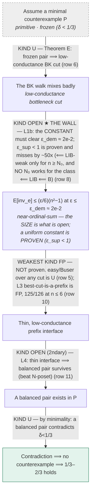

# 1/3–2/3 Program — State of the Wall

*Canonical state of the spectral / near-ordinal-sum attack on the 1/3–2/3 conjecture. Maintained by pm-onethird; updated on every verdict. Everything here is **any-width** — width-3 is old-repo baggage (row 6 is the one row where that had to be *checked* rather than assumed; see its cell). Attempts and probes are subordinate to this document.* **THIS IS THE INTERNAL WORKING RECORD, NOT THE EXECUTIVE SUMMARY (mg-14ad, on Daniel's request).** The one-pager is [`EXECUTIVE-SUMMARY.md`](EXECUTIVE-SUMMARY.md) and **nothing machine-consumes it**: no instrument addresses into it, no pin digests it, no ratchet counts its words — do not add one. The instruments, the pins and the ratchet all read THIS file.

> ⚠️ **READ THE `Kind` COLUMN BEFORE QUOTING ANY ROW, AND READ THE STANDING RULE BEFORE WRITING A SENTENCE THAT SPANS ROWS** (§ *Kinds*, below the ledger). Rows differ **in kind**, not only in status: `U`/`U-id` instantiate at the unknown `n` of a minimal counterexample; **`FP` does not, at all**. **Any prose aggregating rows must state the WEAKEST kind in the set it names.** The two traps actually sprung are row **10**'s `FP` at `125/126` and row **3b**'s `0/132`, **a SAMPLING ARTIFACT** — both stated in full at their own rows. Full rider: [`docs/state-history/state-preamble-riders.md`](docs/state-history/state-preamble-riders.md).

Rich rendered version: [`docs/state-of-the-wall.html`](docs/state-of-the-wall.html) — **HAND-MAINTAINED, NOT GENERATED, AND SUBORDINATE TO THIS FILE.** It carries a **`STATE-PIN`** naming the revision of this file it was last reconciled against, checked **per ledger row** by `python3 code/rendered_twin_pin_9bc2/twin_pin.py`. **Do not quote a ledger row from it without running that.** Why the pin exists, and the three weeks of *"Generated 2026-07-19"* that caused it: [`docs/state-history/state-preamble-riders.md`](docs/state-history/state-preamble-riders.md).

**FACTS WITH NO CONSUMER DO NOT LIVE HERE — THEY LIVE IN [`docs/FACTS.md`](docs/FACTS.md) (mg-03cf), which holds 26 entries.** This file's three homes for a result are all defined by a statement's relation to the *current argument* — load-bearing (the ledger), the open target, or already-walked (the attempt index) — so a true, measured fact attached to no argument can only be filed here by pretending to a relation it does not have. Every entry there carries its kind in this file's `Kind` vocabulary and its exact scope, and nothing there is restated here. Full rider: [`docs/state-history/state-preamble-riders.md`](docs/state-history/state-preamble-riders.md).

**AND HOW WE THINK ABOUT THE SPACE IS NOT RECORDED HERE EITHER — IT IS IN [`docs/CONCEPTS.md`](docs/CONCEPTS.md) (mg-602d, on Daniel's request).** This file records what is **true**; `CONCEPTS.md` records what the objects **mean** — and what we believe and cannot prove, flagged **as belief, in the sentence**. It cites rather than restates, and [`code/concepts_gate_602d/`](code/concepts_gate_602d/) fails the merge if a claim loses its pointer, a belief loses its marker, or the file grows past its ceiling. Full rider: [`docs/state-history/state-preamble-riders.md`](docs/state-history/state-preamble-riders.md).

**THIS FILE IS SIZE-RATCHETED AND THE GATE BLOCKS MERGES (mg-e331).** Its word count is measured against a declared ceiling in [`code/state_ratchet_e331/CEILING.json`](code/state_ratchet_e331/CEILING.json) — the number lives there and is deliberately NOT copied here. `./build.sh` fails the merge if a branch pushes it over, **or if a branch shrinks it and leaves the ceiling behind**. Growth is not forbidden, it is **declared**.

---

## The one-paragraph state

Both **endpoints** of a single spectral axis are proven, along with the machinery that reduces the whole conjecture to **one implication** — and **that machinery is now uniformly `U`/`U-id`, which must NOT be read as good news. The floor is `U` because row 3b WAS NEVER A MEMBER OF THIS SET, not because anything was proven:** standard dominance is L1b's *conclusion* and not its input, so listing it as machinery recorded the open problem as its own premise (mg-65f5 R1; struck, landed mg-a1db). **The one implication the conjecture reduces to IS standard dominance itself** — row 8, the wall, `OPEN`. Almost every quantity we track — `λ_std`, inversion count, squared displacement, interface thinness, entropy — is the *same axis* ("near-ordinal-sumness") in different units. The balance constant `δ` is a **separate axis** (the counterexample condition). The entire remaining gap is the one **bridge** between them: *— this sentence has been wrong in three successive ways; the readings and their corrections, verbatim: [`docs/state-history/headline-corrections.md`](docs/state-history/headline-corrections.md).*

> **L1b (the wall):** `δ(P) < 1/3` ⟹ **`E[inv_e] ≤ (ε/6)(n²−1)` for a constant `ε ≤ ε_dem ≈ 2×10⁻²`, uniform in `n`** — equivalently `1 − λ_std ≤ ε` at that same `ε`, **strictly weaker**. ⚠️ **THE BAR IS THE OPEN CONTENT; THE EXISTENCE OF A UNIFORM CONSTANT IS NOT, AND THIS BLOCKQUOTE ASSERTED OTHERWISE UNTIL mg-0e8c.** ~~*explicit absolute constant, uniform in `n`*~~ — **STRUCK: `ε_sup < 1` already IS such a constant** (`Op-Form` Claim 6.1, all `n`, L4-independent), and at it the **spectral** rendering `1 − λ_std ≤ 1` is **VACUOUS** — true at every poset with no hypothesis, `FP` exhaustive `n ≤ 6`, **sharp**, equality at the antichain. **The whole open content is the ~50× between `ε_sup` and `ε_dem`; equivalently, since `ε_sup = d·n/(n+1)` is LINEAR IN THE INCOMPARABILITY DENSITY, the open region is the DENSE one — `d ≳ 2×10⁻²`** (row 8, [`OneThird-L1b-Restatement-mg-0e8c.md`](docs/OneThird-L1b-Restatement-mg-0e8c.md)). **That constant, not a limit, is what the architecture consumes**, and it is **CONFIRMED CONDITIONALLY, not settled** (mg-88bd, audited mg-e35c): if L4 needs an `n`-dependent modulus the answer flips, and **the flip is on the DEMAND side only** (mg-345e). ⚠️ **THE `1` AND THE `1/6` ARE THE SAME THEOREM IN TWO NORMALISATIONS — NOT TWO RESULTS, AND NOT A FACTOR OF 6 APART (mg-6bc2 §2.1).** **The full derivation, the unit map, the `ε_spec`/`ε_c3ca` dialects, the calibration history and every struck superseded figure, verbatim: [`docs/state-history/l1b-statement-full.md`](docs/state-history/l1b-statement-full.md).**

It is hard because it must use that `σ` ranges over a **real poset's** linear extensions — it is *false* for abstract frozen distributions.

---

## Two axes, one bridge — and the bridge is a RIGIDITY statement whose live currency is `E[inv_e]`, not a spectrum

⚠️ **THE BRIDGE IS L1b — ONE BRIDGE, REAL, `OPEN`, AND THE WHOLE REMAINING GAP — AND IT IS NOT SPECTRAL IN ANY LOAD-BEARING SENSE (mg-05ec, [`docs/OneThird-Spectra-StockTake-mg-05ec.md`](docs/OneThird-Spectra-StockTake-mg-05ec.md)).** Three legs carry that, and each is checkable at its own row: `λ_std` is **one unit among five** and not the currency; Theorem E **caps** the BK gap and hands over a cut, while no consumer of a BK-gap **lower** bound exists; and standard dominance is FP-refuted unconditionally, its conditional form **being** L1b. The three legs in full: [`docs/state-history/proof-chain-riders.md`](docs/state-history/proof-chain-riders.md).

- **Axis 1 — near-ordinal-sumness** (how close to an ordinal sum): `E[inv_e] ≤ (ε/6)(n²−1)` at a constant `ε ≤ ε_dem ≈ 2×10⁻²` uniform in `n` — **the live currency**, of which `1 − λ_std ≤ ε` is the **strictly weaker** spectral rendering. ⚠️ **THE SIZE OF THE CONSTANT IS THE OPEN CONTENT, NOT ITS EXISTENCE (mg-0e8c):** ~~*an explicit absolute constant, uniform in `n`*~~ — **STRUCK, because `ε_sup < 1` already IS one**; what is open is clearing `ε_dem`. `λ_std` is one unit among five and is *not* what the architecture consumes. Full bullet, with the LIB-weak audit history: [`docs/state-history/proof-chain-riders.md`](docs/state-history/proof-chain-riders.md).
- **Axis 2 — balance / frozenness** (the counterexample condition): `δ(P) < 1/3` = frozen = no balanced pair = every incomparable pair is `>2/3`-decided toward `e`.

**Equivalence dictionary** (why "many things tried" is one gap wearing many faces):

- `Σ disp² = 2ΣK_m + 2ΣM_{k,l}` — exact (GID)
- `ΣK_m ≤ inv ≤ 2ΣK_m` — exact (DG)
- `Σ prefix-violations = footrule ≍ inv`
- `λ_std = 1 ⟺ ordinal sum ⟺ incomparability graph disconnected`
- `S_P = ρ_std(η_P)` — the gap lives in the standard sector

---

## Glossary (do not conflate δ and Δ)

| symbol | meaning | axis |
|---|---|---|
| `δ(P)` | balance constant: `max` over incomparable pairs of `min(p, 1−p)` — balance of the *most-balanced* pair. `< 1/3` = frozen. | **Axis 2** |
| `Δ₁(A)` | interface fatness of a cut: `E|A∖σ(A)| / min(|A|,|Aᶜ|)`. A *cut-geometry* property. **Not** `δ`. | Axis 1 |
| `λ_std` | top eigenvalue of the symmetrized transport operator on `1⊥`, **relative to a chosen reference linear extension** — `T[x,i] = Pr[pos_σ(x)=i]` after relabelling by it. **The choice is load-bearing: `λ_std` moves by up to `1/3` across reference orders (4,069 of 4,824 posets at n=6, mg-c4f5), against a target of `ε_spec ≈ 0.02`.** Frozen removes the choice (`e` is canonical and a linear extension) — that is a hypothesis, not a convention. `→1` = near-ordinal-sum. | Axis 1 |
| `inv_e(σ)` | Kendall distance: incomparable pairs flipped vs the distinguished order `e`. | Axis 1 |
| `disp(x)` | `pos_σ(x) − rank_e(x)`. `Σ disp²` is the (B) quantity. | Axis 1 |
| `e` | distinguished linear extension: the `>2/3`-majority order all biases align with. Reference, not a choice. | frame |
| `frozen` | `δ < 1/3`: every incomparable pair `>2/3`-decided. Minimal-counterexample condition. | Axis 2 |
| `primitive` | incomparability graph connected ⟺ not an ordinal sum ⟺ `λ_std < 1` (strictly). Minimal counterexamples are primitive. | structure |
| `R` | the (B)-ratio `E[Σ disp²]/E[inv]`. Large `R` = heavy displacement tail. | Axis 1 |
| `log e(P)` | poset entropy = `log` #linear-extensions = `log` vol(order polytope). *Joint*-law quantity. | geometry |

---

## The proof, and what's proven

```mermaid
flowchart TD
    A["Assume a minimal counterexample P<br/><i>primitive · frozen (δ &lt; 1/3)</i>"]:::assume
    B["The BK walk mixes badly<br/><i>low-conductance bottleneck cut</i>"]
    C["E[inv_e] ≤ (ε/6)(n²−1) at ε ≤ ε_dem ≈ 2e-2<br/><i>near-ordinal-sum — the SIZE is what is open;<br/>a uniform constant is PROVEN (ε_sup &lt; 1)</i>"]
    D["Thin, low-conductance prefix interface"]
    E["A balanced pair exists in P"]
    F["Contradiction ⟹ no counterexample ⟹ 1/3–2/3 holds"]:::concl
    A -->|"KIND U — Theorem E: frozen pair ⟹ low-conductance BK cut (row 6)"| B
    B -->|"KIND OPEN ★ THE WALL — L1b: the CONSTANT must clear ε_dem ≈ 2e-2; ε_sup &lt; 1 is proven and misses by ~50x (⟸ LIB-weak only for n ≥ N₀, and NO N₀ works for the class ⟸ LIB ⟸ B) (row 8)"| C
    C -->|"WEAKEST KIND FP — NOT proven. easy/Buser over any cut is U (row 5); L3 best-cut-is-a-prefix is FP, 125/126 at n ≤ 6 (row 10)"| D
    D -->|"KIND OPEN (2ndary) — L4: thin interface ⟹ balanced pair survives (beat N-poset) (row 11)"| E
    E -->|"KIND U — by minimality: a balanced pair contradicts δ&lt;1/3"| F
    classDef assume fill:#eee,stroke:#999,stroke-dasharray:4 3;
    classDef concl fill:#e3f3ec,stroke:#1f7a54;
```

⚠️ **NODE `B` IS UNCONSUMED BY ANY LIVE ROUTE — `A → B → C` IS NOT WHERE THE WORK IS (mg-05ec).** The diagram routes `A → B → C`; row 8 and the machinery route `A → C` directly, on rows 5 and 7 only, and not one of the three live residuals is an attack on a spectrum. **DOCUMENTARY, not mathematical** — the edge is not wrong, it is unconsumed, and a route drawn through an unconsumed node is how work gets aimed at one. Full rider: [`docs/state-history/proof-chain-riders.md`](docs/state-history/proof-chain-riders.md).

Two links are **OPEN** (**L1b** primary, **L4** secondary). **Of the remaining ledger rows, one is `FP` (row 10), one is refuted as stated (row 9), and row 3b is `FP✗`/`OPEN` — its unconditional form REFUTED and its open form identical to L1b itself — so *"the rest are proven"* is FALSE of that set**; the weakest kind below L1b/L4 is **`OPEN`, not `FP`**, and the chain is exactly as strong as that.

**Machinery L1b's reduction stands on** — ⚠️ **WEAKEST KIND IN THIS SET: `U`** (mg-957a's standing rule; re-derived, not deleted, at mg-a1db). The bullets' strike history and mg-65f5 §1.6's resolution of the malformed standard-dominance fork: [`docs/state-history/proof-chain-riders.md`](docs/state-history/proof-chain-riders.md).

- ~~**standard dominance** (gap lives in the standard sector, so a combinatorial bound controls `λ_std`) — **`FP`, row 3b**~~ — **STRUCK, AND NOT AS A DEMOTION: it was never machinery.** mg-65f5's R1 finds it is L1b's *conclusion*, so listing it here recorded the open problem as its own premise. Its unconditional form is **`FP✗` REFUTED**; the conditional form that remains open **is row 8**.
- **easy/Buser** `1−λ_std ≤ n·leak(A)/(|A||Aᶜ|)`, every cut — **`U`, row 5.**
- the exact identities **GID** + **DG** — **`U-id`, row 7.**
- ~~**(A) SPREAD** `‖r‖² = Ω(n³)` — `U`, row 4.~~ **STRUCK — OFF THE CRITICAL PATH (mg-a58f, audited mg-d112 — CONFIRMED).** The theorem stands (row 4 unchanged, still `U`/**proven**); what was struck is its *membership of this set* — `(B)` implies LIB directly, so the spread bound is not on the route.

### Kinds — the standing rule, and it is the point of the column

mg-e768's cut, replacing the earlier individual-vs-category one (which pm-onethird has withdrawn: nothing in these rows is categorical):

| mark | name | meaning | usable against a minimal counterexample? |
|---|---|---|---|
| `U` | **pointwise-universal** | proven for **every** finite poset; instantiates at the counterexample's own `n` for free | **yes** |
| `U-id` | **identity** | an exact identity or a definitional equivalence — holds by algebra, consumes no hypothesis | **yes**, and it transfers freely |
| `FP` | **finite population** | an exhaustive check over a finite set of small posets. Says **nothing** above the largest `n` checked | **NO** — the counterexample's `n` is unknown and unbounded |
| `FP✗` | **finite population, refuting** | a finite population exhibiting a **counterexample** | **yes, and at universal strength** — one witness kills a universal at every `n` |
| `OPEN` | — | no warrant of any kind on the board | no |

**The asymmetry is the whole reason `FP` and `FP✗` are different marks:** a finite population can **refute** a universal outright and can **never establish** one. Row 9 is `FP✗` and is as strong as anything in the table; **row 10** is `FP` and is not evidence at unbounded `n` at all. **Row 3b was `FP` here and is not any more (mg-55f2): its `0/132` was `FP` only inside a frame — `n ≤ 6` exhaustive + `n = 7` top-λ spot — that excludes the known refuters, so the unconditional form is `FP✗`-REFUTED and the conditional form is `OPEN` (it is row 8). See the row.**

> **STANDING RULE (mg-957a).** *Every row carries its kind, at the row. Any prose that **aggregates** rows must state the **WEAKEST** kind in the set it names.* A sentence saying *"all proven"* over a set containing an `n ≤ 7` empirical row is **FALSE however true each row is individually** — and it is a **different defect** from any individual row being wrong. It is the one that survives fixing rows one at a time, so fixing rows is not a substitute for obeying this rule.

Ordering for aggregation: `U`/`U-id` ≻ `FP` ≻ `OPEN`. `FP✗` is a *refutation*, not support: a set asserted to *support* something is not repaired by containing one — it is false in a second way, and should be reworded rather than relabelled.

**Scope of the marks, stated so they are not over-read (mg-957a).** The `Kind` column classifies **the kind of warrant each row's own recorded `Status` claims** — it does not re-verify the mathematics. A row whose `Status` says *proven* is marked `U`/`U-id` on the ledger's own authority; a row whose `Status` says *empirical `k/N` at `n ≤ m`* is marked `FP` **by construction of that status**, and that half of the column is not a judgement at all. Re-auditing the proofs behind the `U` rows was not attempted here.

### Full ledger

| # | Result | Kind | Status | Width |
|---|---|---|---|---|
| 1 | `λ_std = 1 ⟺ ordinal sum` | `U` | **proven** | any |
| 2 | ordinal sum ⟺ incomparability graph disconnected (primitive = negation) | `U-id` | **proven** | any |
| 3a | `S_P = ρ_std(η_P)` (gap in the standard sector) | `U-id` | **proven** | any |
| 3b | standard **dominance** (that block carries the 2nd eigenvalue). ⚠️ **This row is NOT independent empirical support for L1b; the half of it that is open IS L1b.** **(a) The UNCONDITIONAL statement is REFUTED, not unproven.** `mg-8b64`'s BK-transport probe exhibits **166 explicit refuters at moderate-λ `n = 7`** ([`one_third_width_three/docs/OneThird-L1b-BK-Transport-Transfer-Probe.md`](../one_third_width_three/docs/OneThird-L1b-BK-Transport-Transfer-Probe.md) §2.1). **(b) The all-pairs-frozen CONDITIONAL is OPEN — and it IS L1b, i.e. row 8**, not a second witness for it: [`OneThird-L1b-Reverse-Cheeger-Proof-Attempt.md:449`](../one_third_width_three/docs/OneThird-L1b-Reverse-Cheeger-Proof-Attempt.md) states **`L1b ⟺ "all-pairs-frozen ⇒ standard dominance"`**. **(c) `0/132` IS A SAMPLING ARTIFACT AND IS NEVER QUOTABLE BARE.** **Always carry the frame with the number.** *(Full per-row record — every passage relocated from this cell, verbatim: [`docs/state-history/ledger-row-3b-standard-dominance.md`](docs/state-history/ledger-row-3b-standard-dominance.md).)* | ⚠️ **`FP✗`** (unconditional — refuted) / **`OPEN`** (conditional = row 8). ~~`FP`~~ **— the `FP` mark is WITHDRAWN (mg-55f2): it rested on `0/132`, whose frame excludes the refuters.** | **unconditional: REFUTED** — 166 refuters at moderate-λ `n = 7` (mg-8b64; **read, not re-measured**). **conditional (all-pairs-frozen): OPEN — it is row 8.** ~~empirical (0/132)~~ **struck as a bare status (mg-55f2)** | n ≤ 7 data — **frame: `n ≤ 6` exhaustive + `n = 7` TOP-λ SPOT ONLY**; the known `n = 7` refuters are moderate-λ, i.e. outside it |
| 4 | (A) SPREAD `‖r‖² = Ω(n³)` | `U` | **proven** | any |
| 5 | easy/Buser `1−λ_std ≤ n·leak(A)/(\|A\|\|Aᶜ\|)`, every cut | `U` | **proven** | any |
| 6 | Theorem E: minimal counterexample ⟹ low-conductance BK cut. The corpus's only proof of this row is [`one_third_width_three/step8.tex`](../one_third_width_three/step8.tex) §G1, whose statement reads *"If `P` is a **width-3** indecomposable `γ`-counterexample on `n ≥ 2` elements…"* (`:57–62`). **Settled by reading the source rather than by assumption: the width-3 hypothesis is PRESENT AND INERT.** **The general statement, and what proves it: delete "width-3" from `:60` and the same four proofs stand verbatim.** ⚠️ **What this does NOT cover, stated because it is the part that could still bite:** the Step-8 **cascade** downstream of Theorem E (Prop `G2` onward, `:424` ff — layered width-3 decompositions, Step-7 interaction width) **is genuinely width-3** and nothing here touches it; nor did I inspect the Lean artifact (`lean/OneThird/MainTheorem.lean`), which may carry `width-3` as a formal hypothesis; and this is a reading of the LaTeX, not a machine check. Full record: [`docs/OneThird-TheoremE-Width-and-Row-Kinds-mg-957a.md`](docs/OneThird-TheoremE-Width-and-Row-Kinds-mg-957a.md). *(Full per-row record — every passage relocated from this cell, verbatim: [`docs/state-history/ledger-row-6-theorem-e.md`](docs/state-history/ledger-row-6-theorem-e.md).)* | `U` | **proven** | **any** — see cell |
| 7 | identities GID & DG | `U-id` | **proven** | any |
| 8 | **L1b — the wall**: frozen ⟹ **`E[inv_e] ≤ (ε/6)(n²−1)` for a constant `ε ≤ ε_dem ≈ 2×10⁻²`, uniform in `n`** — equivalently `1 − λ_std ≤ ε` at that same `ε`, which is **STRICTLY WEAKER** (the master bound runs inversions ⟹ spectrum, one way). ⚠️ **A CONSTANT UNIFORM IN `n` IS NOT WHAT IS OPEN — ONE IS PROVEN.** `ε_sup < 1` is pair-bias, `Op-Form` Claim 6.1, all `n`, L4-independent, and it **discharges the existence form outright**. **AND AT THAT CONSTANT THE SPECTRAL RENDERING IS VACUOUS, SHARPLY:** `1 − λ_std ≤ 1` holds at **every** poset with **no hypothesis at all**, with **equality at the antichain at every `n`**. ⚠️ **KIND OF THE VACUITY: `FP`, `n ≤ 6`** — the **discharge** is not `FP` and needs none of it, being Claim 6.1 plus the master bound. **AND THE SUPPLY IS NOT A FLAT `1`: `ε_sup = d·n/(n+1)`, LINEAR IN THE INCOMPARABILITY DENSITY `d = m/C(n,2)`, so the wall is already DOWN — proven, all `n`, L4-free — at `d ≲ 2×10⁻²`, and what is open is the DENSE regime.** **THE OPEN CONTENT IS THE FACTOR OF ~50 BETWEEN `ε_sup` AND `ε_dem`, AND NOTHING ELSE** ([`OneThird-L1b-Restatement-mg-0e8c.md`](docs/OneThird-L1b-Restatement-mg-0e8c.md), instrument [`code/l1b_currency_0e8c/`](code/l1b_currency_0e8c/)). What the architecture consumes is that constant, **CONDITIONALLY** (mg-88bd, audited mg-e35c — the condition is L4-as-stated, row 11); **the condition binds the constant that SUFFICES, not the constant we can PROVE — the pair-bias route to the latter is L4-INDEPENDENT and already proven at `ε_sup < 1` (mg-345e, see the L1b blockquote above)**. ⚠️ **`ε_sup < 1` AND "pair bias gives `1/6`" ARE THE SAME THEOREM IN TWO NORMALISATIONS, NOT A FACTOR OF 6 APART:** **DO NOT READ `1/6` AS A SHARPENING OF THIS `1`, because proving `ε_spec = 1/6` from pair bias would be proving a statement 6× STRONGER than the `1/6` that is already proven** (mg-6bc2 §2.1, [`OneThird-PairBias-EpsSup-Sharpening-mg-6bc2.md`](docs/OneThird-PairBias-EpsSup-Sharpening-mg-6bc2.md)) — **and pair marginals alone are CLOSED, not merely unsharpened: `max{ 6E_μ[inv_e]/(n²−1) : μ ∈ M_n(η) } = (1−3η)·n/(n+1)`, ATTAINED at every `η > 0`, both directions PROVEN FOR ALL `n`** (mg-6bc2 Claim 3.1), so **`Op-Form` Claim 6.1 is an EQUALITY for the information it consumes, not a bound awaiting a better argument** — every route below `1` must add a *realizability* fact. `M_n(η)` is *every pair flipped with probability `≤ 1/3 − η`*; frozen is `δ(P) < 1/3` **STRICT**, so the `1` this row leads with is `sup_{η>0} (1−3η)·n/(n+1) = n/(n+1)` — **a SUPREMUM over the frozen class, NOT a maximum in it** (mg-832f Correction 2). **Which `1/6` was meant is Daniel's question and is NOT decided here; the map is true either way.** `λ_std→1` is a stronger rendering that happens to be available, not the requirement. Sufficient conditions, **one-way**: **(B) ⟹ LIB ⟹ (LIB-weak) `E[inv_e] = o(n²)`**, which closes the **limit** rendering `λ_std → 1` (via mg-210d's master bound, mg-c4f5) — but **(LIB-weak) ⟹ (LIB-const) only for `n ≥ N₀`, and `N₀` IS NOT UNSPECIFIED: NO `N₀` WORKS FOR THE CLASS AT ALL** (mg-c4f5 §5.3, landed mg-5ce3). **What that closes:** *go and find `N₀`* is **not a research direction** — no threshold follows from the `o(n²)` hypothesis at all, so there is nothing to compute. As asymptotic classes `(LIB) ⊊ (LIB-weak) ⊊ (LIB-const)`: **(LIB-weak) is the stronger of those two, and they differ IN KIND — the gap is a quantifier, not a constant** (mg-c3ca). The reverse arrows are **UNPROVEN — not merely absent** (see § *The single lemma to prove*). **DO NOT CITE THE LITERATURE BOUND AGAINST THIS `N₀`:** a minimal counterexample is known to have `n ≥ 12` (refereed, Peczarski 2006) and `n ≥ 15` (preprint, Gupta 2026) — **and that discharges nothing here.** **There is no threshold to exceed** — it is being offered against a quantifier that **no** number, however large, addresses. Separately, it also falls short of the two thresholds that *are* explicit, `n ≥ 100` (primitive) and `n ≈ 900C` (mg-33f5, landed mg-d1a2 — see § *Literature status*) *(Full per-row record — every passage relocated from this cell, verbatim: [`docs/state-history/ledger-row-8-L1b.md`](docs/state-history/ledger-row-8-L1b.md).)* | `OPEN` | **OPEN** | any |
| 9 | **L2's FIRST DISJUNCT** — standard-eigenvector monotonicity. ⚠️ **SCOPE REPAIRED (mg-3329, on mg-fa70's finding): this row is L2's FIRST disjunct ONLY.** `L2` is a **DISJUNCTION** — *"a dominant standard eigenvector is monotone in the distinguished order, **or at least yields a low-conductance prefix**"* (`spectral_near_ordinal_sum_program.tex:560–566`, quoted verbatim at [`OneThird-C3-PrefixCapture-mg-76b2.md`](docs/OneThird-C3-PrefixCapture-mg-76b2.md) §2 — **that `.tex` is not in this repository, so mg-3329 read the quote from mg-76b2's document and did not re-verify it at the source**) — so the `FP✗` refutes the **first clause** and says **NOTHING** about the second. **L2 ITSELF IS `OPEN`, NOT REFUTED.** What the second disjunct does and does not buy is row `:169`'s, cited rather than restated. | `FP✗` | **first disjunct** false as stated (2/126); **L2 as a disjunction: OPEN** | n=6 data |
| 10 | L3 best-cut-is-a-prefix. **Note the population is not unanimous — `125/126`, i.e. one instance at `n ≤ 6` already fails**, so this is `FP` support carrying a known exception, ~~not a clean sweep like row 3b's `0/132`~~ **— THE COMPARISON IS STRUCK (mg-55f2, on mg-65f5's §1.5): ROW 3b's `0/132` IS NOT A CLEAN SWEEP EITHER.** It is `0` failures in a frame — `n ≤ 6` exhaustive + `n = 7` **top-λ spot only** — chosen so that the known moderate-λ `n = 7` refuters are outside it; the unconditional statement it was read as supporting is **refuted** (166 refuters, mg-8b64), see row 3b. What survives of the contrast is row 10's own honesty about its exception, **not** the comparand. **`0/132` must never be cited as a clean sweep, here or anywhere.** **What that one instance is, and whether the statement survives excluding it, was NOT determined here (mg-957a).** | ⚠️ **`FP`** | empirical (125/126) | n ≤ 6 data |
| 11 | L4 near-ordinal-sum stability ⟹ balanced pair survives. **As literally stated it closes Step 6 only through its trivial branch (i)**: branch (iii) needs restating as *exact* preservation in `[1/3,2/3]` (the source's own `:476–479` and `:567–569` already read that way — an internal drafting inconsistency, not an architectural defect), and **branch (ii) is unconsumed by Step 6's stated transfer for *every strictly positive* modulus — UNCONDITIONAL, and the `Ω(ε)` condition is DISCHARGED** (mg-3af9, audited mg-c8c6 — see that row): `F(ε) = ε/4` and every `F(ε) = o(ε)` are included, via the witness **`W*`**. The only escape is `F ≡ 0`, which reads (ii) as *exact* ordinal sum — that makes L4 a **strictly stronger** conjecture, it does not repair Step 6. Separately and **modulus-free**: branch **(iii) as a *standalone universal* is refuted at every `ε > 0`, for every modulus** — (iii) is a disjunct and was never asserted standalone, so this kills the standalone reading and every `ε`-calibration of it, not L4 *(Full per-row record — every passage relocated from this cell, verbatim: [`docs/state-history/ledger-row-11-L4.md`](docs/state-history/ledger-row-11-L4.md).)* | `OPEN` | **OPEN** (AMBER) | any |

**Width-3 baggage to keep out** — three items that are *not* part of this any-width program and have each been mistaken for it once: the deleted pre-`a7c5` certificate crutch, the width-3 minimum-`δ` reading of C.md §9.5, and the `≤ 2`-chain Dilworth framing. In full: [`docs/state-history/proof-chain-riders.md`](docs/state-history/proof-chain-riders.md).

---

## The single lemma to prove

**Poset-LE displacement anti-concentration** (any width). For every finite poset `P` with distinguished order `e` and `δ(P) < 1/3`, `σ` uniform on `L(P)`:

- **displacement face (B):** `E[ Σₓ (pos_σ(x) − rank_e(x))² ] = O( E[ Σₓ |pos_σ(x) − rank_e(x)| ] )`
- **inversion face (LIB):** `E_σ[ inv_e(σ) ] = O( n / γ )`

"A random linear extension of a real, 2/3-frozen poset stays close to its reference order — no heavy displacement tail, only linearly many inversions per slot." The two faces are **one statement in two currencies**, not two targets. The plain-language reading in full, with what each face costs: [`docs/state-history/proof-chain-riders.md`](docs/state-history/proof-chain-riders.md).

**Forced hypotheses:** real-poset LE measure · `δ < 1/3` · distinguished order `e`.

**Why it is hard (obstruction 4):** both faces are false for abstract frozen distributions (a two-atom law has every pair frozen yet `Θ(n²)` inversions). So the proof *must* use that `σ` ranges over a genuine poset's linear extensions. This kills marginal-only tools (slot-law log-concavity numerically false; FKG/XYZ wrong-signed). The untried handle: **weak-Bruhat convexity / Stanley absolute-position AF log-concavity** forcing the slot probabilities to decay.

---

## Attempt index — MOVED, and it is REFERENCE

**The whole section is at [`docs/state-history/attempt-index.md`](docs/state-history/attempt-index.md), verbatim** — 28 rows, every verdict and every per-attempt link, moved without one word rewritten (mg-927a). **Read it before opening a line of attack**; that is what *"so nothing is re-walked"* meant, and a pointer serves it as well as an inlined table did.

**Nothing is superseded or retired by the move.** The verdicts are unchanged and mg-957a's standing rule binds those rows exactly as before. It left rather than shrank because no live ledger row consumes any of it — the split proposal's own §5 rule.

## Where the threads converge

**Current position (2026-08-06).** Three residuals stand, correctly ordered (mg-a58f,
audited mg-d112): **(B-cov)** — *"break the wrong-signed same-side covariance"* (FKG/XYZ
force it `≥ 0`), *"the sharp edge"*, and the object three separate routes converge on;
**(R)** — *"do frozen posets have a density ceiling `d(P) ≤ D < 1`?"* (mg-210d),
elementary, and reopened *quantitatively* by mg-88bd as `D ≤ ε_spec`: *"a door recorded as
the wrong shape is now the right shape with the wrong size"*; and **(EQ)** —
`max_x |E[pos_σ x] − rank_e x| = O(1)`, elementary, *"the only one of the three that is a
cancellation statement rather than a decay statement"*. **Retired or dead:** the *"external
k=1 stability tool"* for Stanley's inequality (refuted, mg-dcae — the reduction to it was
circular, so any usable statement *"must consume the frozen hypothesis directly"*);
mg-0ed7's `Φ→Var` reduction (**REFUTED**, mg-8f56); and the tempering/deformation route to
the BK gap (dead *"for method reasons, not because the conjecture is false"*, mg-4a86).
**Also open, beside the three:** **(RD)** — which reading branch (ii) carries (mg-3af9) —
and the hole mg-3af9 opened at **Step 6** of the architecture, *"independent of L1b"*.

⚠️ **AND THE ROUTE ROW 8's OWN SENTENCE POINTS AT IS DEAD — read this before acting on *"every
route below `1` must add a realizability fact"*.** That fact **cannot be a restriction on `π`**:
for **any** measure class containing the point masses the marginal image `S` has
`conv(S) = M_n`, because `π(δ_σ) = δ_σ` **is** a vertex — **realizability is vacuous at the
vertices**, so no cut, hence **no LP, SDP or lift-and-project route** (mg-c776 `T2`; generalised
to every realizability restriction on independent code, mg-3da1 `T-3da1`,
[`OneThird-ImageClosure-mg-3da1.md`](docs/OneThird-ImageClosure-mg-3da1.md)). ⚠️ **BUT "the image
cannot tighten anything" is FALSE:** inside the convex cell of hypothesis (1) read on the
**measure** the image ceiling is exactly a **`d`-fraction** of the body's — `2/3, 1/3, 1/5, 4/15`
at `n = 3…6`, an identity not a fit — because *that* reading excludes `n!−1` of the `n!` vertices
where realizability and the **poset** reading exclude none. **Vertex exclusion is the whole
dividing line.** So the image **reduces row 8 to `d`** = **(R)** — and mg-0b96 has since **priced**
that: `(1_D)` is the conjecture on `{d > D}` by contraposition at every strength, so the terminus
is the **target itself**, not a lemma.

*Every paragraph of the chronology this replaces, verbatim and in order — mg-a1ec, mg-48ab,
mg-dcae, mg-210d, mg-0ed7, mg-4a86, mg-8f56, mg-a58f, mg-88bd, mg-63e3, mg-3af9:*
[`docs/state-history/threads-chronology.md`](docs/state-history/threads-chronology.md).

---

## Reference material, linked

*Daniel, 2026-08-13: "reference material can be linked at the bottom". This is that bottom.*

| document | what it holds |
|---|---|
| [`EXECUTIVE-SUMMARY.md`](EXECUTIVE-SUMMARY.md) | **the one-pager, and nothing consumes it** — no instrument, no pin, no ratchet |
| [`docs/state-history/attempt-index.md`](docs/state-history/attempt-index.md) | the attempt index whole: 28 rows, so nothing is re-walked |
| [`docs/state-history/`](docs/state-history/) | per-attempt and per-row histories |
| [`docs/CONCEPTS.md`](docs/CONCEPTS.md) | the mental model: what the objects **mean**, and which intuitions are dead |
| [`docs/FACTS.md`](docs/FACTS.md) | the registry of live facts with no consumer, each with its kind and its exact scope |
| [`docs/why-one-third-elementary-anchor.md`](docs/why-one-third-elementary-anchor.md) | why `1/3` is the threshold, the literature status, and the size lower bound |
| [`docs/audit-stage-process.md`](docs/audit-stage-process.md) | audit-stage process (standing process, Daniel directive 2026-07-19; relocated whole by mg-ea0e) |
| [`docs/state-of-the-wall.html`](docs/state-of-the-wall.html) | the hand-maintained rendered twin, pinned per ledger row to this file |
| [`docs/STATE-SPLIT-PROPOSAL-mg-14ad.md`](docs/STATE-SPLIT-PROPOSAL-mg-14ad.md) | the split, the budgets, and the one row that cannot land |
